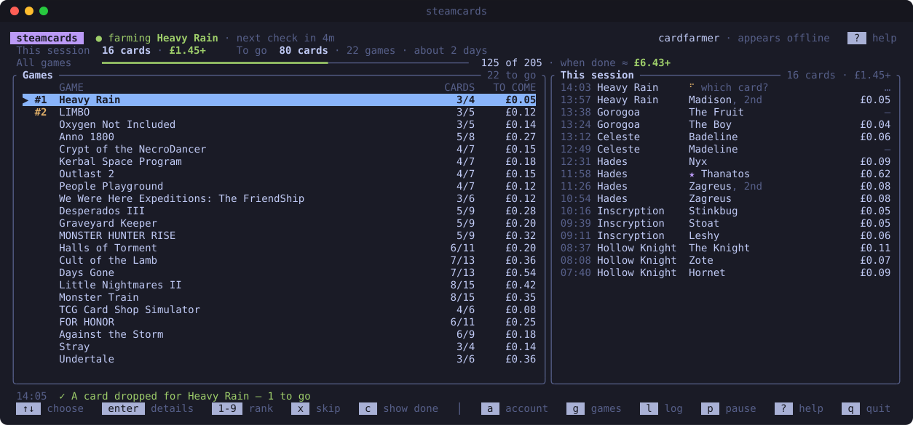
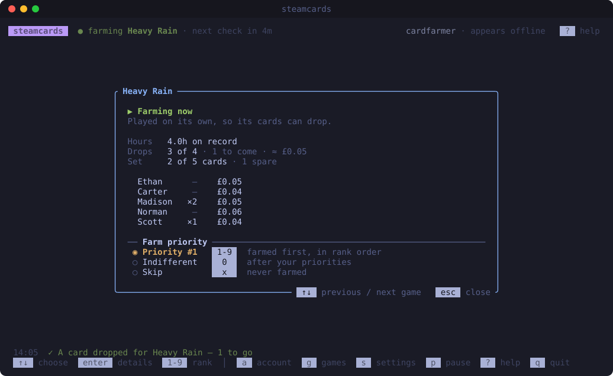
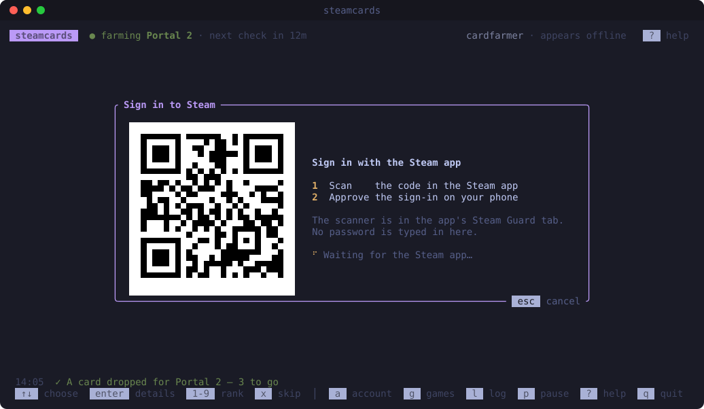

# steamcards

[](https://github.com/joshgallantt/steamcards/actions/workflows/tests.yml)
[](#macos-and-linux)
[](#macos-and-linux)
[](#windows)
[](LICENSE)
[](CONTRIBUTING.md#the-rules-the-build-enforces)


**Get your Steam trading cards without playing for them.** steamcards plays your games in the background, so their cards drop while you get on with your day, and shows you what they're worth. Nothing is installed or launched: it tells Steam what's being played, the way the Steam client does, so it takes a tiny fraction of the power a running game would.



## Features

- **Sign in with your phone:** scan a QR code with the Steam app, so steamcards never sees your password.
- **Your games, in your order.** Rank the games you want cards from first; the rest follow, the ones closest to dropping first.
- **See what you've got, and what it's worth:** this session's time and cards at Steam market prices, how many are left and how long they'll take, and every game's set, card by card.
- **Appears offline** while farming, unless you'd rather not: your friends don't see a pile of games, and the cards drop just the same.
- **Steps aside** while you play on another device, and carries on a minute after you stop.
- **Shakes drops loose,** if you like: it can restart the game every 5 minutes, as Steam Game Idler does. It's off until you turn it on in the games list (`g`, then `s`).
- **Windows, macOS and Linux.**

## Install

Paste the line for your computer into a terminal, and press Enter.

### macOS and Linux

```sh
curl -fsSL https://raw.githubusercontent.com/joshgallantt/steamcards/main/install/install.sh | sh
```

Or, on macOS, with [Homebrew](https://brew.sh):

```sh
brew tap joshgallantt/steamcards https://github.com/joshgallantt/steamcards && brew install joshgallantt/steamcards/steamcards
```

### Windows

In Windows Terminal:

```powershell
irm https://raw.githubusercontent.com/joshgallantt/steamcards/main/install/install.ps1 | iex
```

To update, run the same line again (with Homebrew, `brew upgrade steamcards`). See [what's new](https://github.com/joshgallantt/steamcards/releases).

## Getting started

Type `steamcards` and press Enter. The first time, it walks you through signing in and picking the games you want cards from first. Then leave it running: it remembers everything for next time.

Press `?` at any time to see what the keys do, and `enter` on a game to see its cards. To run without the dashboard, on a server or in a background terminal, see [running it without the dashboard](CONTRIBUTING.md#without-the-dashboard).

<details>
<summary>More screenshots</summary>

<p align="center">
  
  
</p>

</details>

## Good to know

Steam won't drop cards for some games whatever plays them: family-shared games, free-to-play games you haven't spent on, games marked private, and games on limited accounts. steamcards moves on from a game that drops nothing for 10 hours.

If you start a game on another computer while steamcards farms, Steam says you're already playing elsewhere, and offers to close that game: let it.

## Your data, and uninstalling

Your sign-in and choices stay on your computer, in one file only you can read, with your cards' market prices beside it, so a restart doesn't look every game up again. steamcards talks to nobody but Steam, and collects nothing: no analytics, no tracking. Signing out (press `a`) forgets the sign-in, and ends it at Steam's end too. [CONTRIBUTING.md](CONTRIBUTING.md#where-your-data-is) says where the folder is.

To uninstall, paste the line for your computer. It works however you installed steamcards, and asks whether to delete your sign-in and choices too.

**macOS and Linux**

```sh
curl -fsSL https://raw.githubusercontent.com/joshgallantt/steamcards/main/install/uninstall.sh | sh
```

**Windows**

```powershell
irm https://raw.githubusercontent.com/joshgallantt/steamcards/main/install/uninstall.ps1 | iex
```

## Disclaimer

steamcards is unofficial: Valve doesn't make it, endorse it or support it.

**Why it exists.** Trading cards drop for games you play, so people leave games running for hours just to get them, keeping a computer busy drawing frames nobody watches. steamcards gets the same cards without that, and it's open source, so anyone can check exactly what it does.

**What it asks Steam for.** Only what the Steam client and the community site ask for: your badges, your card sets and the market's prices come from the same pages you'd look at yourself, one at a time, at a gentle pace, and when Steam asks it to slow down, it does. It holds one account, yours, never fakes or bypasses a check, and leaves selling your cards to you.

**Your responsibility.** Steam can change how its client works, or what it allows, at any time, and steamcards may stop working until it catches up. Running games automatically may be against the [Steam Subscriber Agreement](https://store.steampowered.com/subscriber_agreement/): it's up to you to read it and decide. Valve could restrict an account that uses it, so don't use one you can't afford to lose. As its [licence](LICENSE) says, steamcards comes with no warranty, and its authors aren't responsible for what happens to your account or your cards. Use it at your own risk.

**From Valve?** If you have a concern about steamcards, please [open an issue](https://github.com/joshgallantt/steamcards/issues) or contact the maintainer, [@joshgallantt](https://github.com/joshgallantt). We'll listen, and change or remove what you object to.

Steam is a trademark of Valve Corporation. steamcards uses the name only to say what it works with.

## Credits

How steamcards farms follows [ArchiSteamFarm](https://github.com/JustArchiNET/ArchiSteamFarm) (Apache-2.0). Steam's messages are Valve's own, as [SteamDatabase](https://github.com/SteamDatabase/Protobufs) publishes them, and the market's currencies and fees follow Valve's own scripts, as [SteamTracking](https://github.com/SteamTracking/SteamTracking) publishes them: see [NOTICE](NOTICE). The look is [streamdrops](https://github.com/joshgallantt/streamdrops)'.

## Licence

MIT: see [LICENSE](LICENSE).

## Contributing

Found a bug, or have an idea? [Open an issue](https://github.com/joshgallantt/steamcards/issues). Everything technical, from building it yourself to how the code is built, is in [CONTRIBUTING.md](CONTRIBUTING.md). Please report security problems privately, as the [security policy](.github/SECURITY.md) says, and follow the [code of conduct](.github/CODE_OF_CONDUCT.md).
