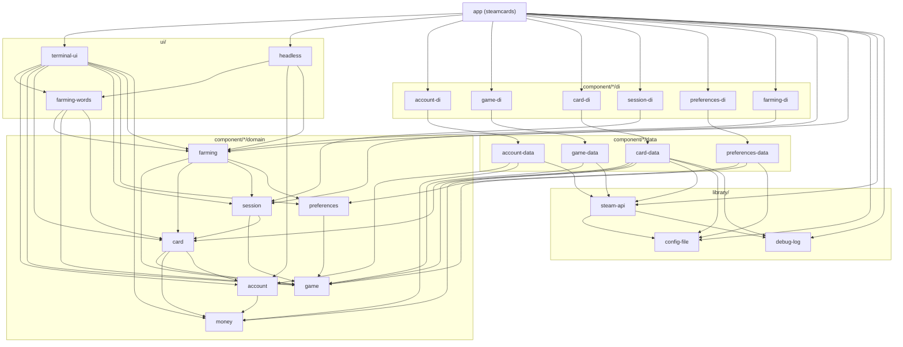

# Architecture reference

steamcards is built the way [streamdrops](https://github.com/joshgallantt/streamdrops)
is: the same layers, the same rules, and the same checks that keep them.

---

## The dependency rule

> *"Source code dependencies must point only inward, toward higher-level policies."*
> — Robert C. Martin, *Clean Architecture* (2017), Chapter 22

| Layer | Crates | May depend on |
| --- | --- | --- |
| Domain | `money`, `account`, `game`, `card`, `session`, `preferences`, `farming` | Domain |
| Data | `account-data`, `game-data`, `card-data`, `preferences-data` | Domain, Library |
| DI | `account-di`, `game-di`, `card-di`, `session-di`, `preferences-di`, `farming-di` | Domain, Data, Library |
| Library | `config-file`, `debug-log`, `steam-api` | Library |
| Presentation | `farming-words`, `terminal-ui`, `headless` | Domain, Presentation |
| App | `steamcards` | Domain, DI, Library, Presentation |

Two things enforce this table:

1. **The compiler.** A crate can only `use` what its `Cargo.toml` lists. No
   domain crate lists a data crate, so an import pointing the wrong way does
   not resolve.
2. **[`app/tests/dependency_rule.rs`](../app/tests/dependency_rule.rs).** This
   reads every manifest through `cargo metadata` and fails on any arrow the
   table doesn't allow. It also fails if a production dependency enables
   `test-support`, and if a domain crate uses a component its own table
   doesn't name:

   | Component | May use |
   | --- | --- |
   | `money`, `game` | nothing |
   | `account` | `money` |
   | `preferences` | `game` |
   | `card` | `game`, `money`, `account` |
   | `session` | `game`, `card` |
   | `farming` | `game`, `card`, `session`, `preferences` |

Dev-dependencies are exempt. A test may reach anywhere it needs to.

---

## Domain layer

The domain starts from its entities:

- **`SteamLibrary`**, in `game`: the games on the account that have
  trading cards. It holds each game once, and knows the drops received and
  still to come.
- **`Game`**: one of those games, by its **`AppId`**: its hours, its `CardDrops`
  (received and still to come) and its badge level. Its drops are what
  farming works through.
- **`Playing`**: who plays on the account, this session or another device,
  which keeps it from playing anything; **`PlayingSignal`**, what Steam says
  of it (another device started or stopped, took over, a session took this
  one's place, the connection went).
- **`Card`**, in `card`: a card in a game's set, and how many the account
  has. The same card can drop more than once, so that's a count, and copies
  beyond one are spares.
- **`CardKind`**: every card comes in two kinds, `Normal` and `Foil`, a
  rarer copy with a shiny border. Steam calls it the card's border; each
  kind makes a badge of its own, and is an item of its own on the market.
- **`CardSet`**: a game's set of one kind, with how many of each card the
  account has: what a badge needs. It's a measure of its own beside the
  game's drops, and neither stands in for the other: 3 of 4 drops can be 2
  of 5 cards and a spare. **`CardSets`** holds the sets looked at, by game;
  **`GameCards`** is one look at a game's card page, the game and its set.
- **`CardAsset`**: one copy of a card the account holds, by its **`AssetId`**:
  the game whose set it's from, its name, its market hash name, its kind,
  and whether it's marketable and tradable. Each copy that drops is its own. It
  says which card dropped, and is what selling one takes. A **`NewItem`**
  is one Steam announced, by its asset ID, before anyone knows what it is.
- **`Account`**, in `account`: the one Steam account, and whether Steam still
  takes its sign-in. One account only, by design.
- **`Preferences`**, in `preferences`: priority games, skipped games, "only
  priority", and whether to appear online while farming.
- **`Session`**, in `session`: this session of farming, from the first run
  of the farmer until the user signs out, another account signs in, or
  steamcards quits, through pauses. It holds every `Drop` (one per copy that
  dropped, which card it was once that's known, and which copy, from the
  account's own counts), the `Stretch`es of what was played and how, the
  games finished, and what the games it farms had left at the start. From
  it, `Forecast::of` learns how long the rest should take. The farmer keeps
  it as a **`KeptSession`**, with what should outlast a pause beside it,
  and the **`SessionKeeper`** keeps that from one run of the farmer to the
  next.
- **`Money`**, a component of its own: an amount in hundredths of a
  `Currency`, Steam's `ECurrency` with Valve's own format for it. Amounts in
  different currencies are never added or converted. Prices, the wallet and
  the screens all count in it.
- **`Wallet`**, in `account`: the account's currency, and the fees Steam
  takes from a sale, with Valve's fee rules (`buyer_pays`, `seller_gets`) in
  whole numbers.
- **`Price`** and **`PriceQuote`**, in `card` like the rest of what cards
  sell for: what's known of a card's price (pending, known, no market, not
  marketable, failed), and what the market said, when.
  A game's **`SetPrices`** hold its cards of each kind as the market lists
  them; the **`PriceBook`** holds every set.
- **`Basis`**, list or net: a card valued at what a buyer pays for it, or at
  what selling it pays after Steam's fees. **`MarketPause`**, Steam's pause
  on price lookups, which outlasts a restart.
- **`HeldCard`**: a card held, as far as its value goes: from a `CardAsset`,
  or just a name and a kind. **`Held`** is what cards held are worth, at
  least; **`Estimate`**, what cards still to drop are likely worth.

Steam's IDs are types of their own, `AppId` in `game` and `AssetId` in
`card`, so a game's ID is never taken for an item's, or for a count. The
data layer wraps Steam's numbers as they come in, and unwraps them as they
go out.

Each domain crate has the same shape, one type to a file, each file named
for the type it holds:

```
component/<name>/domain/src/
├── lib.rs                       the public surface, and what the component is for
├── model/
│   ├── mod.rs                   the models, re-exported
│   ├── <entity>.rs              one entity, value or error each: game.rs holds Game
│   ├── rules.rs                 the numbers it runs on, each with where it comes from
│   └── ...
├── repository/
│   ├── mod.rs
│   └── <name>_repository.rs     the contract the data layer is written to fit
├── service/                     domain services: rules no one entity holds
│   ├── mod.rs
│   └── <name>.rs                card's valuation.rs, farming's ranking.rs
├── use_cases/
│   ├── mod.rs
│   ├── <name>_use_cases.rs      every use case of the component, a trait each
│   └── impl/
│       ├── mod.rs
│       └── default_<use case>.rs   the real one, over the repository: default_sign_in_use_case.rs
└── test_support/                doubles, behind the `test-support` feature, a file each
    ├── fakes/                   the repository, kept in memory: fake_game_repository.rs
    ├── stubs/                   a use case that answers as it's told
    ├── spies/                   a use case that keeps what it's asked
    └── builders/                what a test needs, in a line: game.rs builds a Game
```

A component that keeps nothing has no repository: `session` is kept in
memory by its keeper, and `money` is its models alone. A rule that belongs
to no one entity is a domain service (Evans, *Domain-Driven Design*,
chapter 5): `card`'s valuations work over prices, sets, the wallet and the
library at once, so they're functions in `service/`, pure, so every figure
can be checked by hand.

The numbers a component runs on are its `model/rules.rs`, each with where
it comes from: in `game`'s, the 3 hours a game needs and the 32 Steam plays
at once, which farming and the forecast both use; in `session`'s, the
forecast's priors; in `farming`'s, how often it looks and when it gives up;
in `card`'s, the market's. What a use case runs for a while sits beside it
in `use_cases/impl/`: the farmer `DefaultFarmCardsUseCase` runs, with the
`reporter.rs` it tells the screens through, and the background pricing
`DefaultKeepCardPricesUpToDateUseCase` runs, `price_watcher.rs`, with
`pricing.rs` (looking a set up and keeping it), which two of card's use
cases share. `farming` keeps nothing, so it has no repository either; what
to play, and how, is its domain service, `service/ranking.rs`, pure.
`session` keeps which card each drop was in `KeptSession`, and the time to
finish in `Forecast` (pure). `card` keeps its `Clock` in `model/clock.rs`.
`money` is its models alone, a file each: `Currency`, with Valve's table of
currencies as a `match`, and `Money`.

Entities are plain data with the rules that belong to the data itself
(`SteamLibrary::drops_left`, `CardSet::missing`, `Preferences::wants`,
`Wallet::seller_gets`). They carry no serde derives: how a thing is stored is
the data layer's concern.

The market's valuations are functions of what's known: `value_of(price,
basis, wallet)`, `held_value(cards, unidentified, book, basis, wallet, now)`,
`expected_per_drop(set, basis, wallet)`, `value_left(library, order, book,
basis, wallet)` and `on_completion(held, left)`. A card that isn't priced
never counts as nothing, fees come off card by card, what's left to drop is
counted over the farm order (games never farmed drop nothing) and rounded
once for each game.

### Use cases

Each use case is a **trait**, named for what the user wants and ending in
`UseCase`, with one method, `call`. A component declares all of its use
cases in `use_cases/<name>_use_cases.rs`, and each is done over the
repository by a `Default…UseCase` in a file of its own under
`use_cases/impl/`. View models hold `Arc<dyn …UseCase>`, only the ones they
call, and read `self.set_tier.call(app_id, tier)`. A test double is a type of
its own: a `Stub…UseCase` answers as it's told, and a `Spy…UseCase` keeps
what it's asked. `Get…` answers with the current value, `Set…` sets a new
state, and `Observe…` waits for what Steam says next.

A use case whose answer takes a while returns a `JoinHandle`: its work goes
on in the background, whoever waits for it. One its caller waits on in
place is an `async fn` instead: the farmer waits on Steam's word in a
`select!` with its clock, and a future the `select!` drops takes nothing
with it, where a dropped `JoinHandle`'s task would go on and take the word.

| Component | Use case | What it does |
| --- | --- | --- |
| account | `GetAccountUseCase` | The signed-in account, or nobody. |
| | `CheckSignInUseCase` | Checks the saved sign-in again, in the background. |
| | `SignInUseCase` | Signs in with a QR code; the codes arrive on a channel. Errs with `SignInError`. |
| | `SignOutUseCase` | Signs out: forgets the sign-in, and Steam ends it too, in the background. |
| | `GetWalletUseCase` | The wallet, once Steam has said. |
| game | `GetLibraryUseCase` | The whole library, games with drops left first. Errs with `GameError`, `Replaced` when another session took this one's place meanwhile. |
| | `PlayGamesUseCase` | Plays exactly these games, signing on first if need be, online or not: says whether they play here, or another device keeps them from playing. |
| | `StandByUseCase` | Signs on if need be, playing nothing, so Steam can say when another device stops: says who plays now. |
| | `StopPlayingUseCase` | Stops playing, and signs off. |
| | `ObservePlayingUseCase` | What Steam says next about playing: a `PlayingSignal`. |
| card | `LookAtCardsUseCase` | One game's card page afresh: its drops and hours, and its set. Errs with `CardError`. |
| | `LookAtFoilsUseCase` | One game's set in foil afresh, from its foil badge: how many of each the account has. Read only when a foil drops, rather than ask Steam twice at every look. |
| | `IdentifyCardsUseCase` | Which cards new items are, by asset ID, each copy on its own. Items that aren't cards are left out. |
| | `ObserveNewItemsUseCase` | What Steam says next is new in the inventory: each item once, and none when it only counts more. What was new before steamcards first signed on isn't news. |
| | `GetCardPricesUseCase` | The price book now. |
| | `SetCardsToPriceUseCase` | Which games' cards to price, most urgent first. |
| | `KeepCardPricesUpToDateUseCase` | Prices those games' sets until cancelled, each again once 6 hours old; waits out Steam's pause, and a market it couldn't ask (a minute, doubling to half an hour, nothing taken as failed); reports `PriceEvent`s. |
| | `RefreshCardPricesUseCase` | Prices a game's set again if it's over an hour old: a card of it dropped, or the user asked. |
| preferences | `GetPreferencesUseCase` | The current preferences. |
| | `SetGameTierUseCase` | Moves a game between priority (at a rank), indifferent and skip. |
| | `SetOnlyPriorityUseCase` | Farm priority games only. |
| | `SetAppearOnlineUseCase` | Show as online while farming, or appear offline. |
| farming | `FarmCardsUseCase` | Farms until cancelled, telling what happened (`FarmingEvent`) and where farming stands (`FarmingStatus`), in order, as `FarmingUpdate`s. Each run carries on the session. |
| session | `EndSessionUseCase` | Ends the session: the next run starts a new one. Signing out ends it, and so does signing in as another account. |

The price use cases that keep time take a `Clock`: the system's, or in a
test, one that moves with tokio's paused time.

The dashboard values cards at their market price, on the list basis.
Selling (see [the research](research/market-and-session.md), section 4)
adds what it needs when it's built: an order book's best offer, for one.

### Use cases that call other use cases

`DefaultFarmCardsUseCase` needs the library, playing, the cards and what
the user wants. It takes the game component's `GetLibraryUseCase`,
`PlayGamesUseCase`, `StandByUseCase`, `StopPlayingUseCase` and
`ObservePlayingUseCase`, the card component's `LookAtCardsUseCase`,
`LookAtFoilsUseCase`, `IdentifyCardsUseCase` and `ObserveNewItemsUseCase`,
and `GetPreferencesUseCase`, handed in together as `FarmingDependencies`,
never their repositories: so `farming` depends on `game`, `card` and
`preferences` as domain components, and never learns where any of them
comes from. It's a feature over them, with no data of its own. When a
tier changes, the farmer sees it within moments, through the same use case
the screens call. Steam's word on playing and on new items comes as two
answers; the farmer waits for whichever comes first.

`DefaultFarmCardsUseCase` and `DefaultEndSessionUseCase` share a
`SessionKeeper`, which the
composition root makes: it keeps the session from one run of the farmer to
the next. The session asks the farmer for the farm order when it needs one
(the drops left at the start, the first forecast), since which games are
farmed, and in what order, is the farmer's to say.

`card` depends on `account` for the `Wallet` alone: its valuations are
handed one, and value cards in its currency, net of its fees. Farming never
prices a card; whatever shows a session's cards and what they're worth joins
the two.

### Repository contracts

| Contract | Declared in | Implemented by |
| --- | --- | --- |
| `AccountRepository` | `account` | `DefaultAccountRepository` in `account-data`, through a `SteamAccountClient` |
| `GameRepository` | `game` | `DefaultGameRepository` in `game-data`, through a `SteamGameClient` |
| `PlayingRepository` | `game` | `DefaultPlayingRepository` in `game-data`, through a `SteamPlayingClient` |
| `CardRepository` | `card` | `DefaultCardRepository` in `card-data`, through a `SteamCardClient` |
| `PreferencesRepository` | `preferences` | `DefaultPreferencesRepository` in `preferences-data`, through a `FilePreferencesStore` |
| `CardPriceRepository` | `card` | `DefaultCardPriceRepository` in `card-data`, through a `SteamMarketClient` and a `FilePriceStore` |

Use cases return errors in the user's vocabulary (`SignInError::Refused`,
`SignOutError::Unavailable`, `PreferencesError::Unavailable`,
`GameError::Unavailable`, `CardError::Unavailable`, `PriceError::Paused`).
Repository contracts
return `anyhow::Result` with a reason written for the user; the use case
decides what it means. Farming's failures are the log lines the user reads,
so it passes them on as text, and so does the price watcher. A market lookup
that Steam's pause turns away isn't an error: it answers `Lookup::Paused`.

---

## Data layer

**The sign-in is a data concern.** The domain never sees a token.
`steam_api::SteamClient` holds the saved sign-in, the "Steam rejected it" flag,
the signed-on CM connection and the token for steamcommunity.com. The
composition root builds **one** and hands it to every data crate: when the
farmer's sign-on is refused, the account screen shows the sign-in as expired
straight away, and signing in again clears it.

**So is the market's pace.** `SteamMarketClient`, in `card-data`, holds the
one market queue every `/market/` request goes through, one at a time
(research §1.3): signed in, 5 seconds apart and up to a second more; signed
out, 12. The card component's DI builds the one client. A 429 pauses every
market request for 10 minutes, then one goes to see, doubling the pause to an
hour at most; the price store keeps the pause in the config file, so it
outlasts a restart. A server error is asked once more, 30 seconds later; the
site's quick retries never apply to the market. The `SteamClient` keeps the
wallet Steam tells of as it signs on (CM message 5528), and says which
currency the account's prices are in: the wallet's, or dollars without one.
`account-data` makes the `Wallet` of it, and the market reads its prices in
that currency.

**So is playing, and what's new.** `SteamPlayingClient`, in `game-data`,
tells Steam what's played on the connection it signs on, and hears what
Steam says of playing there. Steam announces new items on whichever
connection is signed on, the farmer's or any other: `SteamClient` hears
each connection's from before it signs on, in order, and `SteamCardClient`,
in `card-data`, passes each card on once. What was new at the account's
first sign-on here was there already.

**Each data crate has the same shape.** A `Default…Repository` satisfies the
domain's contract through a client or a store: a trait, with the
implementation that names the technology beside it (`SteamGameClient`,
`FilePreferencesStore`). What a crate reads or keeps in a shape of its own
is a DTO in `dto/`, mapped onto the domain there (`PreferencesDto`,
`PriceSetDto`, `BadgeDto`). A page only one component reads is read in its
data crate: the badge pages in `game-data`, the market in `card-data`. What
several read, `steam-api` reads once. Each DI takes the client or store and
builds its repository itself.

---

## Library layer

| Crate | Holds |
| --- | --- |
| `steam-api` | Steam in its own terms: a CM connection over WebSocket (framing, jobs, heartbeat, sign-on, games played, the wallet, what Steam says back, new items announced by asset ID), QR sign-in, the pages of steamcommunity.com as the account's owner sees them, with how the site writes its numbers and badges (`page`), each game's own card page (foils' too), which the game and card data crates both read, the inventory's items described over the CM connection, single requests to the site for the market (whose pages and queue `card-data` keeps), and `SteamClient`. Its messages are Valve's own `.proto` definitions, written out with prost. A stand-in Steam server for tests, behind `test-support`. |
| `config-file` | The JSON files: the config file, readable by its owner only, where each data crate reads and writes its own fields in a shape of its own (`read::<T>()`, `write(&T)`), and the saved sign-in (`CredentialStore`); and `JsonFile`, a file of its own for what can be lost, like the market's prices beside it. It writes first and keeps second, so a failed write changes nothing in memory. `ConfigLock` keeps a second steamcards off the same config file: the composition root takes it before the file is read, and holds it until steamcards exits. |
| `debug-log` | `DebugLog`: a value saying where debug lines go. |

---

## Presentation layer

The domain says what happened; the presentation chooses the words. The
farmer reports a `FarmingEvent` (a card dropped for Heavy Rain, two to go)
and a `FarmingStatus` whose reasons are data too (`NothingToFarm`,
`Trouble`); the price watcher a `PriceEvent`. No domain crate writes a
sentence for the user, so a change of words never touches a rule, and the
domain's tests check what happened, not how it's put.

### `terminal-ui`

A feature to a module, each holding its view models and, beside them, the
views that draw them: `dashboard/`, `onboarding/`, `account/`, `sign_in/`,
`games/` and `help/`. A view model (`FarmingViewModel`, `SignInViewModel`)
turns use cases into screen state and keys into use case calls; its view
(`dashboard_view.rs`, `sign_in_view.rs`) draws that state with ratatui.
Neither holds a business rule, and the crate depends on domain crates only.

- **`app/`** holds every feature's view models: what's on screen, the pop-up
  open, the keys, and the event loop. `app/popups.rs` draws the open pop-up
  over what's underneath, faded; each feature draws its own.
- **`dashboard/`**: `Summary` and the functions beside it (`session_cards`,
  `value_to_come`, `card_price`) work out, each frame, what the dashboard
  shows from the farmer's status and session and the market's prices, using
  the market's own valuations. `MarketViewModel` runs the market's use
  cases: pricing in the background, the games wanted first, and a game's
  set again when one of its cards drops. The log and a game's details are
  its pop-ups. `farming_log` and `price_words` give each line of the log
  its words and what it's about (`EventKind`), to highlight the ones that
  matter.
- **`theme.rs`, `widgets.rs` and `popup.rs`** are what every feature draws
  with, each named for what it is. Each piece of text comes in a few lengths
  and the longest that fits is drawn; `widgets::fitted` fails a test on any
  line wider than its area.
- **`app/preview.rs`** renders every screen into an in-memory terminal with
  the domain crates' test doubles, and sweeps every state across sizes from
  60×16 to 240×70. The design is in [docs/design/ui.md](design/ui.md).

### `farming-words`

Farming in words, for both presentations: `event` gives a `FarmingEvent`'s
line in the log, and `status` and `note` the status line. The dashboard and
the headless log share it, so they say the same thing the same way. It's
the one crate a presentation may share with another.

### `headless`

The same `FarmCardsUseCase`, printed as lines in `farming-words`' words.
Its own crate, so `--headless` can't grow a dependency the dashboard doesn't
have.

---

## Application layer: the composition root

[`app/src/settings.rs`](../app/src/settings.rs) reads everything the process
is told from outside, once: `$STEAMCARDS_CONFIG`, `$STEAMCARDS_DEBUG` and the
OS config directory.

[`app/src/composition/`](../app/src/composition/) is the one place concrete
types are named, in three phases, each handed only the one before it:

| Phase | Builds | From |
| --- | --- | --- |
| `DataAssembler` | `ConfigFile`, `steam_api::SteamClient`, `SessionKeeper`, and where the prices are kept | `Settings` |
| `DomainAssembler` | `AccountComponent`, `GameComponent`, `CardComponent`, `SessionComponent`, `PreferencesComponent`, `FarmingComponent` | `DataAssembler` |
| `PresentationAssembler` | the terminal `App`, or a headless run | `DomainAssembler` |

`CardComponent` takes the `SteamClient`, the `ConfigFile` and where the
prices are kept, a file beside the config (`prices.json`) that its store
opens; `Settings` works out where.

---

## Test strategy

| Tier | Where | Speaks | Doubles |
| --- | --- | --- | --- |
| Unit | `#[cfg(test)]` beside the code, and each domain crate's `tests/` | the system's terms (`farm_order`, `unpack_multi`), and the use cases' rules | the component's fakes, stubs and spies |
| Acceptance | `component/*/di/tests/`, with the driver in `tests/support/` | the user's terms: `Player::signs_in`, `has_prices_looked_up` | only Steam: the stand-in Steam server and wiremock for steamcommunity.com, with real files in a folder of their own |
| Paused time | `component/farming/domain/tests/`, `component/card/domain/tests/pricing_cards.rs` | the user's terms, over hours of play: `Player::starts_farming`, `reads(dropped)`, and what the farmer says happened | fakes of Steam and the market, on tokio's paused time |
| Data | `component/*/data/tests/`, `library/steam-api/tests/` | Steam's terms | a stand-in Steam server over a real WebSocket, and wiremock for steamcommunity.com |
| Screens | `ui/terminal-ui/src/app/preview.rs` | what's on screen | `test-support` doubles |
| Architecture | `app/tests/dependency_rule.rs`, `app/tests/language_rules.rs` | the table at the top of this page, and the section below | none |

An acceptance test drives a component as the composition root wires it,
through its DI and the real data layer, and stands in only for what the app
can't own: Steam. It never names a repository or a `Default…` type. Its
driver, named for the person (`Player`), says what they do: signs in, comes
back after a restart, runs out of disk.

The paused-time tests run the real `DefaultFarmCardsUseCase` on paused
tokio time over a fake Steam account whose cards drop as its games are
played: ten hours without a drop costs milliseconds. The prices' run the
real price watcher on paused time over a fake market that pauses as Steam's
queue does. Neither can go through the real data layer: paused time and
real sockets don't mix. The market queue's real pace, minutes and all, is
tested on paused time in `card-data`; over real requests to wiremock it
runs at a quick pace.

No test talks to Steam.

---

## Rust features this codebase doesn't use

| Feature | Why not | Instead | Checked by |
| --- | --- | --- | --- |
| **Extension traits** | Behaviour lives away from its type and shows up wherever the trait is imported. | Methods on your own types; plain functions for mapping, like `to_game(dto)`. | `language_rules.rs` |
| **`static` / `thread_local!` / `lazy_static!` state** | A global is a service locator: anything can reach it and nobody hands it in. | A value the composition root builds and passes in. | `language_rules.rs` |
| **`Deref` to an inner type** | Inheritance in disguise. | Hold the inner value and forward what's needed. | `language_rules.rs` |
| **Reading the environment or OS directories outside `app/src/settings.rs`** | A hidden input that no signature shows. | `Settings`, passed inward as arguments. | `clippy.toml` |
| **Glob imports** | They hide what a module depends on. | Name each import. | clippy |
| **`println!` / `eprintln!` outside presentation** | Only presentation owns the terminal. | Return it, or send it on a channel. | clippy |
| **`unsafe`** | Nothing here needs it. | — | `unsafe_code = "forbid"` |

---

## Module dependencies



Every arrow is a line in a `Cargo.toml`. Each DI crate also lists its
domain crate: those arrows are left out, so the graph stays readable, but
for `session-di`'s and `farming-di`'s, which have no data crate to go
through. The composition root hands farming the other components' use
cases, so `app` lists `farming` too.
