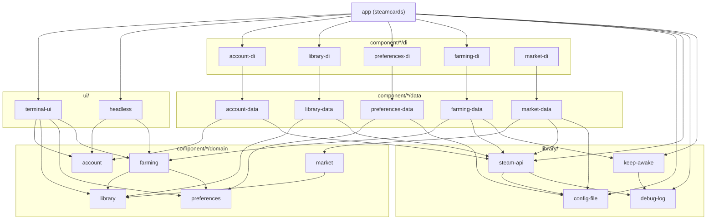

# Architecture reference

steamcards is built the way [streamdrops](https://github.com/joshgallantt/streamdrops)
is: the same layers, the same rules, and the same checks that keep them.

---

## The dependency rule

> *"Source code dependencies must point only inward, toward higher-level policies."*
> — Robert C. Martin, *Clean Architecture* (2017), Chapter 22

| Layer | Crates | May depend on |
| --- | --- | --- |
| Domain | `account`, `library`, `preferences`, `farming`, `market` | Domain |
| Data | `account-data`, `library-data`, `preferences-data`, `farming-data`, `market-data` | Domain, Library |
| DI | `account-di`, `library-di`, `preferences-di`, `farming-di`, `market-di` | Domain, Data, Library |
| Library | `config-file`, `debug-log`, `keep-awake`, `steam-api` | Library |
| Presentation | `terminal-ui`, `headless` | Domain |
| App | `steamcards` | Domain, DI, Library, Presentation |

Two things enforce this table:

1. **The compiler.** A crate can only `use` what its `Cargo.toml` lists. No
   domain crate lists a data crate, so an import pointing the wrong way does
   not resolve.
2. **[`app/tests/dependency_rule.rs`](../app/tests/dependency_rule.rs).** This
   reads every manifest through `cargo metadata` and fails on any arrow the
   table doesn't allow. It also fails if a production dependency enables
   `test-support`, and if a domain crate uses a component its own table
   doesn't name: `farming` may use `library` and `preferences`, `market`
   only `library`, so farming and the market never meet.

Dev-dependencies are exempt. A test may reach anywhere it needs to.

---

## Domain layer

The domain starts from its entities:

- **`SteamLibrary`**, in `library`: the games on the account that have
  trading cards. It holds each game once, and knows the drops received and
  still to come, and how many games have had every drop.
- **`Game`**: one of those games, by app ID: its hours, its `CardDrops`
  (received and still to come), its badge level and its card set. Drops and
  the set are two measures, and neither stands in for the other: drops are
  what farming works through, the set is what a badge needs.
- **`Card`**: a card in a game's set, and how many the account has. The
  same card can drop more than once, so that's a count, and copies beyond
  one are spares.
- **`CardAsset`**: one copy of a card the account holds, by its asset ID:
  the game whose set it's from, its name, its market hash name, and whether
  it's a foil, marketable and tradable. Each copy that drops is its own. It
  says which card dropped, and is what selling one takes.
- **`Account`**, in `account`: the one Steam account, and whether Steam still
  takes its sign-in. One account only, by design.
- **`Preferences`**, in `preferences`: priority games, skipped games, "only
  priority", and whether to appear online while farming.
- **`FarmingSession`**, in `farming`: this session of farming, from the first
  run of the farmer until the user signs out, another account signs in, or
  steamcards quits, through pauses. It holds every `Drop` (one per copy that
  dropped, which card it was once that's known, and which copy, from the
  account's own counts), the `Stretch`es of what was played and how, the
  games finished, and what the games it farms had left at the start. From
  it, `forecast()` learns how long the rest should take.
- **`Money`**, in `market`: an amount in hundredths of a `Currency`, Steam's
  `ECurrency` with Valve's own format for it. Amounts in different
  currencies are never added or converted.
- **`Wallet`**: the account's currency, and the fees Steam takes from a sale,
  with Valve's fee rules (`buyer_pays`, `seller_gets`) in whole numbers.
- **`Price`** and **`PriceQuote`**: what's known of a card's price (pending,
  known, no market, not marketable, failed), and what the market said, when.
  A game's **`SetPrices`** hold its normal cards and foils as the market
  lists them; the **`PriceBook`** holds every set, and each card's best
  offers looked up.
- **`Basis`** (list, net or instant) in **`MarketSettings`**, the market's own
  settings; **`MarketPause`**, Steam's pause on price lookups, which outlasts
  a restart.
- **`HeldCard`**: a card held, as far as its value goes: from a `CardAsset`,
  or just a name and a border. **`Held`** is what cards held are worth, at
  least; **`Estimate`**, what cards still to drop are likely worth.

Each domain crate has the same shape:

```
component/<name>/domain/src/
├── lib.rs           the public surface, and what the component is for
├── model.rs         entities and the component's error type
├── repository.rs    the contract the data layer is written to fit
├── use_cases.rs     one function per action: its type, and the constructor of the real one
└── test_support.rs  doubles, behind the `test-support` feature
```

`farming` adds `ranking.rs` (what to play, and how: pure), `forecast.rs`
(the time to finish: pure), `session.rs` (the session, kept between runs of
the farmer, and which card each drop was), `rules.rs` (every number it runs
on, with where it comes from) and `reporter.rs`. `market` adds `money.rs`
(`Currency`, with Valve's table of currencies as a `match`, and `Money`),
`valuation.rs` (what cards are worth: pure, so every figure can be checked
by hand) and `rules.rs`.

Entities are plain data with the rules that belong to the data itself
(`SteamLibrary::drops_left`, `Game::has_full_set`, `Preferences::wants`,
`Wallet::seller_gets`). They carry no serde derives: how a thing is stored is
the data layer's concern.

The market's valuations are functions of what's known: `value_of(price,
basis, wallet)`, `held_value(cards, unidentified, book, basis, wallet, now)`,
`expected_per_drop(set, basis, wallet)`, `value_left(library, order, book,
basis, wallet)` and `on_completion(held, left)`. A card that isn't priced
never counts as nothing, fees come off card by card, what's left to drop is
counted over the farm order (games never farmed drop nothing) and rounded
once for each game, and on the instant basis, cards still to drop are
valued after fees and say so.

### Use cases

Each use case is a **function value**: a documented type alias names it, and a
constructor builds the real one over the repositories. Call sites read
`(self.read_library)()`, and a test double is a closure.

| Component | Use case (constructor) | What it does |
| --- | --- | --- |
| account | `GetAccount` (`get_account`) | The signed-in account, or nobody. |
| | `RefreshAccount` (`refresh_account`) | Re-checks the saved sign-in in the background. |
| | `LinkAccount` (`link_account`) | Signs in with a QR code; the codes arrive on a channel. Errs with `LinkError`. |
| | `UnlinkAccount` (`unlink_account`) | Signs out: forgets the sign-in, and Steam ends it too, in the background. |
| library | `ReadLibrary` (`read_library`) | The whole library, games with drops left first. Errs with `LibraryError`. |
| | `LookAtGame` (`look_at_game`) | One game afresh: its drops, hours and card set. |
| | `LookAtFoils` (`look_at_foils`) | One game's foils afresh, from its foil badge: how many of each the account has. |
| | `DescribeCards` (`describe_cards`) | Which cards new items are, by asset ID, each copy on its own. Items that aren't cards are left out. |
| preferences | `GetPreferences` (`get_preferences`) | The current preferences. |
| | `SetGameTier` (`set_game_tier`) | Moves a game between priority (at a rank), indifferent and skip. |
| | `SetOnlyPriority` (`set_only_priority`) | Farm priority games only. |
| | `SetAppearOnline` (`set_appear_online`) | Show as online while farming, or appear offline. |
| farming | `FarmCards` (`farm_cards`) | Farms until cancelled, reporting `FarmingEvent`s. Each run carries on the session. |
| | `EndSession` (`end_session`) | Ends the session: the next run starts a new one. Signing out ends it, and so does signing in as another account. |
| market | `GetPrices` (`get_prices`) | The price book now. |
| | `WantPrices` (`want_prices`) | Which games to price, most urgent first. |
| | `WatchPrices` (`watch_prices`) | Prices the wanted games' sets until cancelled, each again once 6 hours old; waits out Steam's pause, and a market it couldn't ask (a minute, doubling to half an hour, nothing taken as failed); reports `MarketEvent`s. |
| | `RefreshPrices` (`refresh_prices`) | Prices a game's set again if it's over an hour old: a card of it dropped, or the user asked. |
| | `PriceOffers` (`price_offers`) | Order books for cards held and the chosen game's cards: the only use of the instant basis. |
| | `GetWallet` (`get_wallet`) | The wallet, once Steam has said. |
| | `GetMarketSettings` (`get_market_settings`), `SetBasis` (`set_basis`) | The value basis, and choosing it. |

The market's use cases that keep time take a `Clock`: the system's, or in a
test, one that moves with tokio's paused time.

### Use cases that call other use cases

`farm_cards` needs the library and what the user wants. It takes
`ReadLibrary`, `LookAtGame`, `LookAtFoils`, `DescribeCards` and
`GetPreferences`, not their repositories: so `farming` depends on `library` and `preferences` as domain
components, and never learns where either comes from. When a tier changes,
the farmer sees it within moments, through the same use case the screens
call.

`farm_cards` and `end_session` share a `SessionKeeper`, which the DI crate
makes: it keeps the session from one run of the farmer to the next.

`market` depends on `library` for its entities alone: it values `CardAsset`s,
a game's set and the drops still to come, handed to it. It never depends on
`farming`, nor `farming` on it; whatever shows a session's cards joins the
two.

### Repository contracts

| Contract | Declared in | Implemented by |
| --- | --- | --- |
| `AccountRepository` | `account` | `SteamAccountRepository` in `account-data` |
| `LibraryRepository` | `library` | `SteamLibraryRepository` in `library-data` |
| `PreferencesRepository` | `preferences` | `FilePreferencesRepository` in `preferences-data` |
| `PlayRepository` | `farming` | `SteamPlayRepository` in `farming-data` |
| `MarketRepository` | `market` | `SteamMarketRepository` in `market-data` |

Use cases return errors in the user's vocabulary (`LinkError::Refused`,
`UnlinkError::Unavailable`, `PreferencesError::Unavailable`,
`LibraryError::Unavailable`, `MarketError::Paused`). Repository contracts
return `anyhow::Result` with a reason written for the user; the use case
decides what it means. Farming's failures are the log lines the user reads,
so it passes them on as text, and so does the price watcher. A market lookup
that Steam's pause turns away isn't an error: it answers `Lookup::Paused`.

---

## Data layer

**The sign-in is a data concern.** The domain never sees a token.
`steam_api::Session` holds the saved sign-in, the "Steam rejected it" flag,
the signed-on CM connection and the token for steamcommunity.com. The
composition root builds **one** and hands it to every data crate: when the
farmer's sign-on is refused, the account screen shows the sign-in as expired
straight away, and signing in again clears it.

**So is the market's pace.** The same `Session` holds the one market queue
every `/market/` request goes through, one at a time (research §1.3): signed
in, 5 seconds apart and up to a second more; signed out, 12. A 429 pauses
every market request for 10 minutes, then one goes to see, doubling the
pause to an hour at most; `market-data` keeps the pause in the config file,
so it outlasts a restart. A server error is asked once more, 30 seconds
later; the site's quick retries never apply to the market. The `Session`
also keeps the wallet Steam tells of as it signs on (CM message 5528).

---

## Library layer

| Crate | Holds |
| --- | --- |
| `steam-api` | Steam in its own terms: a CM connection over WebSocket (framing, jobs, heartbeat, sign-on, games played, the wallet, what Steam says back, new items announced by asset ID), QR sign-in, the badge and card pages (foils' too), the inventory's items described over the CM connection, the market's `search/render` and `orderbook` through the one market queue, and `Session`. Its messages are Valve's own `.proto` definitions, written out with prost. A stand-in Steam server for tests, behind `test-support`. |
| `config-file` | The JSON files: the config file, readable by its owner only (`CredentialStore`, and the stored shape of preferences and of the market's settings and pause), and `PriceCache`, the market's prices in a file of their own beside it. It writes first and keeps second, so a failed write changes nothing in memory. |
| `debug-log` | `DebugLog`: a value saying where debug lines go. |
| `keep-awake` | `KeepAwake`: holds the computer awake with the system's own tool (`caffeinate`, `systemd-inhibit`) while games play. `farming-data` holds it while anything is played. |

---

## Presentation layer

### `terminal-ui`

- **`viewmodel/`** turns use cases into screen state and keys into use case
  calls. It depends on domain crates only. `Summary` and the functions
  beside it (`session_cards`, `value_to_come`, `card_price`) work out, each
  frame, what the dashboard shows from the farmer's status and session and
  the market's prices, using the market's own valuations. `Market` runs the
  market's use cases: pricing in the background, the games wanted first,
  and a game's set again when one of its cards drops.
- **`tui/`** draws that state with ratatui and forwards keys. It holds no
  business rule. `tui/dashboard.rs` draws the header, the summary, the
  games beside this session's cards, and the details pop-up's content;
  `tui/overlays.rs` the pop-ups; `tui/onboarding.rs` the steps of getting
  set up. Each piece of text comes in a few lengths and the longest that
  fits is drawn; `widgets::fitted` fails a test on any line wider than its
  area. `tui/preview.rs` renders every screen into an in-memory terminal
  with the domain crates' test doubles, and sweeps every state across
  sizes from 60×16 to 240×70. The design is in
  [docs/design/ui.md](design/ui.md).

### `headless`

The same `FarmCards`, printed as lines. Its own crate, so `--headless` can't
grow a dependency the dashboard doesn't have.

---

## Application layer: the composition root

[`app/src/settings.rs`](../app/src/settings.rs) reads everything the process
is told from outside, once: `$STEAMCARDS_CONFIG`, `$STEAMCARDS_DEBUG` and the
OS config directory.

[`app/src/composition/`](../app/src/composition/) is the one place concrete
types are named, in three phases, each handed only the one before it:

| Phase | Builds | From |
| --- | --- | --- |
| `DataAssembler` | `ConfigFile`, `PriceCache`, `steam_api::Session`, `KeepAwake` | `Settings` |
| `DomainAssembler` | `AccountComponent`, `LibraryComponent`, `PreferencesComponent`, `FarmingComponent`, `MarketComponent` | `DataAssembler` |
| `PresentationAssembler` | the terminal `App`, or a headless run | `DomainAssembler` |

`MarketComponent` takes the `Session`, the `ConfigFile` and a `PriceCache`
whose file sits beside the config (`prices.json`); `Settings` works out
where.

---

## Test strategy

| Tier | Where | Speaks | Doubles |
| --- | --- | --- | --- |
| Unit | `#[cfg(test)]` beside the code | the system's terms: `farm_order`, `unpack_multi` | local fakes |
| Acceptance | `component/*/domain/tests/` | the user's terms: `Player::starts_farming`, `reads(EventKind::Dropped)` | the component's `test-support` doubles |
| Data | `component/*/data/tests/`, `library/steam-api/tests/` | Steam's terms | a stand-in Steam server over a real WebSocket, and wiremock for steamcommunity.com |
| Screens | `ui/terminal-ui/src/tui/preview.rs` | what's on screen | `test-support` doubles |
| Architecture | `app/tests/dependency_rule.rs`, `app/tests/language_rules.rs` | the table at the top of this page, and the section below | none |

The farming acceptance tests run the real `farm_cards` on paused tokio time
over an in-memory Steam whose cards drop as its games are played: ten hours
without a drop costs milliseconds. The market's run the real watcher on
paused time over an in-memory market that pauses as Steam's queue does, and
value the design's own session by hand. The market queue's real pace, minutes
and all, is tested on paused time in `steam-api`; over real requests to
wiremock it runs at a quick pace, since paused time and real sockets don't
mix.

No test talks to Steam.

---

## Rust features this codebase doesn't use

| Feature | Why not | Instead | Checked by |
| --- | --- | --- | --- |
| **Extension traits** | Behaviour lives away from its type and shows up wherever the trait is imported. | Methods on your own types; plain functions for mapping, like `to_game(dto)`. | `language_rules.rs` |
| **`static` / `thread_local!` / `lazy_static!` state** | A global is a service locator: anything can reach it and nobody hands it in. | A value the composition root builds and passes in. | `language_rules.rs` |
| **`Deref` to an inner type** | Inheritance in disguise. | Hold the inner value and forward what's needed. | `language_rules.rs` |
| **Reading the environment or OS directories outside `app/src/settings.rs`** | A hidden input that no signature shows. | `Settings`, passed inward as arguments. | `clippy.toml` |
| **Glob imports** | They hide what a module depends on. | Name each import. | clippy |
| **`println!` / `eprintln!` outside presentation** | Only presentation owns the terminal. | Return it, or send it on a channel. | clippy |
| **`unsafe`** | Nothing here needs it. | — | `unsafe_code = "forbid"` |

---

## Module dependencies



Every arrow is a line in a `Cargo.toml`. `market-di` isn't assembled by the
app yet, so nothing points to it.
