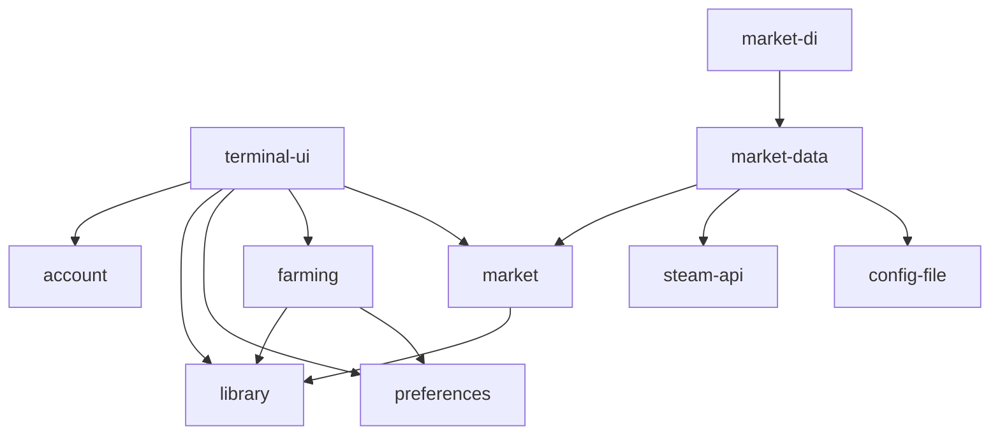

# The terminal UI

This is the specification for steamcards' new terminal UI. It is the single source of truth for building it: the layout at every size, every screen, the key map, the rules for text, numbers and colour, the domain the screens need, how quick-sell fits in later, the build order and tests, and the questions left for you. It was chosen from five designs; it starts from the one that put progress first and takes the best of the others.

It builds on three other documents, cited by name:

- [Research: market prices, card drops and selling](../research/market-and-session.md), cited as "research §n";
- [Research: farming Steam trading cards](../research/steam-card-farming.md);
- [Architecture reference](../architecture.md).

**How the mockups were made.** A script draws every mockup from one data set. It refuses to cut text: a word, figure or name that doesn't fit makes it fail. One set of rules, the ladder in §2.4, draws every size. The dashboard was drawn at every size from 60 × 16 to 240 × 70 (the states other than farming on a coarser grid), and every pop-up at the edges of every size class, and nothing was cut. Each mockup is exactly as wide and as tall as its terminal.

**Reading the mockups.**

- `[k]` is a keycap. On screen it's a dark letter on a light grey cap, the same width.
- `›` marks the chosen game. On screen its whole row is also a light-blue bar.
- `⠋` is one frame of the spinner.
- Colour doesn't show in text. §5.4 gives every element's colour.
- While a pop-up is open, what can still be seen of the dashboard, and the footer, are drawn faded on screen.

**The data set.** It's the one the five designs shared, with one late change, and it holds in every mockup:

| | |
| --- | --- |
| Account | alice, appears offline, wallet in pounds (GBP) |
| Session | Tue 29 Sep 2026, 09:14 to 17:31: "farming for 8h 17m" |
| At the start | 62 games with drops left, 252 drops |
| This session | 16 drops; 5 games finished (Hollow Knight, Inscryption, Hades, Celeste, Gorogoa); 57 games and 236 drops to go |
| The late change | The 13:30 drop is a second Zagreus (Hades, £0.08), not Megaera. Heavy Rain's set: Ethan none, Carter none, Madison ×2 (one dropped at 17:05), Norman none, Scott ×1 |
| Value, list prices | ≥ £1.45 · 3 unpriced (≥ £1.14 after fees; ≥ £0.74 sold now) |
| Estimates | ≈ 4d 21h to finish, 80% likely 3d 13h – 6d 15h; ≈ £16.79 on completion, excl. foils |
| Farming now | Heavy Rain (app 960910): 4.0h, no badge, 3 of 4 drops, 2 of 5 cards in the set, 1 spare; on it since 16:53; next look in 4m |
| Invented | Queued games' prices; the library's totals (183 of 421 drops across 63 games); Warframe, set aside once; the end-of-library summary |

## 1. The idea

steamcards runs for days: this library has 252 drops across 62 games. So a glance must tell **how far through it you are, when it will be done, and what it's worth**. Then **what's farming now**.

Everything else follows in that order:

1. **Progress.** The time to finish with its likely range; this session's drops and the library's; the money: this session's value (at least), what's still to drop, and the value on completion.
2. **Now.** The game being played, its drops, the next look, and when its last card should drop.
3. **The farm queue, as a flight plan.** Every game in the order it will be farmed, with its drops as pips, what it's worth and when it should be done. Ranking happens here, as today.
4. **The chosen game.** Its set, with how many of each card you have and what each is worth, and its farm priority.
5. **This session's cards.** Every copy that dropped, its price and a running total, with the day drawn as a track.

A game has two measures, and neither stands in for the other. **Drops** are what farming works through: Heavy Rain has had 3 of its 4. **The set** is what a badge needs: you have 2 of Heavy Rain's 5 cards. The same card can drop twice, so the set shows a count per card, never a tick, and the haul marks a second copy.

Nothing is ever cut off. Text wraps whole. Columns go whole, by a written ladder. Lists say how much more there is. Pop-ups cover whole panels.

## 2. Layout and information architecture

### 2.1 Regions

The dashboard, top to bottom. At the large size the Now panel, the chosen game and this session's cards stand in a right-hand column beside Progress and the queue.

| Region | Rows | What it shows |
| --- | --- | --- |
| **Header** | 1 | The pill; the farming state and for how long; the account; "appears offline"; "keeping awake" while games play; help. Later, quick-sell's count of listings to confirm. |
| **Progress** | 5 inside at L; 4 at M (5 from 36 rows); 3 at S and XS | The time to finish (big at L), its 80% band and the day it points at; the rate it learnt; this session's drops and games out of those at the start; the library's drops and games; this session's value at least, with the unpriced count; still to drop; on completion; spares. At M and below, a Now line: the farming game, its pips, the next look, its last card. At M from 36 rows, the session track. At S the library's drops and games ride in Progress's top border; at XS, in the queue's bottom border. |
| **Now** | 8, at L only | The game being played and how; its pips; on it for how long; the last drop and which card it was; what the next card could be; when its last card should drop. In other states, what's happening and what happens next. |
| **Farm queue** | the rest of the left side | The sections Priority, Indifferent, Skipped and Done (hidden until c). Each game: the selection, its state, its rank, name, STATUS words (L), hours, drops as k/N and pips, ≈ value of a drop, ≈ value left, ≈ done in. Each section's rule carries its value left. The border counts what's above and below. |
| **The chosen game** | about 12–16, at M and L | Its app ID and badge, what's happening to it, hours, drops, value; its set, a count per card, normal and foil prices; how many cards short of a badge, and what they'd cost; the farm-priority radio. It follows the cursor. |
| **This session** | the rest of the right side, at M and L | Every drop: time, card (★ for a foil, "2nd copy" for a spare), game, price, running total. At L, the session track on top and the other bases below. The border counts earlier cards, unpriced ones and spares. |
| **Strip** | 1 | The latest event, or a flash that confirms a key for 4 seconds. An alert (prices paused by Steam, reconnecting, sign-in expired) holds the strip while it lasts, between flashes. A drop's line names its card and price once known. |
| **Footer** | 1 | Key hints, dropped by priority; help and quit go last. |

**Where each figure comes from.** "Exists" means the domain has it today. The new types are in §6.

| On screen | From | Status |
| --- | --- | --- |
| ● farming for 8h 17m · since 09:14 | `FarmingSession.started_at`; today the view model's `running_for` | new: farming session |
| Steam ● alice, ✕ sign-in expired | `Account { name, expired }` | exists |
| appears offline | `Preferences.appear_online` | exists |
| keeping awake | `FarmingStatus.playing` is not empty | exists |
| ≈ 4d 21h to finish, 80%: 3d 13h – 6d 15h, around Sun 4 Oct | `Forecast { eta, band }` from `farming::forecast()` (research §3.1) | new: farming session |
| 2.1 drops an hour, learnt from 16 in 7h 40m farming alone | `Forecast.rate`; K and T from `FarmingSession.drops` and `stretches` | new: farming session |
| incl. ≈ 3h of building hours | `Forecast.hours_term` | new: farming session |
| assuming 30 min a drop | `Forecast.assumed` (before the second drop) | new: farming session |
| This session 16 of 252 drops · 5 of 62 games | `FarmingSession.drops.len()`, `drops_left_at_start`, `finished.len()`, `games_at_start` | new: farming session |
| Your library 183 of 421 drops · 5 of 63 games | `SteamLibrary::drops_received()`, `drops_total()`, `games_done()`, `games().len()` | new methods on an existing entity |
| ≥ £1.45 this session · 3 unpriced | `market::held_value(&[HeldCard], unidentified, &PriceBook, basis, &Wallet, now) -> Held`, each `HeldCard` from a drop's `CardAsset` | new: market |
| ≈ £15.34 still to drop | `market::value_left(&SteamLibrary, &PriceBook, basis, &Wallet) -> Estimate` | new: market |
| ≈ £16.79 on completion, excl. foils | `market::on_completion(&Held, &Estimate) -> Estimate { value, excl_foils, unpriced_games, basis }` | new: market |
| 2 spares this session: £0.13 | the session's drops whose `copy` is 2 or more, priced | new: farming session + market |
| ▶ Heavy Rain, ▷ building hours, ‖ waiting | `FarmingStatus { status, playing, mode, blocked_by }` | exists |
| next look in 4m | `FarmingStatus.next_look` | exists |
| looks every 5 min: it's the last card | `FarmingStatus.look_every` (the rule in force, made visible) | new: farming |
| on it 38m, since 16:53 | the last `Stretch.from` | new: farming session |
| Last drop 8m ago · ⠋ finding out which card | the last `Drop.at`; `DropCard::Identifying` | new: farming session |
| Next card: one of its 5, 3 of them new to you, £0.04 – £0.06 | `Game.cards` (owned counts) and its `SetPrices` | exists + new: market |
| Last card ≈ 17:55 | `Forecast.per_game` for the farming game | new: farming session |
| Queue sections, #1, ✕ | `Preferences::tier`, `FarmingStatus.order` | exists |
| HOURS, DROPS 3/4 | `Game.hours`, `Game.drops` | exists |
| Pips ●◆★○ | `Game.drops`, and this session's drops of that game (with their foil flag) | exists + new: farming session |
| STATUS ready, needs 0.8h | `farming::hours_to_go(&Game)` | new (the rule, made public) |
| STATUS set aside | `FarmingStatus.set_aside` | new: farming (the farmer keeps it today, privately) |
| ≈ A DROP, ≈ LEFT | `market::expected_per_drop(&SetPrices, basis, &Wallet)`, × `Game.drops.remaining` | new: market |
| ≈ DONE IN | `Forecast.per_game`, cumulative in farm order | new: farming session |
| ✓ 16:48 on a done game | `FarmingSession.finished` | new: farming session |
| ≈ £15.34 left on a section's rule | the sum of its games' ≈ LEFT | new: market |
| App 960910 · no badge yet | `Game.app_id`, `Game.badge_level` | exists |
| The set · 2 of 5 cards · 1 spare | `Game::cards_collected()`, `Game::spares()`, `Game.cards.len()` | exists; `spares()` new |
| Madison ×2, Scott ×1, Ethan — | `Card.owned` | exists (shown as a count, never a tick) |
| NORMAL, FOIL | `SetPrices.normal`, `SetPrices.foil`, matched to the set by the card's name | new: market |
| 3 short of a badge: ≈ £0.15 to buy them | the cards with none owned, at their list prices | derived |
| SELL NOW (details, L) | the order book of the chosen game's cards, fetched when its details open | new: market |
| The set · not read yet | `Game.cards` is empty until the game's card page is read (`LookAtGame`) | exists |
| 13:30 Zagreus, 2nd copy | `Drop.copy` | new: farming session |
| ★ Thanatos (foil) | `CardAsset.foil` | new: library |
| £0.09, …, no market, —, ?, £0.06 8h | `Price` for the card's `market_hash_name` in the `PriceBook`, on the basis; `PriceQuote.fetched_at` | new: market |
| running total, ≥ from the first gap | a fold over the session's drops | view model |
| Other bases: ≥ £1.14 after fees · ≥ £0.74 if sold now | `held_value()` on the other two bases | new: market |
| ‖ prices paused by Steam until 17:41 | `MarketPause.until` | new: market |
| ‖ 2 to confirm in the Steam app | `Listing`s in `AwaitingConfirmation` | later: quick-sell |
| £ GBP (account) | `Wallet.currency` (CM message 5528) | new: market |

### 2.2 Views and pop-ups

| Key | Pop-up | What it shows | Mockup |
| --- | --- | --- | --- |
| enter | **Game details** | Everything about the chosen game: what's happening and why, its drops and this session's, its value, the whole set with counts, normal, foil and (at L) sell-now prices, how many short of a badge, when it was priced, its farm priority. ↑↓ moves to the next game without closing it. | i |
| h | **This session's cards** | Every drop with a running total; the session track; by game, with spares; the session at each basis; the pace; why any card is unpriced. | j |
| m | **The market** | Where every price comes from: each game's card and foil range, its value a drop and left, and when it was priced; what each price state means; the cards this session that aren't priced and why; a banner while Steam has paused lookups. Later it gains the tabs Listings and Quick-sell. | h |
| g | **Games & settings** | Picking priority games in order (as today), only priority, appear offline, the value basis with this session at each, and quick-sell (later). | l |
| a | **Account** | The account, sign in again, appear offline, sign out (d, then y), the wallet's currency, keeping awake. | m |
| a, enter | **Sign in** | The QR code, as today. | m |
| l | **Log** | Every event, scrollable, following the newest, as today. | log |
| ? | **Help** | The whole key map, the symbols, the money marks. | k |
| q | **Quit?** | While farming, as today: "Stop farming and quit? Cards that dropped stay in your Steam inventory." | — |

### 2.3 Size classes

| Class | Needs | Layout |
| --- | --- | --- |
| L | 200 × 40 and up | Left: Progress (7 rows, the big time to finish) over the queue. Right, 76 columns (from 217 columns, the spare too): Now, the chosen game, and this session with its track. |
| M | 100 × 26 and up | Progress across the top, 6 rows (7 from 36 rows, adding the track). The queue on the left; the chosen game and this session on the right, 40 to 66 columns. |
| S | 72 × 20 and up | Progress in 3 rows. The queue full width. The chosen game opens with enter, this session with h. |
| XS | 60 × 16 and up | Three bare rows, then the queue. |
| Too small | under 60 × 16 | What size it needs, and the headline: the state, the drops, the time to finish, the value. |

A window takes the largest class it meets in both width and height. Spare columns go to the queue's name column, up to 56, and then, at L, to the right-hand column.

What the queue shows, at the sizes mocked:

| Window | Class | Games in view | Queue columns |
| --- | --- | --- | --- |
| 209 × 49, the user's | L | 34, as today | STATUS, HOURS, DROPS, pips, ≈ A DROP, ≈ LEFT, ≈ DONE IN |
| 200 × 50 | L | 35 | the same |
| 146 × 40 | M | 25 | HOURS, DROPS, pips, ≈ LEFT, ≈ DONE IN |
| 120 × 30 | M | 16, as today | HOURS, DROPS, pips, ≈ DONE IN |
| 100 × 26 | M | 12 | HOURS, DROPS, ≈ DONE IN |
| 80 × 24 | S | 11 | HOURS, DROPS, pips, ≈ DONE IN |
| 60 × 16 | XS | 6 | HOURS, DROPS, ≈ DONE IN |

### 2.4 What goes first as the window shrinks

**Narrower or shorter, the classes step down:**

1. **Below 200 columns or 40 rows (L to M).** The big digits and the Now panel go. Progress spans the top in 4 rows, its fourth row the Now line; from 36 rows it keeps a fifth, the session track. The queue drops its STATUS words, then ≈ A DROP, by the column rule. The haul loses its track, which stays in h.
2. **Below 100 columns or 26 rows (M to S).** The right-hand column goes. The chosen game opens with enter; this session with h. The strip still names each card as it drops. Progress keeps 3 rows, and the library's drops and games move into its top border.
3. **Below 72 columns or 20 rows (S to XS).** Progress loses its border and becomes three bare rows; the library's drops move to the queue's bottom border.
4. **Below 60 × 16.** The too-small screen.

**The queue's column rule.** The name keeps at least 24 columns. Optional columns join in this order while it does: ≈ DONE IN, pips, ≈ LEFT, ≈ A DROP, STATUS. Gaps between columns are 2 when the queue is 100 columns or more inside, else 1. In a row they stand in this order: STATUS, HOURS, DROPS, pips, ≈ A DROP, ≈ LEFT, ≈ DONE IN. Where STATUS is gone, a set-aside game's ≈ DONE IN cell reads "set aside" instead.

**Inside each region**, first to go on the left:

| Region | Gives up, in this order | Never gives up |
| --- | --- | --- |
| Header | "keeping awake"; "· since 09:14"; the word "Steam"; a long note shortens ("Hades is being played on another device" to "Hades is played elsewhere"); the account name; the note shortens again; the word "for"; the help label; the note; the time; the help key (the footer has it) | the pill, the state, "appears offline"; later, the count of listings to confirm, which goes short ("‖ 2 to confirm") only after everything else |
| Progress, L | the "To go" row's set-aside count; the title's hours term | the big time to finish and its band, both gauges, all four value rows |
| Progress, M | "around Sun 4 Oct"; the gauges (under 8 columns each); the Now line's pips, then its last card | the time to finish, the session's and library's drops and games, the value column, the Now line's game and next look |
| Progress, S | the band; "5 of 62 games"; "on completion" becomes "when done"; the border's "5 of 63 games", then its library drops | the time to finish, ≥ value and unpriced count, drops, the Now line |
| Progress, XS | "5 of 62 games"; the Now line's pips, then its last card | the time to finish, drops, ≥ value, unpriced count, ≈ on completion, the game and next look |
| Queue rules | the longest hint ("after your priorities"), then "closest to dropping first", then the value ("≈ £15.34 left") | the section's name and count |
| The chosen game | the "short of a badge" line; the set table becomes two cards a row, then one a row; at M the haul goes before the set's prices do (h still opens it); last, the set becomes one line ("Set: 2 of 5 · 1 spare · [enter]"); the radio's descriptions | its state, hours, drops, the radio |
| This session, M | cards from the oldest end ("9 earlier ↑") | the newest cards, the ≥ total |
| This session, L | "Other bases"; the track's labels, then the track; cards from the oldest end | the table's columns, the ≥ total |
| Strip | the event's detail ("· finding out which card") | the time, the glyph, what happened |
| Footer | hints by priority: times, show done, skip, basis, rank, market and log, games, account, pause, haul, details, choose; the first that doesn't fit ends the row | help and quit |

**Taller**, the extra rows go to: the queue first (more games); at M, the chosen game's full set table once the haul keeps 7 cards, then the haul; at L, the haul, which takes its two-row track once all 16 cards fit, then "Other bases".

**Shorter**, rows go in this order: the queue's column header (below 18 rows); at M, the chosen game's set table, to two cards a row, then one; at M, the haul, when the set's prices would leave it under 3 cards (h still opens it). The queue always keeps 4 games; below that the window is too small.

**Never dropped, at any size:** the state and its next look; the time to finish (≈); this session's drops; this session's value (≥, with its unpriced count); "appears offline"; the queue's sections, names, hours and drops; the ranking keys; help and quit.

### 2.5 Pop-ups

A pop-up covers **whole panels, never part of one**. It takes the right-hand column (below Now, at L) when its content fits there, otherwise the whole body between the header and the strip. The header, the strip and the footer stay in view, so the state, a drop or a flash are always on screen. Nothing half-hidden can show at a pop-up's edge.

| Pop-up | L | M | S, XS |
| --- | --- | --- | --- |
| Game details | right-hand column, below Now | whole body | whole body |
| Account, and its sign-out confirm | right-hand column, below Now | right-hand column | whole body |
| Sign in (QR) | right-hand column, below Now | whole body | whole body |
| Quit? | right-hand column, below Now | right-hand column | whole body |
| This session's cards, the market, games & settings, log, help | whole body | whole body | whole body |

- Its border is ACCENT, as today. Its keys go in its bottom border when they all fit, or on its last lines when they don't.
- Text longer than its area scrolls, and the border says how much is below: "15 more ↓ [PgDn]".
- While it has the keys, what can still be seen of the dashboard is faded, and so is the footer. The selection still moves in a faded queue when ↑↓ moves between games in the details.
- A flash goes on the strip, which no pop-up covers.

### 2.6 Decisions

Where the designs or the judges disagreed, this is what was decided, and why.

| Question | Decided | Why |
| --- | --- | --- |
| One dashboard, or separate views? | One dashboard, with the separate views' pop-up rule | The queue and the ranking keys stay on the landing screen at every size; whole-panel pop-ups remove every half-hidden word. |
| How big is the progress panel? | 5 rows inside at L, beside a right-hand column | The user's 209 × 49 window shows 34 games, as today; the bigger panel showed 29. |
| Where does L start? | 200 columns, not 160 | Below 200 the big-digit panel can't sit beside the right-hand column and leave the queue its columns. |
| Shorten long game names, or wrap them? | Shorten at a word boundary | Rows of one height scan and scroll better; the details show the full name. |
| Show a per-game "done in"? | Yes, rounded more coarsely the further off it is, with ≈ in its header | It explains the headline row by row; the steps (§5.2) keep it no sharper than its error. |
| Tiles for this session's cards? | A table and a track | Tiles cost the queue rows; the pips carry each game's cards instead. |
| Where is the value basis kept? | In market, as `MarketSettings` | preferences never needs a market type, and farming never learns about money. |
| What's a held card worth? | The latest price for its hash | What you hold is worth what it would sell for now, so staleness is one rule: a set's age. |
| Show "sold" once quick-sell exists? | Not until market history is read | Steam's listings page lists only active and pending listings; a listing that leaves it may have sold or been taken off. |
| Keep the big box-drawing digits? | At L only | They answer "when will it finish" at a glance, and there's room; below 200 columns a bold line does it. |
| Where does the flash's ▸ go? | ACCENT | Only the selection is blue. |
| Borders on the dashboard? | Rounded and dim, as today | The family look is kept. |

## 3. Screens

### a. The dashboard, farming one game alone

**200 × 50.** The time to finish is the biggest thing on screen. The queue is a flight plan: its last column says when each game should be done, in the order they'll be farmed. The right-hand column holds the game being farmed, the chosen game (the same one, until the cursor moves) and every card this session. Colours: the Progress gauge for this session and ◆ pips are green, ★ is magenta, hours under 3 are yellow, the chosen game's border and the Heavy Rain row are the light-blue selection.

```mockup 200x50 dashboard, farming alone (L)
 steamcards   ● farming for 8h 17m · since 09:14                                                                                              Steam ● alice · appears offline · keeping awake   [?] help
╭ Progress ───────────────────── 2.1 drops an hour, learnt from 16 in 7h 40m farming alone · incl. ≈ 3h of building hours ─╮╭ Now ─────────────────────────────────────────────────────── since 16:53 ─╮
│   ╷ ╷   ╷  ╶─┐ ╶┐  ╷                This session  16 of 252 drops · 5 of 62 games   VALUE · list prices  [b]             ││ ▶ Farming Heavy Rain                                     next look in 4m │
│ ≈ └─┤ ┌─┤  ┌─┘  │  ├─┐  to finish   ━━━──────────────────────────────────────   6%  ≥ £1.45 this session · 3 unpriced    ││   ●  ◆  ◆  ○    3 of 4 drops · 1 to go · on it 38m                       │
│     ╵ └─┘  └─╴ ╶┴╴ ╵ ╵              Your library  183 of 421 drops · 5 of 63 games  ≈ £15.34 still to drop               ││   Last drop   8m ago, at 17:23 · ⠋ finding out which card                │
│ around Sun 4 Oct, if left running   ━━━━━━━━━━━━━━━━━━───────────────────────  43%  ≈ £16.79 on completion, excl. foils  ││   Next card   one of its 5 cards, 3 of them new to you: £0.04 – £0.06,   │
│ 80%: 3d 13h – 6d 15h                To go         57 games · 236 drops              2 spares this session: £0.13         ││               or rarely a foil, £0.35 – £0.60                            │
╰──────────────────────────────────────────────────────────────────────────────────────────────────────────────────────────╯│   Last card   ≈ 17:55, in about 25m · then LIMBO                         │
╭ Farm queue ────────────────────────────────────────────────────────────────── 57 to go · 236 drops · ≈ 4d 21h to finish ─╮╰ looks every 5 min: it's the last card ───────────────────────────────────╯
│    #   GAME                                      STATUS      HOURS  DROPS                  ≈ A DROP    ≈ LEFT  ≈ DONE IN │╭ Heavy Rain ─────────────────────────────────────────────────── selected ─╮
│ ── PRIORITY · 0 · nothing ranked yet: select a game and press [1] to farm it first ───────────────────────────────────── ││ App 960910 · no badge yet · ▶ farming now                                │
│ ── INDIFFERENT · 57 · farming ────────────────────── ≈ £15.34 left · after your priorities · closest to dropping first ─ ││ 4.0h on record · 3 of 4 drops · 1 to go · ≈ £0.05 a drop                 │
│ ›▶     Heavy Rain                                farming      4.0h    3/4 ●◆◆○                £0.05     £0.05        25m ││ ── The set · 2 of 5 cards · 1 spare ────────────────────── list prices ─ │
│        LIMBO                                     ready        3.4h    3/5 ●●●○○               £0.06     £0.12     1h 30m ││    CARD           OWNED   NORMAL    FOIL                                 │
│        Oxygen Not Included                       ready        3.4h    3/5 ●●●○○               £0.07     £0.14     2h 30m ││    Ethan              —    £0.05   £0.42                                 │
│        Anno 1800                                 ready        3.5h    5/8 ●●●●●○○○            £0.09     £0.27         4h ││    Carter             —    £0.04   £0.35                                 │
│        Crypt of the NecroDancer                  ready        3.4h    4/7 ●●●●○○○             £0.05     £0.15         5h ││    Madison           ×2    £0.05   £0.60   ◆ one today, 17:05            │
│        Kerbal Space Program                      ready        3.4h    4/7 ●●●●○○○             £0.06     £0.18     6h 30m ││    Norman             —    £0.06   £0.51                                 │
│        Outlast 2                                 ready        3.4h    4/7 ●●●●○○○             £0.05     £0.15         8h ││    Scott             ×1    £0.04   £0.38                                 │
│        People Playground                         ready        3.4h    4/7 ●●●●○○○             £0.04     £0.12     9h 30m ││    3 short of a badge: ≈ £0.15 to buy them, at list prices               │
│        We Were Here Expeditions: The FriendShip  ready        8.7h    3/6 ●●●○○○              £0.04     £0.12        11h ││ ── Farm priority ─────────────────────────────────────────────────────── │
│        Desperados III                            ready        3.4h    5/9 ●●●●●○○○○           £0.07     £0.28        13h ││  ○ Priority     [1-9]  farmed first, in rank order                       │
│        Graveyard Keeper                          ready        3.4h    5/9 ●●●●●○○○○           £0.05     £0.20        15h ││  ◉ Indifferent  [ 0 ]  after your priorities                             │
│        MONSTER HUNTER RISE                       ready        3.4h    5/9 ●●●●●○○○○           £0.08     £0.32        17h ││  ○ Skip         [ x ]  never farmed                                      │
│        Halls of Torment                          ready        3.4h   6/11 ●●●●●●○○○○○         £0.04     £0.20        19h │╰ [enter] everything about it   [o] card page ─────────────────────────────╯
│        Cult of the Lamb                          ready        3.4h   7/13 ●●●●●●●○○○○○○       £0.06     £0.36        22h │╭ This session · 16 cards ────────────────────────── ≥ £1.45 · 3 unpriced ─╮
│        Days Gone                                 ready        3.4h   7/13 ●●●●●●●○○○○○○       £0.09     £0.54      1d 1h ││ 09:14 ───◆──◆───◆┼─◆──◆────◆┼──◆──◆───★───◆┼─◆───◆┼──◆──◆┼◆─◆─ 17:31 now │
│        Little Nightmares II                      ready        3.4h   8/15 ●●●●●●●●○○○○○○○     £0.06     £0.42      1d 4h ││       Hollow Knight             Hades             Gorogoa                │
│        Monster Train                             ready        3.4h   8/15 ●●●●●●●●○○○○○○○     £0.05     £0.35      1d 8h ││                 Inscryption               Celeste     Heavy Rain         │
│        TCG Card Shop Simulator                   needs 0.8h   2.2h    4/6 ●●●●○○              £0.04     £0.08     1d 12h ││ TIME   GAME              CARD                            LIST      TOTAL │
│        FOR HONOR                                 needs 0.9h   2.1h   6/11 ●●●●●●○○○○○         £0.05     £0.25     1d 14h ││ 09:44  Hollow Knight     Hornet                         £0.09      £0.09 │
│        Warhammer 40,000: Dawn of War II…         needs 1.1h   1.9h    6/7 ●●●●●●○             £0.08     £0.08     1d 15h ││ 10:12  Hollow Knight     Zote                           £0.07      £0.16 │
│        Against the Storm                         needs 1.4h   1.6h    6/9 ●●●●●●○○○           £0.06     £0.18     1d 16h ││ 10:41  Hollow Knight     The Knight                     £0.11      £0.27 │
│        Stray                                     needs 1.6h   1.4h    3/4 ●●●○                £0.14     £0.14     1d 17h ││ 11:15  Inscryption       Leshy                          £0.06      £0.33 │
│        Total War: ATTILA                         needs 2.3h   0.7h    3/6 ●●●○○○              £0.07     £0.21     1d 18h ││ 11:43  Inscryption       Stoat                          £0.05      £0.38 │
│        Undertale                                 needs 2.3h   0.7h    3/6 ●●●○○○              £0.12     £0.36     1d 20h ││ 12:20  Inscryption       Stinkbug                       £0.05      £0.43 │
│        Palworld                                  needs 2.6h   0.4h    5/9 ●●●●●○○○○           £0.09     £0.36     1d 21h ││ 12:58  Hades             Zagreus                        £0.08      £0.51 │
│        Papers, Please                            needs 2.6h   0.4h    4/7 ●●●●○○○             £0.08     £0.24     1d 23h ││ 13:30  Hades             Zagreus, 2nd copy              £0.08      £0.59 │
│        Witch It                                  needs 2.6h   0.4h    5/9 ●●●●●○○○○           £0.03     £0.12         2d ││ 14:02  Hades             ★ Thanatos (foil)              £0.62      £1.21 │
│        The Binding of Isaac: Rebirth             needs 2.7h   0.3h   7/13 ●●●●●●●○○○○○○       £0.07     £0.42      2d 3h ││ 14:35  Hades             Nyx                            £0.09      £1.30 │
│        FATE                                      needs 2.8h   0.2h    3/5 ●●●○○               £0.05     £0.10      2d 6h ││ 15:09  Celeste           Madeline                           …    ≥ £1.30 │
│        Baldur's Gate 3                           needs 3.0h   0.0h   6/12 ●●●●●●○○○○○○        £0.13     £0.78      2d 9h ││ 15:41  Celeste           Badeline                       £0.06    ≥ £1.36 │
│        Cities: Skylines                          needs 3.0h   0.0h    3/6 ●●●○○○              £0.06     £0.18      2d 9h ││ 16:15  Gorogoa           The Boy                        £0.04    ≥ £1.40 │
│        Danganronpa 2: Goodbye Despair            needs 3.0h   0.0h   5/10 ●●●●●○○○○○          £0.08     £0.40     2d 12h ││ 16:48  Gorogoa           The Fruit                  no market    ≥ £1.40 │
│        Danganronpa: Trigger Happy Havoc          needs 3.0h   0.0h   5/10 ●●●●●○○○○○          £0.07     £0.35     2d 15h ││ 17:05  Heavy Rain        Madison, 2nd copy              £0.05    ≥ £1.45 │
│        Dead by Daylight                          needs 3.0h   0.0h    4/8 ●●●●○○○○            £0.04     £0.16     2d 15h ││ 17:23  Heavy Rain        ⠋ finding out which card           …    ≥ £1.45 │
│        Deep Rock Galactic                        needs 3.0h   0.0h    0/5 ○○○○○               £0.07     £0.35     2d 18h ││ Other bases: ≥ £1.14 after fees · ≥ £0.74 if sold now                    │
╰ ▶ farming  ▷ building hours  ‖ waiting  #1 priority  ✕ skipped   ● had  ◆ this session  ★ foil  ○ to come ─── 23 more ↓ ─╯╰ [h] every card, by game ─────────────────────────────── 2 spares, £0.13 ─╯
 17:23  ✓ A card dropped for Heavy Rain — 1 to go · finding out which card
 [↑↓] choose game  [enter] details  [1-9] rank  [x] skip  [c] show done  │  [h] haul  [m] market  [b] list/net/instant  [t] times  [g] games  [a] account  [l] log  [p] pause  [?] help  [q] quit
```

- Heavy Rain's pips read ●◆◆○: one drop before this session, two today, one to come. Its set reads Madison ×2, Scott ×1, and "—" for the three you don't have. The 17:05 Madison was a second copy, so the haul marks it "2nd copy" and the set didn't move.
- The track draws the day: ◆ a drop, ★ the foil, ┼ where one game handed over to the next, and each game's name under its stretch, on two rows so every name fits.
- STATUS says "ready" (3 hours or more) or how many hours a game still needs, so the yellow hours are never the only sign.
- With t, ≈ DONE IN shows clock times instead: 17:55, 19:00, 20:00, 21:30, … Wed 05:00 … Thu … Sun.

**209 × 49, the user's own window.** The same layout. The queue shows 34 games, as many as today's screen, and says "24 more ↓".

```mockup 209x49 dashboard, farming alone, the user's window (L)
 steamcards   ● farming for 8h 17m · since 09:14                                                                                                       Steam ● alice · appears offline · keeping awake   [?] help
╭ Progress ────────────────────────────── 2.1 drops an hour, learnt from 16 in 7h 40m farming alone · incl. ≈ 3h of building hours ─╮╭ Now ─────────────────────────────────────────────────────── since 16:53 ─╮
│   ╷ ╷   ╷  ╶─┐ ╶┐  ╷                This session  16 of 252 drops · 5 of 62 games            VALUE · list prices  [b]             ││ ▶ Farming Heavy Rain                                     next look in 4m │
│ ≈ └─┤ ┌─┤  ┌─┘  │  ├─┐  to finish   ━━━───────────────────────────────────────────────   6%  ≥ £1.45 this session · 3 unpriced    ││   ●  ◆  ◆  ○    3 of 4 drops · 1 to go · on it 38m                       │
│     ╵ └─┘  └─╴ ╶┴╴ ╵ ╵              Your library  183 of 421 drops · 5 of 63 games           ≈ £15.34 still to drop               ││   Last drop   8m ago, at 17:23 · ⠋ finding out which card                │
│ around Sun 4 Oct, if left running   ━━━━━━━━━━━━━━━━━━━━━━────────────────────────────  43%  ≈ £16.79 on completion, excl. foils  ││   Next card   one of its 5 cards, 3 of them new to you: £0.04 – £0.06,   │
│ 80%: 3d 13h – 6d 15h                To go         57 games · 236 drops · 1 set aside         2 spares this session: £0.13         ││               or rarely a foil, £0.35 – £0.60                            │
╰───────────────────────────────────────────────────────────────────────────────────────────────────────────────────────────────────╯│   Last card   ≈ 17:55, in about 25m · then LIMBO                         │
╭ Farm queue ─────────────────────────────────────────────────────────────────────────── 57 to go · 236 drops · ≈ 4d 21h to finish ─╮╰ looks every 5 min: it's the last card ───────────────────────────────────╯
│    #   GAME                                               STATUS      HOURS  DROPS                  ≈ A DROP    ≈ LEFT  ≈ DONE IN │╭ Heavy Rain ─────────────────────────────────────────────────── selected ─╮
│ ── PRIORITY · 0 · nothing ranked yet: select a game and press [1] to farm it first ────────────────────────────────────────────── ││ App 960910 · no badge yet · ▶ farming now                                │
│ ── INDIFFERENT · 57 · farming ─────────────────────────────── ≈ £15.34 left · after your priorities · closest to dropping first ─ ││ 4.0h on record · 3 of 4 drops · 1 to go · ≈ £0.05 a drop                 │
│ ›▶     Heavy Rain                                         farming      4.0h    3/4 ●◆◆○                £0.05     £0.05        25m ││ ── The set · 2 of 5 cards · 1 spare ────────────────────── list prices ─ │
│        LIMBO                                              ready        3.4h    3/5 ●●●○○               £0.06     £0.12     1h 30m ││    CARD           OWNED   NORMAL    FOIL                                 │
│        Oxygen Not Included                                ready        3.4h    3/5 ●●●○○               £0.07     £0.14     2h 30m ││    Ethan              —    £0.05   £0.42                                 │
│        Anno 1800                                          ready        3.5h    5/8 ●●●●●○○○            £0.09     £0.27         4h ││    Carter             —    £0.04   £0.35                                 │
│        Crypt of the NecroDancer                           ready        3.4h    4/7 ●●●●○○○             £0.05     £0.15         5h ││    Madison           ×2    £0.05   £0.60   ◆ one today, 17:05            │
│        Kerbal Space Program                               ready        3.4h    4/7 ●●●●○○○             £0.06     £0.18     6h 30m ││    Norman             —    £0.06   £0.51                                 │
│        Outlast 2                                          ready        3.4h    4/7 ●●●●○○○             £0.05     £0.15         8h ││    Scott             ×1    £0.04   £0.38                                 │
│        People Playground                                  ready        3.4h    4/7 ●●●●○○○             £0.04     £0.12     9h 30m ││    3 short of a badge: ≈ £0.15 to buy them, at list prices               │
│        We Were Here Expeditions: The FriendShip           ready        8.7h    3/6 ●●●○○○              £0.04     £0.12        11h ││ ── Farm priority ─────────────────────────────────────────────────────── │
│        Desperados III                                     ready        3.4h    5/9 ●●●●●○○○○           £0.07     £0.28        13h ││  ○ Priority     [1-9]  farmed first, in rank order                       │
│        Graveyard Keeper                                   ready        3.4h    5/9 ●●●●●○○○○           £0.05     £0.20        15h ││  ◉ Indifferent  [ 0 ]  after your priorities                             │
│        MONSTER HUNTER RISE                                ready        3.4h    5/9 ●●●●●○○○○           £0.08     £0.32        17h ││  ○ Skip         [ x ]  never farmed                                      │
│        Halls of Torment                                   ready        3.4h   6/11 ●●●●●●○○○○○         £0.04     £0.20        19h │╰ [enter] everything about it   [o] card page ─────────────────────────────╯
│        Cult of the Lamb                                   ready        3.4h   7/13 ●●●●●●●○○○○○○       £0.06     £0.36        22h │╭ This session · 16 cards ────────────────────────── ≥ £1.45 · 3 unpriced ─╮
│        Days Gone                                          ready        3.4h   7/13 ●●●●●●●○○○○○○       £0.09     £0.54      1d 1h ││ 09:14 ───◆──◆───◆┼─◆──◆────◆┼──◆──◆───★───◆┼─◆───◆┼──◆──◆┼◆─◆─ 17:31 now │
│        Little Nightmares II                               ready        3.4h   8/15 ●●●●●●●●○○○○○○○     £0.06     £0.42      1d 4h ││       Hollow Knight             Hades             Gorogoa                │
│        Monster Train                                      ready        3.4h   8/15 ●●●●●●●●○○○○○○○     £0.05     £0.35      1d 8h ││                 Inscryption               Celeste     Heavy Rain         │
│        TCG Card Shop Simulator                            needs 0.8h   2.2h    4/6 ●●●●○○              £0.04     £0.08     1d 12h ││ TIME   GAME              CARD                            LIST      TOTAL │
│        FOR HONOR                                          needs 0.9h   2.1h   6/11 ●●●●●●○○○○○         £0.05     £0.25     1d 14h ││ 09:44  Hollow Knight     Hornet                         £0.09      £0.09 │
│        Warhammer 40,000: Dawn of War II - Anniversary…    needs 1.1h   1.9h    6/7 ●●●●●●○             £0.08     £0.08     1d 15h ││ 10:12  Hollow Knight     Zote                           £0.07      £0.16 │
│        Against the Storm                                  needs 1.4h   1.6h    6/9 ●●●●●●○○○           £0.06     £0.18     1d 16h ││ 10:41  Hollow Knight     The Knight                     £0.11      £0.27 │
│        Stray                                              needs 1.6h   1.4h    3/4 ●●●○                £0.14     £0.14     1d 17h ││ 11:15  Inscryption       Leshy                          £0.06      £0.33 │
│        Total War: ATTILA                                  needs 2.3h   0.7h    3/6 ●●●○○○              £0.07     £0.21     1d 18h ││ 11:43  Inscryption       Stoat                          £0.05      £0.38 │
│        Undertale                                          needs 2.3h   0.7h    3/6 ●●●○○○              £0.12     £0.36     1d 20h ││ 12:20  Inscryption       Stinkbug                       £0.05      £0.43 │
│        Palworld                                           needs 2.6h   0.4h    5/9 ●●●●●○○○○           £0.09     £0.36     1d 21h ││ 12:58  Hades             Zagreus                        £0.08      £0.51 │
│        Papers, Please                                     needs 2.6h   0.4h    4/7 ●●●●○○○             £0.08     £0.24     1d 23h ││ 13:30  Hades             Zagreus, 2nd copy              £0.08      £0.59 │
│        Witch It                                           needs 2.6h   0.4h    5/9 ●●●●●○○○○           £0.03     £0.12         2d ││ 14:02  Hades             ★ Thanatos (foil)              £0.62      £1.21 │
│        The Binding of Isaac: Rebirth                      needs 2.7h   0.3h   7/13 ●●●●●●●○○○○○○       £0.07     £0.42      2d 3h ││ 14:35  Hades             Nyx                            £0.09      £1.30 │
│        FATE                                               needs 2.8h   0.2h    3/5 ●●●○○               £0.05     £0.10      2d 6h ││ 15:09  Celeste           Madeline                           …    ≥ £1.30 │
│        Baldur's Gate 3                                    needs 3.0h   0.0h   6/12 ●●●●●●○○○○○○        £0.13     £0.78      2d 9h ││ 15:41  Celeste           Badeline                       £0.06    ≥ £1.36 │
│        Cities: Skylines                                   needs 3.0h   0.0h    3/6 ●●●○○○              £0.06     £0.18      2d 9h ││ 16:15  Gorogoa           The Boy                        £0.04    ≥ £1.40 │
│        Danganronpa 2: Goodbye Despair                     needs 3.0h   0.0h   5/10 ●●●●●○○○○○          £0.08     £0.40     2d 12h ││ 16:48  Gorogoa           The Fruit                  no market    ≥ £1.40 │
│        Danganronpa: Trigger Happy Havoc                   needs 3.0h   0.0h   5/10 ●●●●●○○○○○          £0.07     £0.35     2d 15h ││ 17:05  Heavy Rain        Madison, 2nd copy              £0.05    ≥ £1.45 │
│        Dead by Daylight                                   needs 3.0h   0.0h    4/8 ●●●●○○○○            £0.04     £0.16     2d 15h ││ 17:23  Heavy Rain        ⠋ finding out which card           …    ≥ £1.45 │
╰ ▶ farming  ▷ building hours  ‖ waiting  #1 priority  ✕ skipped   ● had  ◆ this session  ★ foil  ○ to come ──────────── 24 more ↓ ─╯╰ [h] every card, by game ─────────────────────────────── 2 spares, £0.13 ─╯
 17:23  ✓ A card dropped for Heavy Rain — 1 to go · finding out which card
 [↑↓] choose game   [enter] details   [1-9] rank   [x] skip   [c] show done   │   [h] haul   [m] market   [b] list/net/instant   [t] times   [g] games   [a] account   [l] log   [p] pause   [?] help   [q] quit
```

**146 × 40, the M layout with height to spare.** Progress spans the top and keeps the session track as its fifth row. The chosen game's set is a full table, and the haul keeps its newest 12 cards.

```mockup 146x40 dashboard, farming alone (M, tall)
 steamcards   ● farming for 8h 17m · since 09:14                                        Steam ● alice · appears offline · keeping awake   [?] help
╭ Progress ─────────────────────────────────────────── 2.1 drops an hour, learnt from 16 in 7h 40m farming alone · incl. ≈ 3h of building hours ─╮
│ ≈ 4d 21h to finish · around Sun 4 Oct · 80%: 3d 13h – 6d 15h                                             VALUE · list prices  [b]              │
│ This session  16 of 252 drops  ━━━─────────────────────────────────────────────────  6% · 5 of 62 games  ≥ £1.45 this session · 3 unpriced     │
│ Your library  183 of 421 drops ━━━━━━━━━━━━━━━━━━━━━━━───────────────────────────── 43% · 5 of 63 games  ≈ £15.34 still to drop                │
│ ▶ Heavy Rain ●◆◆○ 3 of 4 · next look in 4m · last card ≈ 17:55                                           ≈ £16.79 on completion, excl. foils   │
│ 09:14 ─────◆────◆────◆┼────◆────◆─────◆┼─────◆────◆─────★─────◆┼───◆─────◆┼────◆─────◆┼─◆──◆─ 17:31 now  2 spares this session: £0.13          │
╰────────────────────────────────────────────────────────────────────────────────────────────────────────────────────────────────────────────────╯
╭ Farm queue ────────────────────────────────────────────────── 57 to go · 236 drops ─╮╭ Heavy Rain ────────────────────────────────── selected ─╮
│    #   GAME                          HOURS DROPS                   ≈ LEFT ≈ DONE IN ││ App 960910 · no badge yet · ▶ farming now               │
│ ── PRIORITY · 0 · press [1] on a game to farm it first ──────────────────────────── ││ 4.0h · 3 of 4 drops · 1 to go · ≈ £0.05 a drop          │
│ ── INDIFFERENT · 57 · farming ───────── ≈ £15.34 left · closest to dropping first ─ ││ ── The set · 2 of 5 cards · 1 spare ───── list prices ─ │
│ ›▶     Heavy Rain                     4.0h   3/4 ●◆◆○               £0.05       25m ││    CARD           OWNED   NORMAL    FOIL                │
│        LIMBO                          3.4h   3/5 ●●●○○              £0.12    1h 30m ││    Ethan              —    £0.05   £0.42                │
│        Oxygen Not Included            3.4h   3/5 ●●●○○              £0.14    2h 30m ││    Carter             —    £0.04   £0.35                │
│        Anno 1800                      3.5h   5/8 ●●●●●○○○           £0.27        4h ││    Madison           ×2    £0.05   £0.60                │
│        Crypt of the NecroDancer       3.4h   4/7 ●●●●○○○            £0.15        5h ││    Norman             —    £0.06   £0.51                │
│        Kerbal Space Program           3.4h   4/7 ●●●●○○○            £0.18    6h 30m ││    Scott             ×1    £0.04   £0.38                │
│        Outlast 2                      3.4h   4/7 ●●●●○○○            £0.15        8h ││    3 short of a badge: ≈ £0.15 to buy them              │
│        People Playground              3.4h   4/7 ●●●●○○○            £0.12    9h 30m ││ ── Farm priority ────────────────────────────────────── │
│        We Were Here Expeditions…      8.7h   3/6 ●●●○○○             £0.12       11h ││  ○ Priority     [1-9]  farmed first, in rank order      │
│        Desperados III                 3.4h   5/9 ●●●●●○○○○          £0.28       13h ││  ◉ Indifferent  [ 0 ]  after your priorities            │
│        Graveyard Keeper               3.4h   5/9 ●●●●●○○○○          £0.20       15h ││  ○ Skip         [ x ]  never farmed                     │
│        MONSTER HUNTER RISE            3.4h   5/9 ●●●●●○○○○          £0.32       17h │╰ [enter] everything about it   [o] card page ────────────╯
│        Halls of Torment               3.4h  6/11 ●●●●●●○○○○○        £0.20       19h │╭ This session · 16 ──────────────────────────── ≥ £1.45 ─╮
│        Cult of the Lamb               3.4h  7/13 ●●●●●●●○○○○○○      £0.36       22h ││ 11:43 Stoat · Inscryption                         £0.05 │
│        Days Gone                      3.4h  7/13 ●●●●●●●○○○○○○      £0.54     1d 1h ││ 12:20 Stinkbug · Inscryption                      £0.05 │
│        Little Nightmares II           3.4h  8/15 ●●●●●●●●○○○○○○○    £0.42     1d 4h ││ 12:58 Zagreus · Hades                             £0.08 │
│        Monster Train                  3.4h  8/15 ●●●●●●●●○○○○○○○    £0.35     1d 8h ││ 13:30 Zagreus, 2nd copy · Hades                   £0.08 │
│        TCG Card Shop Simulator        2.2h   4/6 ●●●●○○             £0.08    1d 12h ││ 14:02 ★ Thanatos (foil) · Hades                   £0.62 │
│        FOR HONOR                      2.1h  6/11 ●●●●●●○○○○○        £0.25    1d 14h ││ 14:35 Nyx · Hades                                 £0.09 │
│        Warhammer 40,000: Dawn of…     1.9h   6/7 ●●●●●●○            £0.08    1d 15h ││ 15:09 Madeline · Celeste                              … │
│        Against the Storm              1.6h   6/9 ●●●●●●○○○          £0.18    1d 16h ││ 15:41 Badeline · Celeste                          £0.06 │
│        Stray                          1.4h   3/4 ●●●○               £0.14    1d 17h ││ 16:15 The Boy · Gorogoa                           £0.04 │
│        Total War: ATTILA              0.7h   3/6 ●●●○○○             £0.21    1d 18h ││ 16:48 The Fruit · Gorogoa                     no market │
│        Undertale                      0.7h   3/6 ●●●○○○             £0.36    1d 20h ││ 17:05 Madison, 2nd copy · Heavy Rain              £0.05 │
│        Palworld                       0.4h   5/9 ●●●●●○○○○          £0.36    1d 21h ││ 17:23 ⠋ which card? · Heavy Rain                      … │
╰ ▶ farming  ▷ hours  ✕ skipped  ● had ◆ today ★ foil ○ to come ────────── 33 more ↓ ─╯╰ 4 earlier ↑ · [h] all ───────────────────── 3 unpriced ─╯
 17:23  ✓ A card dropped for Heavy Rain — 1 to go · finding out which card
 [↑↓] choose  [enter] details  [1-9] rank  │  [h] haul  [m] market  [g] games  [a] account  [l] log  [p] pause  [?] help  [q] quit
```

**120 × 30.** Progress in 4 rows: the time to finish, the session, the library, and a Now line. The chosen game stays beside the queue, as today, with its set two cards a row. The newest 7 cards and their prices stay on the dashboard.

```mockup 120x30 dashboard, farming alone (M)
 steamcards   ● farming for 8h 17m · since 09:14              Steam ● alice · appears offline · keeping awake   [?] help
╭ Progress ───────────────── 2.1 drops an hour, learnt from 16 in 7h 40m farming alone · incl. ≈ 3h of building hours ─╮
│ ≈ 4d 21h to finish · around Sun 4 Oct · 80%: 3d 13h – 6d 15h                   VALUE · list prices  [b]              │
│ This session  16 of 252 drops  ━━────────────────────────  6% · 5 of 62 games  ≥ £1.45 this session · 3 unpriced     │
│ Your library  183 of 421 drops ━━━━━━━━━━━─────────────── 43% · 5 of 63 games  ≈ £15.34 still to drop                │
│ ▶ Heavy Rain ●◆◆○ 3 of 4 · next look in 4m · last card ≈ 17:55                 ≈ £16.79 on completion, excl. foils   │
╰──────────────────────────────────────────────────────────────────────────────────────────────────────────────────────╯
╭ Farm queue ───────────────────────────────────── 57 to go · 236 drops ─╮╭ Heavy Rain ───────────────────── selected ─╮
│    #   GAME                      HOURS DROPS                 ≈ DONE IN ││ App 960910 · no badge yet · ▶ farming now  │
│ ── PRIORITY · 0 · press [1] on a game to farm it first ─────────────── ││ 4.0h · 3 of 4 drops · 1 to go              │
│ ── INDIFFERENT · 57 · farming ──────────────────────── ≈ £15.34 left ─ ││ ── Set · 2 of 5 · 1 spare ───────── list ─ │
│ ›▶     Heavy Rain                 4.0h   3/4 ●◆◆○                  25m ││ Ethan    —  £0.05  Norman   —  £0.06       │
│        LIMBO                      3.4h   3/5 ●●●○○              1h 30m ││ Carter   —  £0.04  Scott   ×1  £0.04       │
│        Oxygen Not Included        3.4h   3/5 ●●●○○              2h 30m ││ Madison ×2  £0.05  foils £0.35 – £0.60     │
│        Anno 1800                  3.5h   5/8 ●●●●●○○○               4h ││ ── Farm priority ───────────────────────── │
│        Crypt of the NecroDancer   3.4h   4/7 ●●●●○○○                5h ││  ○ Priority     [1-9]  farmed first        │
│        Kerbal Space Program       3.4h   4/7 ●●●●○○○            6h 30m ││  ◉ Indifferent  [ 0 ]  after priorities    │
│        Outlast 2                  3.4h   4/7 ●●●●○○○                8h ││  ○ Skip         [ x ]  never farmed        │
│        People Playground          3.4h   4/7 ●●●●○○○            9h 30m │╰ [enter] all   [o] card page ───────────────╯
│        We Were Here Expeditions…  8.7h   3/6 ●●●○○○                11h │╭ This session · 16 ─────────────── ≥ £1.45 ─╮
│        Desperados III             3.4h   5/9 ●●●●●○○○○             13h ││ 14:35 Nyx · Hades                    £0.09 │
│        Graveyard Keeper           3.4h   5/9 ●●●●●○○○○             15h ││ 15:09 Madeline · Celeste                 … │
│        MONSTER HUNTER RISE        3.4h   5/9 ●●●●●○○○○             17h ││ 15:41 Badeline · Celeste             £0.06 │
│        Halls of Torment           3.4h  6/11 ●●●●●●○○○○○           19h ││ 16:15 The Boy · Gorogoa              £0.04 │
│        Cult of the Lamb           3.4h  7/13 ●●●●●●●○○○○○○         22h ││ 16:48 The Fruit · Gorogoa        no market │
│        Days Gone                  3.4h  7/13 ●●●●●●●○○○○○○       1d 1h ││ 17:05 Madison, 2nd copy · Heavy Rain £0.05 │
│        Little Nightmares II       3.4h  8/15 ●●●●●●●●○○○○○○○     1d 4h ││ 17:23 ⠋ which card? · Heavy Rain         … │
╰ ● had ◆ this session ★ foil ○ to come ───────────────────── 42 more ↓ ─╯╰ 9 earlier ↑ · [h] all ──────── 3 unpriced ─╯
 17:23  ✓ A card dropped for Heavy Rain — 1 to go · finding out which card
 [↑↓] choose  [enter] details  │  [h] haul  [m] market  [g] games  [a] account  [l] log  [p] pause  [?] help  [q] quit
```

**80 × 24.** Progress in 3 rows, with the library's drops and games in its border. The queue keeps its pips and ≈ DONE IN. The chosen game opens with enter, and this session with h.

```mockup 80x24 dashboard, farming alone (S)
 steamcards   ● farming for 8h 17m    Steam ● alice · appears offline   [?] help
╭ Progress ───────────────────────── library 183 of 421 drops · 5 of 63 games ─╮
│ ≈ 4d 21h to finish · 80%: 3d 13h – 6d 15h               ≥ £1.45 · 3 unpriced │
│ 16 of 252 drops ━─────────────── 6% · 5 of 62 games · ≈ £16.79 on completion │
│ ▶ Heavy Rain ●◆◆○ 3 of 4 · next look in 4m · last card ≈ 17:55               │
╰──────────────────────────────────────────────────────────────────────────────╯
╭ Farm queue ─────────────────────────────────────────── 57 to go · 236 drops ─╮
│    #   GAME                            HOURS DROPS                 ≈ DONE IN │
│ ── PRIORITY · 0 · press [1] on a game to farm it first ───────────────────── │
│ ── INDIFFERENT · 57 · farming ────────────────────────────── ≈ £15.34 left ─ │
│ ›▶     Heavy Rain                       4.0h   3/4 ●◆◆○                  25m │
│        LIMBO                            3.4h   3/5 ●●●○○              1h 30m │
│        Oxygen Not Included              3.4h   3/5 ●●●○○              2h 30m │
│        Anno 1800                        3.5h   5/8 ●●●●●○○○               4h │
│        Crypt of the NecroDancer         3.4h   4/7 ●●●●○○○                5h │
│        Kerbal Space Program             3.4h   4/7 ●●●●○○○            6h 30m │
│        Outlast 2                        3.4h   4/7 ●●●●○○○                8h │
│        People Playground                3.4h   4/7 ●●●●○○○            9h 30m │
│        We Were Here Expeditions: The…   8.7h   3/6 ●●●○○○                11h │
│        Desperados III                   3.4h   5/9 ●●●●●○○○○             13h │
│        Graveyard Keeper                 3.4h   5/9 ●●●●●○○○○             15h │
╰ ▶ farming  ▷ hours  ✕ skipped  ● had ◆ today ★ foil ○ to come ─── 47 more ↓ ─╯
 17:23  ✓ A card dropped for Heavy Rain — 1 to go · finding out which card
 [↑↓] choose  [enter] details  │  [h] haul  [p] pause  [?] help  [q] quit
```

**60 × 16.** Three bare rows carry the glance: the time to finish and the session's drops; the value at least and on completion; what's farming and the next look. The library's drops are in the queue's bottom border.

```mockup 60x16 dashboard, farming alone (XS)
 steamcards   ● farming 8h 17m    appears offline   [?] help
 ≈ 4d 21h to finish · 16 of 252 drops · 5 of 62 games
 ≥ £1.45 · 3 unpriced · ≈ £16.79 on completion
 ▶ Heavy Rain 3 of 4 · next look in 4m · last card ≈ 17:55
╭ Farm queue · 57 to go ─────── hours · drops · ≈ done in ─╮
│ ── PRIORITY · 0 · press [1] on a game to farm it first ─ │
│ ── INDIFFERENT · 57 · farming ────────────────────────── │
│ ›▶     Heavy Rain                   4.0h   3/4       25m │
│        LIMBO                        3.4h   3/5    1h 30m │
│        Oxygen Not Included          3.4h   3/5    2h 30m │
│        Anno 1800                    3.5h   5/8        4h │
│        Crypt of the NecroDancer     3.4h   4/7        5h │
│        Kerbal Space Program         3.4h   4/7    6h 30m │
╰ library 183 of 421 drops ──────────────────── 52 more ↓ ─╯
 17:23  ✓ A card dropped for Heavy Rain — 1 to go
 [↑↓] choose  [enter] details  │  [?] help  [q] quit
```

**80 × 24, the queue scrolled to its end.** Warframe had no card in 10 hours of play, so the farmer set it aside behind the others; with no STATUS column, its ≈ DONE IN cell says so. Below it come Skipped and Done (hidden until c). The border counts the games above.

```mockup 80x24 the queue scrolled to its end (S)
 steamcards   ● farming for 8h 17m    Steam ● alice · appears offline   [?] help
╭ Progress ───────────────────────── library 183 of 421 drops · 5 of 63 games ─╮
│ ≈ 4d 21h to finish · 80%: 3d 13h – 6d 15h               ≥ £1.45 · 3 unpriced │
│ 16 of 252 drops ━─────────────── 6% · 5 of 62 games · ≈ £16.79 on completion │
│ ▶ Heavy Rain ●◆◆○ 3 of 4 · next look in 4m · last card ≈ 17:55               │
╰──────────────────────────────────────────────────────────────────────────────╯
╭ Farm queue ─────────────────────────────────────────── 57 to go · 236 drops ─╮
│    #   GAME                            HOURS DROPS                 ≈ DONE IN │
│        Oddworld: Soulstorm              0.0h   0/5 ○○○○○                  4d │
│        Pentiment                        0.0h   0/5 ○○○○○               4d 3h │
│        Raft                             0.0h   0/5 ○○○○○               4d 6h │
│        Return of the Obra Dinn          0.0h   0/5 ○○○○○               4d 6h │
│        Slay the Spire                   0.0h   0/5 ○○○○○               4d 9h │
│        Spiritfarer                      0.0h   0/5 ○○○○○              4d 12h │
│        Terraria                         0.0h   0/5 ○○○○○              4d 15h │
│        Valheim                          0.0h   0/5 ○○○○○              4d 18h │
│        Vampire Survivors                0.0h   0/5 ○○○○○              4d 18h │
│ ›      Warframe                          16h   2/6 ●●○○○○          set aside │
│ ── SKIPPED · 1 ────────────────────────────────────────────── never farmed ─ │
│    ✕   Counter-Strike 2                 350h   0/2 ○○                  never │
│ ── DONE · 5 this session ───────────────────────────────────── [c] to show ─ │
╰ ▶ farming  ▷ hours  ✕ skipped  ● had ◆ today ★ foil ○ to come ─── 47 more ↑ ─╯
 17:23  ✓ A card dropped for Heavy Rain — 1 to go · finding out which card
 [↑↓] choose  [enter] details  │  [h] haul  [p] pause  [?] help  [q] quit
```

### b. Building hours with the 12-game group, 120 × 30

Stray has just been ranked #1. It's short of 3 hours, so the farmer plays it together with the other 11 games under 3 hours to build hours, and nothing drops meanwhile. The Now line says when Stray reaches 3 hours. Stray's card page hasn't been read yet, so its panel shows the set's price range and how to read it. At L, the Now panel lists the group's hours as thin gauges (3 hours across 12 cells), with what each still needs.

```mockup 120x30 building hours with the 12-game group
 steamcards   ● farming for 8h 17m · since 09:14              Steam ● alice · appears offline · keeping awake   [?] help
╭ Progress ───────────────── 2.1 drops an hour, learnt from 16 in 7h 40m farming alone · incl. ≈ 3h of building hours ─╮
│ ≈ 4d 21h to finish · around Sun 4 Oct · 80%: 3d 13h – 6d 15h                   VALUE · list prices  [b]              │
│ This session  16 of 252 drops  ━━────────────────────────  6% · 5 of 62 games  ≥ £1.45 this session · 3 unpriced     │
│ Your library  183 of 421 drops ━━━━━━━━━━━─────────────── 43% · 5 of 63 games  ≈ £15.34 still to drop                │
│ ▷ Building hours on 12 games · Stray has 3h ≈ 19:00                            ≈ £16.79 on completion, excl. foils   │
╰──────────────────────────────────────────────────────────────────────────────────────────────────────────────────────╯
╭ Farm queue ───────────────────────────────────── 57 to go · 236 drops ─╮╭ Stray ────────────────────────── selected ─╮
│    #   GAME                      HOURS DROPS                 ≈ DONE IN ││ ▷ building hours · App 1332010             │
│ ── PRIORITY · 2 · building hours ────────────────────── ≈ £0.26 left ─ ││ 1.4h, needs 1.6h · 3 of 4 drops            │
│ ›▷ #1  Stray                      1.4h   3/4 ●●●○                   2h ││ ── The set · not read yet ──────────────── │
│    #2  LIMBO                      3.4h   3/5 ●●●○○                  3h ││ cards £0.12 – £0.18 · foils £0.81 – £2.55  │
│ ── INDIFFERENT · 55 · building hours ───────────────── ≈ £15.08 left ─ ││ [enter] reads its card page, for the set   │
│        Heavy Rain                 4.0h   3/4 ●◆◆○               3h 30m ││ ── Farm priority ───────────────────────── │
│        Oxygen Not Included        3.4h   3/5 ●●●○○              4h 30m ││  ◉ Priority #1  [1-9]  farmed first        │
│        Anno 1800                  3.5h   5/8 ●●●●●○○○               6h ││  ○ Indifferent  [ 0 ]  after priorities    │
│        Crypt of the NecroDancer   3.4h   4/7 ●●●●○○○            7h 30m ││  ○ Skip         [ x ]  never farmed        │
│        Kerbal Space Program       3.4h   4/7 ●●●●○○○                9h │╰ [enter] all   [o] card page ───────────────╯
│        Outlast 2                  3.4h   4/7 ●●●●○○○               10h │╭ This session · 16 ─────────────── ≥ £1.45 ─╮
│        People Playground          3.4h   4/7 ●●●●○○○               12h ││ 14:02 ★ Thanatos (foil) · Hades      £0.62 │
│        We Were Here Expeditions…  8.7h   3/6 ●●●○○○                13h ││ 14:35 Nyx · Hades                    £0.09 │
│        Desperados III             3.4h   5/9 ●●●●●○○○○             15h ││ 15:09 Madeline · Celeste                 … │
│        Graveyard Keeper           3.4h   5/9 ●●●●●○○○○             17h ││ 15:41 Badeline · Celeste             £0.06 │
│        MONSTER HUNTER RISE        3.4h   5/9 ●●●●●○○○○             19h ││ 16:15 The Boy · Gorogoa              £0.04 │
│        Halls of Torment           3.4h  6/11 ●●●●●●○○○○○           21h ││ 16:48 The Fruit · Gorogoa        no market │
│        Cult of the Lamb           3.4h  7/13 ●●●●●●●○○○○○○          1d ││ 17:05 Madison, 2nd copy · Heavy Rain £0.05 │
│        Days Gone                  3.4h  7/13 ●●●●●●●○○○○○○       1d 3h ││ 17:23 ⠋ which card? · Heavy Rain         … │
╰ ● had ◆ this session ★ foil ○ to come ───────────────────── 42 more ↓ ─╯╰ 8 earlier ↑ · [h] all ──────── 3 unpriced ─╯
 17:24  ↻ Stray is priority #1: building its hours first, with 11 others
 [↑↓] choose  [enter] details  │  [h] haul  [m] market  [g] games  [a] account  [l] log  [p] pause  [?] help  [q] quit
```

### c. The first minutes of a session, 120 × 30

Three minutes in, no drops yet. The time to finish says what it assumes, and has no band until the second drop. Prices arrive a few games a minute: the value says so, the section rule gives the partial sum with how many games aren't priced yet, and the completion value waits. Nothing reads £0.00.

```mockup 120x30 the first minutes of a session
 steamcards   ● farming for 3m · since 09:14                  Steam ● alice · appears offline · keeping awake   [?] help
╭ Progress ───────────────────────────────────────────────── a first estimate: a likely range follows the second card ─╮
│ ≈ 5d 9h to finish, assuming 30 min a drop · incl. ≈ 3h of building hours       VALUE · list prices  [b]              │
│ This session  0 of 252 drops   ──────────────────────────  0% · 0 of 62 games  no cards yet this session             │
│ Your library  167 of 421 drops ━━━━━━━━━━──────────────── 39% · 0 of 63 games  ⠋ pricing your games: 14 of 62        │
│ ▶ Hollow Knight ●○○○ 1 of 4 · next look in 12m · first card ≈ 09:45            on completion: once they're priced    │
╰──────────────────────────────────────────────────────────────────────────────────────────────────────────────────────╯
╭ Farm queue ───────────────────────────────────── 62 to go · 252 drops ─╮╭ Hollow Knight ────────────────── selected ─╮
│    #   GAME                      HOURS DROPS                 ≈ DONE IN ││ App 367520 · no badge yet · ▶ farming now  │
│ ── PRIORITY · 0 · press [1] on a game to farm it first ─────────────── ││ 5.6h · 1 of 4 drops · 3 to go              │
│ ── INDIFFERENT · 62 · farming ───────── ≈ £2.37 so far · 48 unpriced ─ ││ ── Set · 1 of 7 ─────────────────── list ─ │
│ ›▶     Hollow Knight              5.6h   1/4 ●○○○               1h 30m ││ The Knight ×1  £0.11  Cornifer    —  £0.08 │
│        Inscryption                6.2h   1/4 ●○○○                   3h ││ Hornet      —  £0.09  Iselda      —  £0.09 │
│        Hades                      7.8h   0/4 ○○○○                   5h ││ Zote        —  £0.07  Grimm       —  £0.12 │
│        Celeste                    6.9h   2/4 ●●○○                   6h ││ Quirrel     —  £0.08  foils £0.69 – £1.40  │
│        Gorogoa                    5.1h   1/3 ●○○                    7h ││ ── Farm priority ───────────────────────── │
│        Heavy Rain                 3.4h   1/4 ●○○○               8h 30m ││  ○ Priority     [1-9]  farmed first        │
│        LIMBO                      3.4h   3/5 ●●●○○              9h 30m ││  ◉ Indifferent  [ 0 ]  after priorities    │
│        Oxygen Not Included        3.4h   3/5 ●●●○○                 10h ││  ○ Skip         [ x ]  never farmed        │
│        Anno 1800                  3.5h   5/8 ●●●●●○○○              12h │╰ [enter] all   [o] card page ───────────────╯
│        Crypt of the NecroDancer   3.4h   4/7 ●●●●○○○               14h │╭ This session · no cards yet ───────────────╮
│        Kerbal Space Program       3.4h   4/7 ●●●●○○○               15h ││ No cards yet. The first usually drops      │
│        Outlast 2                  3.4h   4/7 ●●●●○○○               16h ││ within about half an hour of a game being  │
│        People Playground          3.4h   4/7 ●●●●○○○               18h ││ played on its own, and shows here a few    │
│        We Were Here Expeditions…  8.7h   3/6 ●●●○○○                20h ││ seconds later, with its price.             │
│        Desperados III             3.4h   5/9 ●●●●●○○○○             22h ││                                            │
│        Graveyard Keeper           3.4h   5/9 ●●●●●○○○○              1d ││                                            │
╰ ● had ◆ this session ★ foil ○ to come ───────────────────── 47 more ↓ ─╯╰ [h] all ───────────────────────────────────╯
 09:14  ▶ Farming Hollow Knight — 3 cards to drop
 [↑↓] choose  [enter] details  │  [h] haul  [m] market  [g] games  [a] account  [l] log  [p] pause  [?] help  [q] quit
```

**Reading the badges**, before the first read lands, at three sizes.

```mockup 120x30 reading the badges (M)
 steamcards   ● farming for <1m · since 09:14                 Steam ● alice · appears offline · keeping awake   [?] help
╭ Progress ───────────────────────────────────────────────────────────────────────────────────────────────── starting ─╮
│ ⠋ Reading your badges for games with cards left                                VALUE · list prices  [b]              │
│   The first read can take a minute. The time to finish and what the cards are  no cards yet this session             │
│   worth follow as soon as it's done.                                           prices follow the badges              │
│                                                                                                                      │
╰──────────────────────────────────────────────────────────────────────────────────────────────────────────────────────╯
╭ Farm queue ────────────────────────────────────────────────────────────╮╭ The chosen game ───────────────────────────╮
│                                                                        ││ Nothing to show until the badges are read: │
│                                                                        ││ a game's cards, prices and priority appear │
│                                                                        ││ here.                                      │
│                                                                        ││                                            │
│                                                                        ││                                            │
│                                                                        ││                                            │
│                                                                        │╰────────────────────────────────────────────╯
│                                                                        │╭ This session · no cards yet ───────────────╮
│                         ⠋ Reading your badges                          ││ No cards yet. The first usually drops      │
│                  Games with cards left show up here.                   ││ within about half an hour of a game being  │
│                                                                        ││ played on its own, and shows here a few    │
│                                                                        ││ seconds later, with its price.             │
│                                                                        ││                                            │
│                                                                        ││ Prices are what buyers pay now. [b]        │
│                                                                        ││ switches to what you'd get after Steam's   │
│                                                                        ││ fees, or by selling at once.               │
│                                                                        ││                                            │
│                                                                        ││                                            │
│                                                                        ││                                            │
╰────────────────────────────────────────────────────────────────────────╯╰ [h] all ───────────────────────────────────╯
 09:14  · Signed on to Steam as alice: reading the badges
 [↑↓] choose  [enter] details  │  [h] haul  [m] market  [g] games  [a] account  [l] log  [p] pause  [?] help  [q] quit
```

```mockup 80x24 reading the badges (S)
 steamcards   ● farming for <1m       Steam ● alice · appears offline   [?] help
╭ Progress ───────────────────────────────────────────────────────── starting ─╮
│ ⠋ Reading your badges for games with cards left                              │
│   The first read can take a minute. The time to finish and what the cards    │
│   are worth follow as soon as it's done.                                     │
╰──────────────────────────────────────────────────────────────────────────────╯
╭ Farm queue ──────────────────────────────────────────────────────────────────╮
│                                                                              │
│                                                                              │
│                                                                              │
│                                                                              │
│                                                                              │
│                                                                              │
│                            ⠋ Reading your badges                             │
│                     Games with cards left show up here.                      │
│                                                                              │
│                                                                              │
│                                                                              │
│                                                                              │
│                                                                              │
│                                                                              │
╰──────────────────────────────────────────────────────────────────────────────╯
 09:14  · Signed on to Steam as alice: reading the badges
 [↑↓] choose  [enter] details  │  [h] haul  [p] pause  [?] help  [q] quit
```

```mockup 60x16 reading the badges (XS)
 steamcards   ● farming for <1m   appears offline   [?] help
 ⠋ Reading your badges for games with cards left
 The first read can take a minute.

╭ Farm queue ──────────────────────────────────────────────╮
│                                                          │
│                                                          │
│                                                          │
│                  ⠋ Reading your badges                   │
│           Games with cards left show up here.            │
│                                                          │
│                                                          │
│                                                          │
╰──────────────────────────────────────────────────────────╯
 09:14  · Signed on to Steam as alice: reading the badges
 [↑↓] choose  [enter] details  │  [?] help  [q] quit
```

### d. Steam played on another device, 80 × 24

Hades is being played on the user's PC. The header says "waiting" and why; Progress says what happens next; the farming game's row shows ‖. The time to finish counts farming time, so it's "of farming left", with no date.

```mockup 80x24 Steam played on another device
 steamcards   ‖ waiting · Hades is played elsewhere   appears offline   [?] help
╭ Progress ─────────────── waiting · library 183 of 421 drops · 5 of 63 games ─╮
│ ‖ Waiting: Hades is being played on another device, since 17:29.             │
│   Farming carries on a minute after it stops. Heavy Rain is next.            │
│ ≈ 4d 21h of farming left · 16 of 252 drops ━────── 6% · ≥ £1.45 · 3 unpriced │
╰──────────────────────────────────────────────────────────────────────────────╯
╭ Farm queue ─────────────────────────────────────────── 57 to go · 236 drops ─╮
│    #   GAME                            HOURS DROPS                 ≈ DONE IN │
│ ── PRIORITY · 0 · press [1] on a game to farm it first ───────────────────── │
│ ── INDIFFERENT · 57 · waiting ────────────────────────────── ≈ £15.34 left ─ │
│ ›‖     Heavy Rain                       4.0h   3/4 ●◆◆○                  25m │
│        LIMBO                            3.4h   3/5 ●●●○○              1h 30m │
│        Oxygen Not Included              3.4h   3/5 ●●●○○              2h 30m │
│        Anno 1800                        3.5h   5/8 ●●●●●○○○               4h │
│        Crypt of the NecroDancer         3.4h   4/7 ●●●●○○○                5h │
│        Kerbal Space Program             3.4h   4/7 ●●●●○○○            6h 30m │
│        Outlast 2                        3.4h   4/7 ●●●●○○○                8h │
│        People Playground                3.4h   4/7 ●●●●○○○            9h 30m │
│        We Were Here Expeditions: The…   8.7h   3/6 ●●●○○○                11h │
│        Desperados III                   3.4h   5/9 ●●●●●○○○○             13h │
│        Graveyard Keeper                 3.4h   5/9 ●●●●●○○○○             15h │
╰ ▶ farming  ▷ hours  ✕ skipped  ● had ◆ today ★ foil ○ to come ─── 47 more ↓ ─╯
 17:29  ‖ Hades started on another device: farming waits for it
 [↑↓] choose  [enter] details  │  [h] haul  [p] pause  [?] help  [q] quit
```

### e. Nothing left to farm, with the session's summary, 120 × 30

The end of the library, five days on. Progress becomes the session's summary, and checks the estimate against what happened: the first estimate with a likely range, made after the second card, against the time it took. For a session longer than a day the track shows days and foils, not every drop. The Done section is open (c), newest first, with when each game finished.

```mockup 120x30 nothing left to farm, with the session's summary
 steamcards   ○ nothing to farm                                               Steam ● alice · appears offline   [?] help
╭ Progress ──────────────────────────────────────────────────────────────────────────────────── Tue 09:14 – Sun 17:44 ─╮
│ ○ Nothing left to farm: all done or skipped. It looks again at 01:44, or as soon as you rank or unskip a game.       │
│ THIS SESSION                            THE ESTIMATE                              VALUE · list prices  [b]           │
│ 252 of 252 drops, from 62 games         said ≈ 5d 6h at 10:12 on Tue, after the   ≥ £17.31 · 4 cards not priced      │
│ in 5d 8h 30m · 2.1 drops an hour        second card; it took 5d 8h from then,     ★ 2 foils: Thanatos, The Lamb      │
│ Your library: 419 of 421 drops          inside its 80% band, 2d 18h – 10d 1h      estimated ≈ £16.79, excl. foils    │
│ Tue 09:14 ────★──────┼─────────────────┼────────────────┼────────★────────┼─────────────────┼───────────── Sun 17:44 │
│               Tue            Wed              Thu               Fri               Sat            Sun                 │
╰──────────────────────────────────────────────────────────────────────────────────────────────────────────────────────╯
╭ Farm queue ──────────────────────────────────────────── nothing to go ─╮╭ Vampire Survivors ────────────── selected ─╮
│    #   GAME                      HOURS DROPS                 ≈ DONE IN ││ ✓ done at 17:44 · App 1794680              │
│ ── PRIORITY · 0 · press [1] on a game to farm it first ─────────────── ││ 5.1h · 5 of 5 drops                        │
│ ── INDIFFERENT · 0 ──────────────────────────── nothing left to farm ─ ││ Set: 4 of 6 · 1 spare · [enter]            │
│ ── SKIPPED · 1 ──────────────────────────────────────── never farmed ─ ││ ── Farm priority ───────────────────────── │
│    ✕   Counter-Strike 2           350h   0/2 ○○                  never ││  ○ Priority     [1-9]  farmed first        │
│ ── DONE · 62 this session, newest first ──────────────── [c] to hide ─ ││  ◉ Indifferent  [ 0 ]  after priorities    │
│ ›✓     Vampire Survivors          5.1h   5/5 ◆◆◆◆◆             ✓ 17:44 ││  ○ Skip         [ x ]  never farmed        │
│  ✓     Warframe                    18h   6/6 ◆◆◆◆◆◆            ✓ 15:12 │╰ [enter] all   [o] card page ───────────────╯
│  ✓     Valheim                    3.9h   5/5 ◆◆◆◆◆             ✓ 12:31 │╭ This session · 252 ───────────── ≥ £17.31 ─╮
│  ✓     Terraria                   4.1h   5/5 ◆◆◆◆◆             ✓ 09:58 ││ 14:36 Excalibur · Warframe           £0.04 │
│  ✓     Spiritfarer                3.8h   5/5 ◆◆◆◆◆             ✓ 07:40 ││ 15:12 Mag · Warframe                 £0.03 │
│  ✓     Slay the Spire             3.6h   5/5 ◆◆◆◆◆             ✓ 05:02 ││ 15:49 Antonio · Vampire Survivors    £0.05 │
│  ✓     Return of the Obra Dinn    3.9h   5/5 ◆◆◆◆◆             ✓ 02:47 ││ 16:20 Imelda · Vampire Survivors     £0.04 │
│  ✓     Raft                       4.2h   5/5 ◆◆◆◆◆             ✓ 00:13 ││ 16:51 Pasqualina · Vampire Survivors £0.05 │
│  ✓     Pentiment                  3.7h   5/5 ◆◆◆◆◆           Sat 21:50 ││ 17:18 Gennaro · Vampire Survivors    £0.04 │
│  ✓     Oddworld: Soulstorm        4.0h   5/5 ◆◆◆◆◆           Sat 19:24 ││ 17:44 Antonio (2nd) · Vampire Survivors  … │
╰ ● had ◆ this session ★ foil ○ to come ───────────────────── 52 more ↓ ─╯╰ 245 earlier ↑ · [h] all ────── 4 unpriced ─╯
 17:44  ✓ Every card has dropped for Vampire Survivors — nothing left to farm
 [↑↓] choose  [enter] details  │  [h] haul  [m] market  [g] games  [a] account  [l] log  [p] pause  [?] help  [q] quit
```

### f. Paused, 80 × 24

```mockup 80x24 paused
 steamcards   ‖ paused                Steam ● alice · appears offline   [?] help
╭ Progress ──────────────── paused · library 183 of 421 drops · 5 of 63 games ─╮
│ ‖ Paused: nothing is played until you press [p] to carry on.                 │
│   The time to finish counts farming time, so it waits too.                   │
│ ≈ 4d 21h of farming left · 16 of 252 drops ━────── 6% · ≥ £1.45 · 3 unpriced │
╰──────────────────────────────────────────────────────────────────────────────╯
╭ Farm queue ─────────────────────────────────────────── 57 to go · 236 drops ─╮
│    #   GAME                            HOURS DROPS                 ≈ DONE IN │
│ ── PRIORITY · 0 · press [1] on a game to farm it first ───────────────────── │
│ ── INDIFFERENT · 57 ──────────── ≈ £15.34 left · closest to dropping first ─ │
│ ›      Heavy Rain                       4.0h   3/4 ●◆◆○                  25m │
│        LIMBO                            3.4h   3/5 ●●●○○              1h 30m │
│        Oxygen Not Included              3.4h   3/5 ●●●○○              2h 30m │
│        Anno 1800                        3.5h   5/8 ●●●●●○○○               4h │
│        Crypt of the NecroDancer         3.4h   4/7 ●●●●○○○                5h │
│        Kerbal Space Program             3.4h   4/7 ●●●●○○○            6h 30m │
│        Outlast 2                        3.4h   4/7 ●●●●○○○                8h │
│        People Playground                3.4h   4/7 ●●●●○○○            9h 30m │
│        We Were Here Expeditions: The…   8.7h   3/6 ●●●○○○                11h │
│        Desperados III                   3.4h   5/9 ●●●●●○○○○             13h │
│        Graveyard Keeper                 3.4h   5/9 ●●●●●○○○○             15h │
╰ ▶ farming  ▷ hours  ✕ skipped  ● had ◆ today ★ foil ○ to come ─── 47 more ↓ ─╯
 ▸ Paused: nothing is played until you carry on. Press p.
 [↑↓] choose  [enter] details  │  [h] haul  [p] carry on  [?] help  [q] quit
```

### g. Sign-in expired, and connection lost, 80 × 24 each

The sign-in has expired: farming stopped, the queue and this session's cards are kept, and a signs in again. The footer keeps that key ahead of every other.

```mockup 80x24 sign-in expired
 steamcards   ○ not farming       ✕ sign-in expired · appears offline   [?] help
╭ Progress ─────────────── stopped · library 183 of 421 drops · 5 of 63 games ─╮
│ ✕ Steam no longer takes the saved sign-in: press [a] to sign in again.       │
│   Farming stopped at 17:31. The queue and this session's cards are kept.     │
│ ≈ 4d 21h of farming left · 16 of 252 drops ━────── 6% · ≥ £1.45 · 3 unpriced │
╰──────────────────────────────────────────────────────────────────────────────╯
╭ Farm queue ─────────────────────────────────────────── 57 to go · 236 drops ─╮
│    #   GAME                            HOURS DROPS                 ≈ DONE IN │
│ ── PRIORITY · 0 · press [1] on a game to farm it first ───────────────────── │
│ ── INDIFFERENT · 57 ──────────── ≈ £15.34 left · closest to dropping first ─ │
│ ›      Heavy Rain                       4.0h   3/4 ●◆◆○                  25m │
│        LIMBO                            3.4h   3/5 ●●●○○              1h 30m │
│        Oxygen Not Included              3.4h   3/5 ●●●○○              2h 30m │
│        Anno 1800                        3.5h   5/8 ●●●●●○○○               4h │
│        Crypt of the NecroDancer         3.4h   4/7 ●●●●○○○                5h │
│        Kerbal Space Program             3.4h   4/7 ●●●●○○○            6h 30m │
│        Outlast 2                        3.4h   4/7 ●●●●○○○                8h │
│        People Playground                3.4h   4/7 ●●●●○○○            9h 30m │
│        We Were Here Expeditions: The…   8.7h   3/6 ●●●○○○                11h │
│        Desperados III                   3.4h   5/9 ●●●●●○○○○             13h │
│        Graveyard Keeper                 3.4h   5/9 ●●●●●○○○○             15h │
╰ ▶ farming  ▷ hours  ✕ skipped  ● had ◆ today ★ foil ○ to come ─── 47 more ↓ ─╯
 17:31  ✕ Steam no longer takes the saved sign-in
 [↑↓] choose  [enter] details  │  [a] sign in again  [?] help  [q] quit
```

The connection was lost: steamcards tries again by itself.

```mockup 80x24 connection lost, retrying
 steamcards   ✕ reconnecting · in 42s       ● alice · appears offline   [?] help
╭ Progress ────────── reconnecting · library 183 of 421 drops · 5 of 63 games ─╮
│ ✕ Lost touch with Steam: the connection was reset. Trying again in 42s.      │
│   Nothing is played until it's back; then farming carries on by itself.      │
│ ≈ 4d 21h of farming left · 16 of 252 drops ━────── 6% · ≥ £1.45 · 3 unpriced │
╰──────────────────────────────────────────────────────────────────────────────╯
╭ Farm queue ─────────────────────────────────────────── 57 to go · 236 drops ─╮
│    #   GAME                            HOURS DROPS                 ≈ DONE IN │
│ ── PRIORITY · 0 · press [1] on a game to farm it first ───────────────────── │
│ ── INDIFFERENT · 57 ──────────── ≈ £15.34 left · closest to dropping first ─ │
│ ›      Heavy Rain                       4.0h   3/4 ●◆◆○                  25m │
│        LIMBO                            3.4h   3/5 ●●●○○              1h 30m │
│        Oxygen Not Included              3.4h   3/5 ●●●○○              2h 30m │
│        Anno 1800                        3.5h   5/8 ●●●●●○○○               4h │
│        Crypt of the NecroDancer         3.4h   4/7 ●●●●○○○                5h │
│        Kerbal Space Program             3.4h   4/7 ●●●●○○○            6h 30m │
│        Outlast 2                        3.4h   4/7 ●●●●○○○                8h │
│        People Playground                3.4h   4/7 ●●●●○○○            9h 30m │
│        We Were Here Expeditions: The…   8.7h   3/6 ●●●○○○                11h │
│        Desperados III                   3.4h   5/9 ●●●●●○○○○             13h │
│        Graveyard Keeper                 3.4h   5/9 ●●●●●○○○○             15h │
╰ ▶ farming  ▷ hours  ✕ skipped  ● had ◆ today ★ foil ○ to come ─── 47 more ↓ ─╯
 17:30  ✕ Lost touch with Steam (connection reset): trying every minute
 [↑↓] choose  [enter] details  │  [h] haul  [p] pause  [?] help  [q] quit
```

### h. Prices paused by Steam, with some stale, 120 × 30

Steam turned down a price lookup at 13:31 and each try since, so lookups wait, doubling each time up to an hour; the next try is at 17:41. Farming carries on. Sets whose prices turned 6 hours old in the meantime show dim with their age ("£0.06 8h") and still count; the totals say how old the oldest is. Madeline's price is still on its way ("…").

```mockup 120x30 prices paused by Steam, some stale
 steamcards   ● farming for 8h 17m · since 09:14              Steam ● alice · appears offline · keeping awake   [?] help
╭ Progress ───────────────── 2.1 drops an hour, learnt from 16 in 7h 40m farming alone · incl. ≈ 3h of building hours ─╮
│ ≈ 4d 21h to finish · around Sun 4 Oct · 80%: 3d 13h – 6d 15h                   VALUE · list prices  [b]              │
│ This session  16 of 252 drops  ━━────────────────────────  6% · 5 of 62 games  ≥ £1.45 this session · 3 unpriced     │
│ Your library  183 of 421 drops ━━━━━━━━━━━─────────────── 43% · 5 of 63 games  ≈ £16.79 on completion · oldest 8h    │
│ ▶ Heavy Rain ●◆◆○ 3 of 4 · next look in 4m · last card ≈ 17:55                 ‖ prices paused by Steam until 17:41  │
╰──────────────────────────────────────────────────────────────────────────────────────────────────────────────────────╯
╭ Farm queue ───────────────────────────────────── 57 to go · 236 drops ─╮╭ Heavy Rain ───────────────────── selected ─╮
│    #   GAME                      HOURS DROPS                 ≈ DONE IN ││ App 960910 · no badge yet · ▶ farming now  │
│ ── PRIORITY · 0 · press [1] on a game to farm it first ─────────────── ││ 4.0h · 3 of 4 drops · 1 to go              │
│ ── INDIFFERENT · 57 · farming ──────────────────────── ≈ £15.34 left ─ ││ ── Set · 2 of 5 · 1 spare ─────── 8h old ─ │
│ ›▶     Heavy Rain                 4.0h   3/4 ●◆◆○                  25m ││ Ethan    —  £0.05  Norman   —  £0.06       │
│        LIMBO                      3.4h   3/5 ●●●○○              1h 30m ││ Carter   —  £0.04  Scott   ×1  £0.04       │
│        Oxygen Not Included        3.4h   3/5 ●●●○○              2h 30m ││ Madison ×2  £0.05  foils £0.35 – £0.60     │
│        Anno 1800                  3.5h   5/8 ●●●●●○○○               4h ││ ── Farm priority ───────────────────────── │
│        Crypt of the NecroDancer   3.4h   4/7 ●●●●○○○                5h ││  ○ Priority     [1-9]  farmed first        │
│        Kerbal Space Program       3.4h   4/7 ●●●●○○○            6h 30m ││  ◉ Indifferent  [ 0 ]  after priorities    │
│        Outlast 2                  3.4h   4/7 ●●●●○○○                8h ││  ○ Skip         [ x ]  never farmed        │
│        People Playground          3.4h   4/7 ●●●●○○○            9h 30m │╰ [enter] all   [o] card page ───────────────╯
│        We Were Here Expeditions…  8.7h   3/6 ●●●○○○                11h │╭ This session · 16 ─────────────── ≥ £1.45 ─╮
│        Desperados III             3.4h   5/9 ●●●●●○○○○             13h ││ 14:35 Nyx · Hades                    £0.09 │
│        Graveyard Keeper           3.4h   5/9 ●●●●●○○○○             15h ││ 15:09 Madeline · Celeste                 … │
│        MONSTER HUNTER RISE        3.4h   5/9 ●●●●●○○○○             17h ││ 15:41 Badeline · Celeste          £0.06 8h │
│        Halls of Torment           3.4h  6/11 ●●●●●●○○○○○           19h ││ 16:15 The Boy · Gorogoa           £0.04 8h │
│        Cult of the Lamb           3.4h  7/13 ●●●●●●●○○○○○○         22h ││ 16:48 The Fruit · Gorogoa        no market │
│        Days Gone                  3.4h  7/13 ●●●●●●●○○○○○○       1d 1h ││ 17:05 Madison (2nd) · Heavy Rain  £0.05 8h │
│        Little Nightmares II       3.4h  8/15 ●●●●●●●●○○○○○○○     1d 4h ││ 17:23 ⠋ which card? · Heavy Rain         … │
╰ ● had ◆ this session ★ foil ○ to come ───────────────────── 42 more ↓ ─╯╰ 9 earlier ↑ · [h] all ──────── 3 unpriced ─╯
 16:41  ‖ Steam turned down price lookups again: they wait until 17:41. Farming carries on.
 [↑↓] choose  [enter] details  │  [h] haul  [m] market  [g] games  [a] account  [l] log  [p] pause  [?] help  [q] quit
```

**The market (m)** is where every price can be checked: each game's range, its value, when it was priced; what each price state means; which cards this session aren't priced and why; and a banner that explains the pause.

```mockup 120x30 the market view, prices paused
 steamcards   ● farming for 8h 17m · since 09:14              Steam ● alice · appears offline · keeping awake   [?] help
╭ Market · Prices ───────────────────────────────────────────── list prices · 57 games with drops left, in farm order ─╮
│  ── ‖ Prices paused by Steam ────────────────────────────────────────────── until 17:41 · the wait is an hour now ─  │
│  Steam turned down a price lookup at 13:31, and each try since, so lookups wait: 10 minutes, then 20, 40, and an     │
│  hour at most. The next try is at 17:41. Farming carries on as normal; only prices wait. Prices older than 6 hours   │
│  show dim, with their age, and still count.                                                                          │
│                                                                                                                      │
│  GAME                           CARDS       FOILS  ≈ A DROP  ≈ LEFT    PRICED │ WHAT PRICES SHOW                     │
│  Heavy Rain                £0.04–0.06  £0.35–0.60     £0.05   £0.05  stale 8h │ £0.05        priced, fresh           │
│  LIMBO                     £0.04–0.09  £0.49–1.35     £0.06   £0.12  stale 8h │ £0.05 8h     over 6h old: dim        │
│  Oxygen Not Included       £0.05–0.10  £0.53–1.50     £0.07   £0.14  stale 8h │ …            not looked up yet       │
│  Anno 1800                 £0.07–0.12  £0.61–1.80     £0.09   £0.27  stale 8h │ ?            lookup failed: again    │
│  Crypt of the NecroDancer  £0.03–0.07  £0.45–1.20     £0.05   £0.15  stale 8h │              after 24 hours          │
│  Kerbal Space Program      £0.04–0.09  £0.49–1.35     £0.06   £0.18  stale 8h │ no market    nobody is selling it    │
│  Outlast 2                 £0.03–0.07  £0.45–1.20     £0.05   £0.15  stale 8h │ —            can't be sold           │
│  People Playground         £0.03–0.06  £0.41–1.05     £0.04   £0.12  stale 8h │ $0.07        not in pounds: shown,   │
│  We Were Here…             £0.03–0.06  £0.41–1.05     £0.04   £0.12  stale 8h │              left out of totals      │
│  Desperados III            £0.05–0.10  £0.53–1.50     £0.07   £0.28  stale 8h │                                      │
│  Graveyard Keeper          £0.03–0.07  £0.45–1.20     £0.05   £0.20  stale 8h │ Unpriced cards never count as £0:    │
│  MONSTER HUNTER RISE       £0.06–0.11  £0.57–1.65     £0.08   £0.32  stale 8h │ totals say ≥ and how many.           │
│  Halls of Torment          £0.03–0.06  £0.41–1.05     £0.04   £0.20  stale 8h │                                      │
│  Cult of the Lamb          £0.04–0.09  £0.49–1.35     £0.06   £0.36  stale 8h │ UNPRICED THIS SESSION · 3            │
│  Days Gone                 £0.07–0.12  £0.61–1.80     £0.09   £0.54  stale 8h │ Madeline · Celeste    … on its way   │
│  Little Nightmares II      £0.04–0.09  £0.49–1.35     £0.06   £0.42  stale 8h │ The Fruit · Gorogoa       no market  │
│  Monster Train             £0.03–0.07  £0.45–1.20     £0.05   £0.35  stale 8h │ 17:23 · Heavy Rain    not known yet  │
│  TCG Card Shop Simulator   £0.03–0.06  £0.41–1.05     £0.04   £0.08  stale 8h │                                      │
│  39 more ↓ · the 6 games with cards this session follow                       │                                      │
╰───────────────────────────────────────── [↑↓] choose   [b] basis   [o] on the market   [r] look again   [esc] close ─╯
 16:41  ‖ Steam turned down price lookups again: they wait until 17:41. Farming carries on.
 [↑↓] choose  [enter] details  │  [h] haul  [m] market  [g] games  [a] account  [l] log  [p] pause  [?] help  [q] quit
```

### i. The game's details

**120 × 30.** Over the whole body. Everything about one game: why it's played, its drops and this session's, its value, the whole set with a count per card and normal, foil and sell-now prices, how many cards short of a badge, when it was priced, and its farm priority. ↑↓ moves to the next game without closing it. Sell-now prices need an order book per card, so they're fetched only when a game's details open.

```mockup 120x30 game details
 steamcards   ● farming for 8h 17m · since 09:14              Steam ● alice · appears offline · keeping awake   [?] help
╭ Heavy Rain ──────────────────────────────────────────────────────────────────────────────────────── ▶ farming alone ─╮
│  App 960910 · no badge yet · 4.0h on record · cards drop from 3h                                                     │
│  ▶ Farming now. Played on its own, so its cards can drop. Its card page is looked at every 5 minutes, as it's the    │
│    last card, and as soon as Steam says new items arrived.                                                           │
│                                                                                                                      │
│  Drops  ●◆◆○ 3 of 4 · 1 to go · done in ≈ 25m, around 17:55                                                          │
│         2 this session: Madison at 17:05, and one at 17:23 still being identified                                    │
│  Value  ≈ £0.05 a drop · ≈ £0.05 still to drop, excl. foils                                                          │
│         £0.05 this session · 1 card not priced yet                                                                   │
│                                                                                                                      │
│  ── The set · 2 of 5 cards · 1 spare ────────────────────────────────────────────────── a badge takes one of each ─  │
│    CARD         OWNED  NORMAL    FOIL  SELL NOW                                                                      │
│    Ethan            —   £0.05   £0.42     £0.01                                                                      │
│    Carter           —   £0.04   £0.35     £0.01                                                                      │
│    Madison         ×2   £0.05   £0.60     £0.02   ◆ one today, 17:05                                                 │
│    Norman           —   £0.06   £0.51     £0.02                                                                      │
│    Scott           ×1   £0.04   £0.38     £0.01                                                                      │
│    3 short of a badge: ≈ £0.15 to buy them, at list prices                                                           │
│    Prices from the Steam market at 15:21, 2h ago.                                                                    │
│                                                                                                                      │
│  ── Farm priority ─────────────────────────────────────────────────────────────────────────────────────────────────  │
│   ○ Priority     [1-9]  farmed first, in rank order                                                                  │
│   ◉ Indifferent  [ 0 ]  after your priorities                                                                        │
│   ○ Skip         [ x ]  never farmed                                                                                 │
│                                                                                                                      │
│                                                                                                                      │
╰──────────────────────────────────────────────────────────────────────────── [↑↓] game   [o] card page   [esc] close ─╯
 17:23  ✓ A card dropped for Heavy Rain — 1 to go · finding out which card
 [↑↓] choose  [enter] details  │  [h] haul  [m] market  [g] games  [a] account  [l] log  [p] pause  [?] help  [q] quit
```

**60 × 16.** The same, scrolling; the border says how much is below.

```mockup 60x16 game details (XS)
 steamcards   ● farming 8h 17m    appears offline   [?] help
╭ Heavy Rain ──────────────────────────── ▶ farming alone ─╮
│  App 960910 · no badge yet · 4.0h on record              │
│  ▶ Farming now. Played on its own, so its cards can      │
│    drop. Its card page is looked at every 5 minutes, as  │
│    it's the last card, and as soon as Steam says new     │
│    items arrived.                                        │
│                                                          │
│  Drops  ●◆◆○ 3 of 4 · 1 to go · done in ≈ 25m            │
│         2 this session: Madison at 17:05, and one at     │
│         17:23 still being identified                     │
│  Value  ≈ £0.05 a drop · ≈ £0.05 to come                 │
│         £0.05 this session · 1 card not priced yet       │
╰───────────────────────── 15 more ↓ [PgDn]   [esc] close ─╯
 17:23  ✓ A card dropped for Heavy Rain — 1 to go
 [↑↓] choose  [enter] details  │  [?] help  [q] quit
```

### j. This session's haul, 120 × 30

Every copy with its own row and price, and a running total that turns ≥ at the first unpriced card. The track draws the day. By game, with spares; the session at each basis; the pace; and, in words, why each gap is there. o opens the chosen card's market page.

```mockup 120x30 this session's haul
 steamcards   ● farming for 8h 17m · since 09:14              Steam ● alice · appears offline · keeping awake   [?] help
╭ This session's cards ──────────────────────────────────────────────── 16 cards · ≥ £1.45 · 3 unpriced · list prices ─╮
│  09:14 ──────◆────◆─────◆┼─────◆────◆──────◆┼──────◆─────◆─────★──────◆┼────◆──────◆┼────◆──────◆┼─◆──◆── 17:31 now  │
│           Hollow Knight                                Hades                           Gorogoa                       │
│                              Inscryption                                  Celeste              Heavy Rain            │
│  TIME   GAME              CARD                         LIST     TOTAL │ BY GAME          CARDS SPARE     LIST        │
│  09:44  Hollow Knight     Hornet                      £0.09     £0.09 │ ✓ Hollow Knight      3     —    £0.27        │
│  10:12  Hollow Knight     Zote                        £0.07     £0.16 │ ✓ Inscryption        3     —    £0.16        │
│  10:41  Hollow Knight     The Knight                  £0.11     £0.27 │ ✓ Hades              4     1    £0.87        │
│  11:15  Inscryption       Leshy                       £0.06     £0.33 │ ✓ Celeste            2     —  ≥ £0.06        │
│  11:43  Inscryption       Stoat                       £0.05     £0.38 │ ✓ Gorogoa            2     —  ≥ £0.04        │
│  12:20  Inscryption       Stinkbug                    £0.05     £0.43 │ ▶ Heavy Rain         2     1  ≥ £0.05        │
│  12:58  Hades             Zagreus                     £0.08     £0.51 │                     16     2  ≥ £1.45        │
│  13:30  Hades             Zagreus, 2nd copy           £0.08     £0.59 │                                              │
│  14:02  Hades             ★ Thanatos (foil)           £0.62     £1.21 │ AT EACH BASIS                                │
│  14:35  Hades             Nyx                         £0.09     £1.30 │ list       ≥ £1.45  what buyers pay          │
│  15:09  Celeste           Madeline                        …   ≥ £1.30 │ net        ≥ £1.14  after Steam's fees       │
│  15:41  Celeste           Badeline                    £0.06   ≥ £1.36 │ instant    ≥ £0.74  sold now, to offers      │
│  16:15  Gorogoa           The Boy                     £0.04   ≥ £1.40 │                                              │
│  16:48  Gorogoa           The Fruit               no market   ≥ £1.40 │ PACE                                         │
│  17:05  Heavy Rain        Madison, 2nd copy           £0.05   ≥ £1.45 │ 2.1 drops an hour, farming alone             │
│  17:23  Heavy Rain        ⠋ identifying                   …   ≥ £1.45 │ ≥ £0.17 an hour so far, at list prices       │
│                                                                       │ best: ★ Thanatos (Hades), £0.62              │
│                                                                                                                      │
│  16 cards from 6 games: 1 is a foil, and 2 are spares, a second copy of a card you already had (Zagreus, Madison).   │
│  3 aren't priced yet, so totals read ≥: Madeline waits for its price, nobody is selling The Fruit, and the 17:23     │
│  card is still being identified.                                                                                     │
╰───────────────────────────────────────────────── [↑↓] choose   [b] list/net/instant   [o] market page   [esc] close ─╯
 17:23  ✓ A card dropped for Heavy Rain — 1 to go · finding out which card
 [↑↓] choose  [enter] details  │  [h] haul  [m] market  [g] games  [a] account  [l] log  [p] pause  [?] help  [q] quit
```

### k. Help, with the complete key map, 120 × 30

```mockup 120x30 help
 steamcards   ● farming for 8h 17m · since 09:14              Steam ● alice · appears offline · keeping awake   [?] help
╭ Help ────────────────────────────────────────────────────────────────────────────────────────────────────────────────╮
│  THE QUEUE                                 EVERYWHERE                            SYMBOLS                             │
│  [↑↓]          choose a game               [p]           pause, or carry on      ▶ farming alone  ▷ building hours   │
│  [PgUp] [PgDn] a page at a time            [b]           list, net or instant    ‖ waiting or paused  ✓ done         │
│  [Home] [End]  first or last               [q]           quit (asks if farming)  ✕ skipped, or failed  #1 priority   │
│  [enter]       the game's details          [ctrl-c]      quit at once            › chosen game, a light-blue bar     │
│  [1-9]         rank it #1–#9                                                     ● a drop you had  ◆ this session    │
│  [0]           back to indifferent         IN A POP-UP OR VIEW                   ★ a foil this session  ○ to come    │
│                (Backspace, Delete too)     [esc]         close it (q too)        ×2 two of that card  — none of it   │
│  [x]           skip it: never farmed       [↑↓] [PgUp]   scroll, or choose                                           │
│  [o]           open its card page                                                MONEY AND ESTIMATES                 │
│  [c]           show or hide done           KEPT FOR QUICK-SELL, LATER            ≈ an estimate                       │
│  [t]           clock times, or countdowns  [s]           sell this card now      ≥ at least: some aren't priced      │
│                                            [k]           keep it: never listed   … not priced yet  ? lookup failed   │
│  VIEWS                                     [u]           take it off sale        — can't be sold                     │
│  [h]           this session's cards        [tab]         the market's tabs       no market: nobody is selling it     │
│  [m]           the market: prices                                                8h a price that old (shown dim)     │
│  [g]           games & settings                                                  list: what buyers pay               │
│  [a]           account                                                           net: what you'd get, after fees     │
│  [l]           log: every event                                                  instant: what selling now gets      │
│  [?]           this help                                                                                             │
│                                                                                                                      │
│  Cards drop for one game at a time, once it has 3 hours on record. Games short of that are played together, up to    │
│  32, to build hours. The time to finish learns from this session's drops.                                            │
│                                                                                                                      │
│                                                                                                                      │
╰──────────────────────────────────────────────────────────────────────────────────────────────────────── [esc] close ─╯
 17:23  ✓ A card dropped for Heavy Rain — 1 to go · finding out which card
 [↑↓] choose  [enter] details  │  [h] haul  [m] market  [g] games  [a] account  [l] log  [p] pause  [?] help  [q] quit
```

### l. Games and settings, 120 × 30

Today's games pop-up, with a settings column: only priority, appear offline, and the value basis with this session at each basis, so the choice is concrete. Quick-sell is there, marked later. The flash on the strip confirms the last change.

```mockup 120x30 games and settings
 steamcards   ● farming for 8h 17m · since 09:14              Steam ● alice · appears offline · keeping awake   [?] help
╭ Games & settings ───────────────────────────────────────────────────────────────────────────────────────── 2 picked ─╮
│  PRIORITY GAMES · farmed first, in this order         │ FARMING                                                      │
│   #1  LIMBO                         2 to drop · 3.4h  │  ○ Only priority         [o]                                 │
│  ›#2  Stray                         1 to drop · 1.4h  │    Off: the rest follow, closest to                          │
│                                                       │    dropping first.                                           │
│  OTHER GAMES WITH CARDS TO DROP · 55                  │  ◉ Appear offline        [v]                                 │
│       Heavy Rain                    1 to drop · 4.0h  │    Friends don't see the games being                         │
│       Oxygen Not Included           2 to drop · 3.4h  │    played. Steam counts them the same.                       │
│       Anno 1800                     3 to drop · 3.5h  │                                                              │
│       Crypt of the NecroDancer      3 to drop · 3.4h  │ VALUES   [b]                                                 │
│       Kerbal Space Program          3 to drop · 3.4h  │  ◉ List      what buyers pay: the lowest                     │
│       Outlast 2                     3 to drop · 3.4h  │              listing                                         │
│       People Playground             3 to drop · 3.4h  │  ○ Net       what you'd get after                            │
│       We Were Here Expeditions…     3 to drop · 8.7h  │              Steam's fees                                    │
│       Desperados III                4 to drop · 3.4h  │  ○ Instant   what selling now gets: the                      │
│       Graveyard Keeper              4 to drop · 3.4h  │              best offer, after fees                          │
│       MONSTER HUNTER RISE           4 to drop · 3.4h  │    This session: ≥ £1.45 · ≥ £1.14 · ≥ £0.74                 │
│       Halls of Torment              5 to drop · 3.4h  │                                                              │
│       Cult of the Lamb              6 to drop · 3.4h  │ SELLING · later   [m]                                        │
│       Days Gone                     6 to drop · 3.4h  │    Quick-sell will list each card as it                      │
│       Little Nightmares II          7 to drop · 3.4h  │    drops, if you turn it on.                                 │
│       Monster Train                 7 to drop · 3.4h  │                                                              │
│       TCG Card Shop Simulator       2 to drop · 2.2h  │                                                              │
│       FOR HONOR                     5 to drop · 2.1h  │                                                              │
│       Warhammer 40,000: Dawn of…    1 to drop · 1.9h  │                                                              │
│  36 more ↓                                            │                                                              │
╰────────────────────────────── [↑↓] select   [space] unpick   [1-9] rank   [0] unrank   [r] read again   [esc] close ─╯
 ▸ Stray is priority #2: farmed first.
 [↑↓] choose  [enter] details  │  [h] haul  [m] market  [g] games  [a] account  [l] log  [p] pause  [?] help  [q] quit
```

### m. Signing in, and the account, 120 × 30 each

The QR sign-in doesn't change. It's shown scanned and waiting for approval; the code is a stand-in.

```mockup 120x30 sign in with a QR code, scanned
 steamcards   ● farming for 8h 17m · since 09:14              Steam ● alice · appears offline · keeping awake   [?] help
╭ Sign in to Steam ────────────────────────────────────────────────────────────────────────────────────────────────────╮
│                                                                                                                      │
│                                                                                                                      │
│                                                                                                                      │
│                                                                                                                      │
│                                                                                                                      │
│    █▀▀▀▀▀█ ██▀██ ▀█   ▀▄ █▀▀▀▀▀█                                                                                     │
│    █ ███ █ ▄▄▀ █▄▄▄▄▀█▄█ █ ███ █                                                                                     │
│    █ ▀▀▀ █ ▀▀█▀█▀▀▀▀██▄  █ ▀▀▀ █                                                                                     │
│    ▀▀▀▀▀▀▀ █▄ ▀▄▄▄▀▀█▀▀  ▀▀▀▀▀▀▀       Sign in with the Steam app                                                    │
│    ▀▄ ▀▀█▀▄█▀▀ ▀▀▄ ▀  ▄ █▀▀▀ █▀                                                                                      │
│    ▄▀███▀▀▄  ▀▄▄█ ▄█▄▀▀▄▄▀▀ ██▀▄       ✓  Scan     the code in the Steam app                                         │
│    █  ▄█ █ ██ ▄▀▀ █▀▀▀███▄█ ███▀       2  Approve  the sign-in on your phone                                         │
│    ▄ ▀▀▀▀▀██ ▄ ▀▄▀▀▀▀▀▄▀ ▀▀▀▀▀▀▀                                                                                     │
│    ▀▀▀▀█▄▄ ▄ ██▄   ▄▀▄██▀▄▀ ▄█▀▀       The scanner is in the app's Steam Guard tab.                                  │
│    █▀▀ █▄█  █▄▄▄▄▀▄▀██▀██▀▀▀ ▀         No password is typed in here.                                                 │
│     ▀ ▀  ▀▀ ▀██▀▄▄█▄▀▄▀▀▀█▄██▄ ▀                                                                                     │
│    █▀▀▀▀▀█ ▀▄▄ ▄██▀  ▄▄▄ ▀▄█▄▀▄▄       ⠋ Scanned — approve it in the app                                             │
│    █ ███ █   ▄█ ▀▄▀█▄█▄███▀▄ ██▀                                                                                     │
│    █ ▀▀▀ █  ██▄▄▀█▀ ▀  ██▄ █▄▀██                                                                                     │
│    ▀▀▀▀▀▀▀ ▀▀ ▀▀▀     ▀ ▀ ▀ ▀▀▀▀                                                                                     │
│                                                                                                                      │
│                                                                                                                      │
│                                                                                                                      │
│                                                                                                                      │
│                                                                                                                      │
╰─────────────────────────────────────────────────────────────────────────────────────────────────────── [esc] cancel ─╯
 17:23  ✓ A card dropped for Heavy Rain — 1 to go · finding out which card
 [↑↓] choose  [enter] details  │  [h] haul  [m] market  [g] games  [a] account  [l] log  [p] pause  [?] help  [q] quit
```

The account gains two facts: the wallet's currency, which every price is shown in, and that the computer is kept awake while games play. Sign out still asks first (d, then y). Its keys don't all fit its border, so they're its last lines.

```mockup 120x30 account
 steamcards   ● farming for 8h 17m · since 09:14              Steam ● alice · appears offline · keeping awake   [?] help
╭ Progress ───────────────── 2.1 drops an hour, learnt from 16 in 7h 40m farming alone · incl. ≈ 3h of building hours ─╮
│ ≈ 4d 21h to finish · around Sun 4 Oct · 80%: 3d 13h – 6d 15h                   VALUE · list prices  [b]              │
│ This session  16 of 252 drops  ━━────────────────────────  6% · 5 of 62 games  ≥ £1.45 this session · 3 unpriced     │
│ Your library  183 of 421 drops ━━━━━━━━━━━─────────────── 43% · 5 of 63 games  ≈ £15.34 still to drop                │
│ ▶ Heavy Rain ●◆◆○ 3 of 4 · next look in 4m · last card ≈ 17:55                 ≈ £16.79 on completion, excl. foils   │
╰──────────────────────────────────────────────────────────────────────────────────────────────────────────────────────╯
╭ Farm queue ───────────────────────────────────── 57 to go · 236 drops ─╮╭ Account ───────────────────────────────────╮
│    #   GAME                      HOURS DROPS                 ≈ DONE IN ││  › Steam  ● alice                 farming  │
│ ── PRIORITY · 0 · press [1] on a game to farm it first ─────────────── ││                                            │
│ ── INDIFFERENT · 57 · farming ──────────────────────── ≈ £15.34 left ─ ││  Signs in with the Steam app on your       │
│ ›▶     Heavy Rain                 4.0h   3/4 ●◆◆○                  25m ││  phone: scan a QR code and approve.        │
│        LIMBO                      3.4h   3/5 ●●●○○              1h 30m ││                                            │
│        Oxygen Not Included        3.4h   3/5 ●●●○○              2h 30m ││   ◉ Appear offline while farming  [v]      │
│        Anno 1800                  3.5h   5/8 ●●●●●○○○               4h ││     Friends don't see the games being      │
│        Crypt of the NecroDancer   3.4h   4/7 ●●●●○○○                5h ││     played. Steam counts them just the     │
│        Kerbal Space Program       3.4h   4/7 ●●●●○○○            6h 30m ││     same.                                  │
│        Outlast 2                  3.4h   4/7 ●●●●○○○                8h ││                                            │
│        People Playground          3.4h   4/7 ●●●●○○○            9h 30m ││  Wallet  £ GBP. Every price and value is   │
│        We Were Here Expeditions…  8.7h   3/6 ●●●○○○                11h ││          shown in it, and never            │
│        Desperados III             3.4h   5/9 ●●●●●○○○○             13h ││          converted.                        │
│        Graveyard Keeper           3.4h   5/9 ●●●●●○○○○             15h ││  Awake   The computer is kept awake while  │
│        MONSTER HUNTER RISE        3.4h   5/9 ●●●●●○○○○             17h ││          games play, and may sleep when    │
│        Halls of Torment           3.4h  6/11 ●●●●●●○○○○○           19h ││          nothing is played.                │
│        Cult of the Lamb           3.4h  7/13 ●●●●●●●○○○○○○         22h ││                                            │
│        Days Gone                  3.4h  7/13 ●●●●●●●○○○○○○       1d 1h ││  [enter] sign in again   [d] sign out      │
│        Little Nightmares II       3.4h  8/15 ●●●●●●●●○○○○○○○     1d 4h ││  [v] online   [esc] close                  │
╰ ● had ◆ this session ★ foil ○ to come ───────────────────── 42 more ↓ ─╯╰────────────────────────────────────────────╯
 17:23  ✓ A card dropped for Heavy Rain — 1 to go · finding out which card
 [↑↓] choose  [enter] details  │  [h] haul  [m] market  [g] games  [a] account  [l] log  [p] pause  [?] help  [q] quit
```

### The log

The log is a view like the others and follows the newest event. It shows how a card is identified, and what happens when Steam is slow to say (research §2.3).

```mockup 120x30 the log
 steamcards   ● farming for 8h 17m · since 09:14              Steam ● alice · appears offline · keeping awake   [?] help
╭ Log ───────────────────────────────────────────────────────────────────────────── 214 events · following the newest ─╮
│  15:24:19  · Looked at Celeste's cards: 1 to go                                                                      │
│  15:41:02  · Steam says new items arrived                                                                            │
│  15:41:04  ✓ Badeline dropped for Celeste, £0.06                                                                     │
│  15:46:08  ✓ Every card has dropped for Celeste                                                                      │
│  15:46:10  ▶ Farming Gorogoa — 2 cards to drop                                                                       │
│  16:01:25  · Looked at Gorogoa's cards: 2 to go                                                                      │
│  16:15:02  · Steam says new items arrived                                                                            │
│  16:15:04  ✓ The Boy dropped for Gorogoa, £0.04 — 1 to go                                                            │
│  16:30:19  · Looked at Gorogoa's cards: 1 to go                                                                      │
│  16:45:34  · Looked at Gorogoa's cards: 1 to go                                                                      │
│  16:48:01  · Steam says new items arrived                                                                            │
│  16:48:03  ✓ The Fruit dropped for Gorogoa: no one is selling it                                                     │
│  16:53:10  ✓ Every card has dropped for Gorogoa                                                                      │
│  16:53:11  ▶ Farming Heavy Rain — 3 cards to drop                                                                    │
│  17:05:02  · Steam says new items arrived                                                                            │
│  17:05:04  ✓ Madison dropped for Heavy Rain (a 2nd copy), £0.05 — 2 to go                                            │
│  17:20:19  · Looked at Heavy Rain's cards: 1 to go                                                                   │
│  17:23:40  · Steam says new items arrived                                                                            │
│  17:23:42  ✓ A card dropped for Heavy Rain — 1 to go                                                                 │
│  17:23:42  · Asking Steam which card it was                                                                          │
│  17:23:44  ! Steam hasn't described it yet: asking again in 2 seconds                                                │
│  17:23:46  ! Still not described: looking through the inventory instead                                              │
│  17:24:01  ! The inventory didn't answer: trying again at 17:35                                                      │
│  17:28:42  · Looked at Heavy Rain's cards: 1 to go                                                                   │
│  17:29:14  · Prices: all 57 games looked up; the next round is at 21:21                                              │
╰─────────────────────────────────────────────────────────── 189 earlier ↑   [↑↓] scroll   [End] follow   [esc] close ─╯
 17:23  ✓ A card dropped for Heavy Rain — 1 to go · finding out which card
 [↑↓] choose  [enter] details  │  [h] haul  [m] market  [g] games  [a] account  [l] log  [p] pause  [?] help  [q] quit
```

```mockup 80x24 the log (S)
 steamcards   ● farming for 8h 17m    Steam ● alice · appears offline   [?] help
╭ Log ───────────────────────────────────── 214 events · following the newest ─╮
│  16:15:02  · Steam says new items arrived                                    │
│  16:15:04  ✓ The Boy dropped for Gorogoa, £0.04 — 1 to go                    │
│  16:30:19  · Looked at Gorogoa's cards: 1 to go                              │
│  16:45:34  · Looked at Gorogoa's cards: 1 to go                              │
│  16:48:01  · Steam says new items arrived                                    │
│  16:48:03  ✓ The Fruit dropped for Gorogoa: no one is selling it             │
│  16:53:10  ✓ Every card has dropped for Gorogoa                              │
│  16:53:11  ▶ Farming Heavy Rain — 3 cards to drop                            │
│  17:05:02  · Steam says new items arrived                                    │
│  17:05:04  ✓ Madison dropped for Heavy Rain (a 2nd copy), £0.05 — 2 to go    │
│  17:20:19  · Looked at Heavy Rain's cards: 1 to go                           │
│  17:23:40  · Steam says new items arrived                                    │
│  17:23:42  ✓ A card dropped for Heavy Rain — 1 to go                         │
│  17:23:42  · Asking Steam which card it was                                  │
│  17:23:44  ! Steam hasn't described it yet: asking again in 2 seconds        │
│  17:23:46  ! Still not described: looking through the inventory instead      │
│  17:24:01  ! The inventory didn't answer: trying again at 17:35              │
│  17:28:42  · Looked at Heavy Rain's cards: 1 to go                           │
│  17:29:14  · Prices: all 57 games looked up; the next round is at 21:21      │
╰─────────────────── 195 earlier ↑   [↑↓] scroll   [End] follow   [esc] close ─╯
 17:23  ✓ A card dropped for Heavy Rain — 1 to go · finding out which card
 [↑↓] choose  [enter] details  │  [h] haul  [p] pause  [?] help  [q] quit
```

```mockup 60x16 the log (XS)
 steamcards   ● farming 8h 17m    appears offline   [?] help
╭ Log ───────────────── 214 events · following the newest ─╮
│  17:23  ✓ A card dropped for Heavy Rain — 1 to go        │
│  17:23  · Asking Steam which card it was                 │
│  17:23  ! Steam hasn't described it yet: asking again    │
│           in 2 seconds                                   │
│  17:23  ! Still not described: looking through the       │
│           inventory instead                              │
│  17:24  ! The inventory didn't answer: trying again at   │
│           17:35                                          │
│  17:28  · Looked at Heavy Rain's cards: 1 to go          │
│  17:29  · Prices: all 57 games looked up; the next       │
│           round is at 21:21                              │
╰─────────────── 207 earlier ↑   [↑↓] scroll  [esc] close ─╯
 17:23  ✓ A card dropped for Heavy Rain — 1 to go
 [↑↓] choose  [enter] details  │  [?] help  [q] quit
```

### n. Later: quick-sell

None of this is built. It shows where quick-sell fits, so the layout, the keys and the domain leave room for it now. §7 has the rules. Prices follow the research's Undercut default, never below the best offer: Madison's lowest listing is £0.05, so it lists at £0.04 and pays £0.02.

**The haul with a sale column.** The header counts listings waiting for the Steam app. YOU GET is what a listing pays if it sells.

```mockup 120x30 LATER quick-sell: the haul with a sale column
 steamcards   ● farming for 8h 17m          ‖ 2 to confirm in the Steam app   Steam ● alice · appears offline   [?] help
╭ This session's cards ──────────────────────────────────────── later · quick-sell on · 2 to confirm in the Steam app ─╮
│  TIME   GAME           CARD                      LIST  SALE                                          YOU GET         │
│  09:44  Hollow Knight  Hornet                   £0.09  ○ kept: dropped before quick-sell                             │
│  10:12  Hollow Knight  Zote                     £0.07  ○ kept: dropped before quick-sell                             │
│  10:41  Hollow Knight  The Knight               £0.11  ○ kept: dropped before quick-sell                             │
│  11:15  Inscryption    Leshy                    £0.06  · no longer listed, since 11:52                               │
│  11:43  Inscryption    Stoat                    £0.05  · no longer listed, since 12:30                               │
│  12:20  Inscryption    Stinkbug                 £0.05  ◇ listed at £0.04                               £0.02         │
│  12:58  Hades          Zagreus                  £0.08  · no longer listed, since 13:21                               │
│  13:30  Hades          Zagreus, 2nd copy        £0.08  ◇ listed at £0.07                               £0.05         │
│  14:02  Hades          ★ Thanatos (foil)        £0.62  ○ kept: foils are yours to list                               │
│  14:35  Hades          Nyx                      £0.09  ↻ Steam said try later: again at 17:40          £0.06         │
│  15:09  Celeste        Madeline                     …  · queued: waits for its price                                 │
│  15:41  Celeste        Badeline                 £0.06  ‖ listed at £0.05: confirm in the Steam app     £0.03         │
│  16:15  Gorogoa        The Boy                  £0.04  ○ kept: £0.03 would be under your floor                       │
│  16:48  Gorogoa        The Fruit            no market  ○ kept: no one is selling it                                  │
│  17:05  Heavy Rain     Madison, 2nd copy        £0.05  ‖ listed at £0.04: confirm in the Steam app     £0.02         │
│  17:23  Heavy Rain     ⠋ identifying                …  · queued: waits until the card is known                       │
│                                                                                                                      │
│  Quick-sell has been on since 11:00, for every card but foils. 2 are on sale, and 2 wait for you to confirm them in  │
│  the Steam app. 3 are no longer listed: sold, or taken off on Steam (which, needs your market history: not read      │
│  yet). YOU GET is what a listing pays if it sells. Nothing is listed under your £0.04 floor or the best offer.       │
│                                                                                                                      │
│                                                                                                                      │
│                                                                                                                      │
│                                                                                                                      │
╰──────────────────────────────────────────── [↑↓] choose   [s] sell now   [k] keep   [u] take off sale   [esc] close ─╯
 17:23  ✓ A card dropped for Heavy Rain — 1 to go · finding out which card
 [↑↓] choose  [enter] details  │  [h] haul  [m] market  [g] games  [a] account  [l] log  [p] pause  [?] help  [q] quit
```

**The quick-sell settings** (m, then tab). ↑↓ picks a row and ←→ changes it. The example works one card through the fees.

```mockup 120x30 LATER quick-sell settings
 steamcards   ● farming for 8h 17m          ‖ 2 to confirm in the Steam app   Steam ● alice · appears offline   [?] help
╭ Market · Quick-sell ─────────────────────────────────────────── later: designed, not built · [tab] prices, listings ─╮
│   ◉ List each card on the market as it drops   [space]          │ EXAMPLE · Madison (Heavy Rain)                     │
│     On since 11:00. Turned off, nothing new is listed;          │ lowest listing          £0.05                      │
│     cards already listed stay until sold or taken off.          │ best offer              £0.04                      │
│                                                                 │ undercut: listed at     £0.04                      │
│  PRICE                                                          │   Steam's fee           £0.01                      │
│   ◉ Undercut   1p under the lowest listing, never under         │   the game's fee        £0.01                      │
│                the best offer: first in line to sell            │ you get, once it sells  £0.02                      │
│   ○ Match      the lowest listing: sells after older ones       │ Never less than the best offer                     │
│   ○ Instant    the best offer: sells at once, for less          │ would pay you: £0.02.                              │
│                                                                 │                                                    │
│  LIMITS                        NORMAL      FOIL                 │ CONFIRMATIONS                                      │
│  › Never list under         ‹ £0.04 ›     £0.30                 │ Steam may ask you to confirm a                     │
│    Ask me first above           £1.00     £3.00                 │ listing in the Steam app. steamcards               │
│                                                                 │ can't confirm for you. Cards listed                │
│  WHICH CARDS                                                    │ one at a time near their usual price               │
│   ◉ Every card   ○ Only spares: keep one of each for a badge    │ often don't ask; bursts and low                    │
│   ◉ Keep foils: you list them yourself                          │ prices do. Right now: 2 wait for                   │
│     Games: all with cards left · pick them in [g]               │ you (see Listings).                                │
│                                                                 │                                                    │
│  PACE                                                           │                                                    │
│     One listing at a time, at least 10 seconds apart. It        │                                                    │
│     stops itself after 5 refusals in 5 minutes, or when         │                                                    │
│     Steam asks for fewer requests, and says why here.           │                                                    │
│                                                                                                                      │
│                                                                                                                      │
╰────────────────────────────────────────── [↑↓] choose   [space] on/off   [←→] change   [tab] next tab   [esc] close ─╯
 17:23  ✓ A card dropped for Heavy Rain — 1 to go · finding out which card
 [↑↓] choose  [enter] details  │  [h] haul  [m] market  [g] games  [a] account  [l] log  [p] pause  [?] help  [q] quit
```

**Listings**, grouped by state, the ones waiting for you first. A listing that has left your listings says so; whether it sold needs your market history.

```mockup 120x30 LATER listings, some awaiting confirmation
 steamcards   ● farming for 8h 17m          ‖ 2 to confirm in the Steam app   Steam ● alice · appears offline   [?] help
╭ Market · Listings ───────────────────────────────────────────────────────── later · 2 wait for you in the Steam app ─╮
│  CARD                 GAME            LISTED   YOU GET                                                               │
│  ── WAITING FOR YOU · 2 ─────────────────────────────────────────────────────────── confirm them in the Steam app ─  │
│  Badeline             Celeste          £0.05     £0.03  ‖ confirm in the Steam app · 1h 50m                          │
│  Madison, 2nd copy    Heavy Rain       £0.04     £0.02  ‖ confirm in the Steam app · 26m                             │
│  ── ON SALE · 2 ───────────────────────────────────────────────────────────────────────────────────────────────────  │
│  Stinkbug             Inscryption      £0.04     £0.02  ◇ on sale since 12:22                                        │
│  Zagreus, 2nd copy    Hades            £0.07     £0.05  ◇ on sale since 13:32                                        │
│  ── TRYING AGAIN · 1 ──────────────────────────────────────────────────────────────────────────────────────────────  │
│  Nyx                  Hades            £0.08     £0.06  ↻ again at 17:40                                             │
│                                                           Steam said: "There was a problem listing your item.        │
│                                                           Refresh the page and try again."                           │
│  ── NO LONGER LISTED · 3 ──────────────────────────────────────────────────────────── sold, or taken off on Steam ─  │
│  Leshy                Inscryption      £0.05            · gone since 11:52                                           │
│  Stoat                Inscryption      £0.04            · gone since 12:30                                           │
│  Zagreus              Hades            £0.07            · gone since 13:21                                           │
│  ── QUEUED · 2 ────────────────────────────────────────────────────────────────────────────────────────────────────  │
│  ⠋ the 17:23 card     Heavy Rain           …         …  · waits until the card is known                              │
│  Madeline             Celeste              …         …  · waits for its price                                        │
│  ── KEPT · 6 ───────────────────────────────────────────────────────────────────────────────────────── not listed ─  │
│  3 dropped before quick-sell was on (Hollow Knight's), 1 is a foil (★ Thanatos), 1 would list under your £0.04       │
│  floor (The Boy), and no one is selling The Fruit.                                                                   │
│                                                                                                                      │
│  steamcards can't confirm listings: open the Steam app, then Confirmations. A listed card leaves your inventory      │
│  until it sells or you take it off sale ([u]).                                                                       │
│                                                                                                                      │
╰────────────────────────────────────── [↑↓] choose   [u] take off sale   [o] on Steam   [tab] next tab   [esc] close ─╯
 17:23  ✓ A card dropped for Heavy Rain — 1 to go · finding out which card
 [↑↓] choose  [enter] details  │  [h] haul  [m] market  [g] games  [a] account  [l] log  [p] pause  [?] help  [q] quit
```

**Turning it on** is a decision, not a keypress. It asks first, says what will happen and what steamcards can't do.

```mockup 80x24 LATER turning quick-sell on
 steamcards   ● farming for 8h 17m    Steam ● alice · appears offline   [?] help
╭ Turn on quick-sell? ───────────────────────────────────────────────── later ─╮
│                                                                              │
│  Each card goes on the Steam market as it drops: 1p under the lowest         │
│  listing, never under the best offer or your £0.04 floor. Foils are kept.    │
│  That's about 2 listings an hour.                                            │
│                                                                              │
│  Steam may ask you to confirm listings in the Steam app; steamcards can't    │
│  confirm them for you. A listed card leaves your inventory until it sells    │
│  or you take it off sale.                                                    │
│                                                                              │
│  Listing automatically is your call: check the Steam market's rules first.   │
│                                                                              │
│  For example, Madison, whose lowest listing is £0.05:                        │
│    listed at £0.04 · Steam's fee £0.01 · the game's fee £0.01                │
│    you get £0.02, once it sells                                              │
│                                                                              │
│                                                                              │
│                                                                              │
│                                                                              │
│                                                                              │
╰─────────────────────────────────────────────── [y] turn it on   [n] not now ─╯
 17:23  ✓ A card dropped for Heavy Rain — 1 to go · finding out which card
 [↑↓] choose  [enter] details  │  [h] haul  [p] pause  [?] help  [q] quit
```

### o. Onboarding

Welcome, Sign in and Games don't change. The Start step sizes up the job before it begins, and says how values are read.

```mockup 100x28 onboarding, ready to farm
 steamcards    ✓ Welcome › ✓ Sign in › ✓ Games › 4 Start


          ╭ Ready to farm ───────────────────────────────────────────────────────────────╮
          │                                                                              │
          │    Steam      ● alice                                                        │
          │    Games      none picked: the ones closest to dropping go first             │
          │    Friends    see you offline, as you appear now  [v]                        │
          │                                                                              │
          │    To farm    62 games · 252 drops                                           │
          │    Time       ≈ 5d 9h, if a card drops every 30 minutes,                     │
          │               plus ≈ 3h building hours. It learns as cards drop.             │
          │    Values     at list prices [b], read from the Steam market                 │
          │               a few games a minute, in the background                        │
          │                                                                              │
          │   Farming runs while steamcards is open, so leave it running. Change any     │
          │   of this later from the dashboard.                                          │
          │                                                                              │
          │    Start farming →                                                           │
          │                                                                              │
          ╰──────────────────────────────────────────────────────────────────────────────╯


 [enter] start farming   [v] appear online   [b] list/net/instant   [←] back   [?] help   [q] quit
```

At 60 × 16, the Welcome drops its three-step list, which the step line covers, and keeps the whole notice and "Press enter to agree" (today it cuts the notice mid-sentence).

```mockup 60x16 onboarding, welcome (XS)
 steamcards    1 Welcome › 2 Sign in › 3 Games › 4 Start
 ╭ Welcome to steamcards ─────────────────────────────────╮
 │   steamcards plays your Steam games in the             │
 │   background, so their trading cards drop while you    │
 │   get on with your day. Nothing is installed or        │
 │   launched: Steam is simply told what's being          │
 │   played.                                              │
 │                                                        │
 │   steamcards is unofficial: Valve doesn't make or      │
 │   support it. Farming cards is at your own risk.       │
 │                                                        │
 │   Press [enter] to agree and begin.                    │
 ╰────────────────────────────────────────────────────────╯


 [enter] agree and begin   [?] help   [q] quit
```

### p. Too small, 50 × 12

Farming carries on while the window is too small, so the glance does too: the state, "appears offline", the drops, the time to finish and the value.

```mockup 50x12 too small
 steamcards  ● farming            appears offline


         Make the window a little bigger:
         it needs 60×16, and it's 50×12.

          Farming carries on meanwhile:
     ▶ Heavy Rain · 3 of 4 · next look in 4m
       16 of 252 drops · ≈ 4d 21h to finish
           ≥ £1.45 so far · 3 unpriced


```

## 4. Key map

Every key that works today keeps its meaning. New keys take letters nothing uses, and quick-sell's are kept free now.

### 4.1 The dashboard

| Key | Does | |
| --- | --- | --- |
| ↑ ↓ | choose a game | today |
| PgUp PgDn | ten games at a time | today |
| Home End | the first or last game | today |
| enter | the chosen game's details | today below 100 columns; now at every size |
| 1–9 | rank the chosen game priority #1–#9 | today |
| 0, Backspace, Delete | back to indifferent | today |
| x | skip it: never farmed | today |
| o | open its card page in the browser | today |
| c | show or hide done games | today |
| **h** | this session's cards | new |
| **m** | the market: prices (later also listings and quick-sell) | new |
| **b** | the value basis: list, then net, then instant | new |
| **t** | ≈ DONE IN as time left, or as clock times | new |
| g | games & settings | today; it gains settings |
| a | account | today |
| l | the log | today |
| p | pause, or carry on | today |
| ? | help | today |
| q | quit; asks while farming | today |
| ctrl-c | quit at once | today |

### 4.2 Pop-ups and views

| Where | Keys | |
| --- | --- | --- |
| Game details | ↑↓ the previous or next game · PgUp PgDn scroll when it doesn't fit · 1–9, 0, Backspace, Delete, x its tier · o its card page · esc, enter, q close | today; PgUp PgDn new |
| This session's cards | ↑↓ PgUp PgDn Home End choose a card · b basis · o the card's market page · esc, h, q close | new |
| The market | ↑↓ PgUp PgDn Home End choose a game · b basis · o its market page · r look again (queued; waits out a pause) · esc, m, q close | new |
| Games & settings | ↑↓ PgUp PgDn Home End choose · space pick or unpick · 1–9 rank · 0, Backspace, Delete unrank · o only priority · r read the badges again · v appear online or offline · b basis · esc, enter, g, q close | today; v and b new here |
| Account | enter sign in again · v appear online or offline · d sign out, then y (any other key keeps it) · esc, a, q close | today |
| Sign in | esc cancel · r try again after a failure · enter, esc, q close once done | today |
| Log | ↑↓ PgUp PgDn Home, End (follows the newest) · esc, enter, l, q close | today |
| Help | ↑↓ PgUp PgDn scroll when it doesn't fit · esc, enter, ?, q close | today; scrolling new |
| Quit? | y, q, enter quit · n, esc keep farming | today |
| Onboarding | enter go on (or sign in, on the Steam row) · → Tab next · ← BackTab esc back · ↑↓ choose · space pick · o only priority · r read again · v appear online · b basis (Start) · ? help · q quit | today; b new |

### 4.3 Kept for quick-sell, later

These do nothing until quick-sell is built, so nothing can be pressed into them by habit.

| Key | Where | Will do |
| --- | --- | --- |
| s | this session's cards | sell the chosen card now: asks y or n, showing the price and what you'd get |
| k | this session's cards | keep it: never listed ("○ kept: by you") |
| u | this session's cards; Listings | take its listing off sale: asks y or n |
| tab | the market | Prices › Listings › Quick-sell |
| space | the market, Quick-sell | quick-sell on or off; turning it on asks y or n first |
| ←→ | the market, Quick-sell | change the chosen setting |
| y, n | quick-sell's questions | yes, or no |

**Enter never sells, lists or takes anything off sale.**

No key means two things in one place. o opens the browser wherever a game or a card is shown, and means "only priority" in games & settings and onboarding, as today. r means "read again", "try again" or "look again", and each pop-up's border says which. q closes a pop-up and quits from the dashboard, as today.

## 5. Rules

### 5.1 Wrapping and shortening

- **Prose wraps at spaces, whole words only.** A word longer than the line, only ever a URL, breaks after a "/". Today's `wrap_text` cuts such a word; it must not.
- **A figure is one word.** "≈ 4d 21h", "≥ £1.45", "3 of 4", "£0.04 – £0.06" and "80%: 3d 13h – 6d 15h" never break across lines.
- **A paragraph that doesn't fit is never cut.** Its box scrolls, with "n more ↓" in the border, or a whole lower-priority part goes, by the ladder in §2.4. So the 60 × 16 Welcome drops its step list and keeps its notice whole.
- **Game names in table cells** may be shortened at a word boundary, with "…" and no trailing punctuation ("Warhammer 40,000: Dawn of…"), because the details show the full name. **Card names** are never shortened: the game beside them gives way first.
- **Titles in borders** show whole or not at all. Each has shorter variants.
- **Numbers and money are whole or absent.** A column that can't fit goes whole.
- **"…" means two things only:** a shortened name, or a price on its way. Progress words end without it: "⠋ Reading your badges", "⠋ finding out which card".
- **Lists that don't fit scroll and say so,** counting games or cards, never rows: "42 more ↓", "9 earlier ↑", "15 more ↓ [PgDn]".

### 5.2 Numbers, money and time

| Kind | Format | Examples |
| --- | --- | --- |
| Drops | "k of N" in prose, "k/N" in tables | 3 of 4, 3/4, 1 to go |
| The set | distinct cards owned of the set's size; spares beyond one of each | 2 of 5 cards · 1 spare |
| A card's count | "×n" for one or more, "—" for none: never a tick | Madison ×2, Scott ×1, Ethan — |
| Hours on record | one decimal under 10, whole above | 4.0h, 16h, 350h, 1,234h |
| Money | the wallet's currency, integer minor units, formatted as Valve's `v_currencyformat` (research §1.2) | £0.05, £1.45, £1,234.50 |
| Cards held, some unpriced | "≥" and the count | ≥ £1.45 · 3 unpriced |
| Cards held, all priced | plain | £1.45 |
| Estimates | "≈", and what they leave out | ≈ £16.79 on completion, excl. foils |
| Partial estimates | what they cover so far, and what's missing | ≈ £2.37 so far · 48 unpriced |
| A column of estimates | "≈" in its header, the cells bare | ≈ A DROP, ≈ LEFT, ≈ DONE IN |
| Durations | two units at most | <1m, 38m, 8h 17m, 4d 21h |
| Countdowns | minutes; seconds only under a minute | in 4m, in 42s, now |
| Time to finish | ≈, its 80% band once there are two drops, the day it lands on, if left running | ≈ 4d 21h · 80%: 3d 13h – 6d 15h · around Sun 4 Oct |
| Before the second drop | the assumption, no band | ≈ 5d 9h, assuming 30 min a drop |
| Per-game and "last card" times | rounded to a step that grows with distance: 5 minutes under an hour, 30 minutes under 10 hours, an hour under 2 days, 3 hours beyond | ≈ 25m, 1h 30m, 11h, 1d 12h, 4d 21h |
| The same, as clock times (t) | rounded the same way; a day alone beyond 2 days | 17:55, 19:00, Wed 05:00, Thu |
| Clock times | 24-hour, local; the day when it isn't today | 17:23, Sat 21:50 |
| Percentages | whole, rounded down, beside a gauge only | 6%, 43% |
| Rates | drops an hour, one decimal | 2.1 drops an hour |
| Ages of prices | the largest unit | 2h ago, 8h |

No estimate shows a clock minute days ahead, and none shows more precision than its step.

### 5.3 Values and prices

**Three bases** (research §1.4). The user picks one with b; it's shown wherever money is.

| Basis | A card is worth | From |
| --- | --- | --- |
| List | its lowest listing: what a buyer pays | the set's prices (`search/render`) |
| Net | `seller(lowest listing)`: what listing it at that price pays you | the same |
| Instant | `seller(best offer)`: what selling now pays you | the card's order book |

Fees are worked out per card, then summed (research §1.4): never on a total.

**Instant is budgeted.** A best offer needs an order book per card, and every market request shares one queue, 5 seconds apart (research §1.3). So instant prices only **cards held** (one order book per new hash, research D4) and **the chosen game's cards when its details open**. It never prices the queue. On the instant basis, figures for cards still to drop stay after fees, and say so: "≈ £10.62 still to drop, after fees".

**How prices arrive.** Sets are priced in the background, through the one market queue:

1. at the start, the farming game first, then games with cards this session, then games with drops left, in farm order;
2. each set again once its prices are 6 hours old;
3. a game's set again when one of its cards drops, if its prices are over an hour old.

**A held card is worth the latest price for its hash**, not the price it had when it dropped. A price older than 6 hours is stale: it shows dim, with its age ("£0.06 8h"), and still counts. A total built on a stale price says how old the oldest is ("oldest 8h").

**Price states** (research §1.5):

| State | The card shows | In totals |
| --- | --- | --- |
| Pending | a dim "…" | unpriced |
| No market | "no market" | unpriced |
| Not marketable | "—" | left out |
| Failed | "?"; tried again after 24 hours | unpriced |
| Stale | the price, dim, with its age | counted; totals show the oldest age |
| Another currency | the amount as it came ("$0.07") | unpriced, never converted |
| Paused by Steam | as before, plus a banner "‖ prices paused by Steam until 17:41" | as before |

**Never £0.00 for a price that isn't known.** A partial sum always says what it leaves out. The queue's title carries no money, and the completion value waits ("on completion: once they're priced") until every game with drops left is priced.

**Expected value of a drop** (research §3.3): the mean of the set's normal cards, each priced on the basis first. Foils are left out until a foil rate is known, so estimates say "excl. foils". Value on completion = this session's value + Σ drops left × expected value of a drop.

**Spares.** A badge level takes one of each card, so copies beyond one are spares (§9 asks whether that should be beyond one, or beyond what more badge levels need). The haul lists every copy as its own row, with its own price, and a look that finds two new cards shows two rows. Every copy counts in totals at its own price: two drops of one card are two drops.

### 5.4 Symbols and colours

Named ANSI colours only, from `theme.rs`. Everything coloured also carries a symbol or a word.

| Element | Drawn as | Colour |
| --- | --- | --- |
| The pill | " steamcards " | ACCENT, reversed, bold |
| Farming, in the header | ● farming | GOOD |
| Waiting, paused | ‖ waiting, ‖ paused | BUSY |
| Reconnecting, error | ✕ reconnecting | BAD |
| Nothing to farm, not farming | ○ | DIM |
| The account | "Steam ● alice" | "Steam" LINK bold; ● GOOD |
| Sign-in expired | ✕ sign-in expired | BAD |
| appears offline, keeping awake, since 09:14 | words | DIM |
| Later: listings to confirm | ‖ 2 to confirm in the Steam app | BUSY |
| Panel borders and rules | ╭ ─ ╮ ── | DIM |
| Panel titles, block headings | "Progress", "VALUE · list prices" | bold, default colour |
| The chosen game's panel border | ╭ Heavy Rain ─ selected ╮ | SELECT: it's the selection's panel, as today |
| Pop-up borders | ╭ Help ─╮ | ACCENT, as today |
| The selected row | › and the whole row reversed | SELECT, the only blue on screen |
| Time to finish | the big digits, or a bold line | default, bold |
| This session's gauge | ━ done, ─ to go | GOOD, DIM |
| The library's gauge | ━ done, ─ to go | default, DIM |
| The session track | ─ line, ┼ next game, ◆ drop, ★ foil, names | line, ┼ and names DIM; ◆ GOOD; ★ ACCENT |
| This session's value | "≥ £1.45", "3 unpriced" | bold; the count BUSY |
| Estimates | "≈ £16.79", "excl. foils" | default; the note DIM |
| Pips | ● had, ◆ this session, ★ a foil this session, ○ to come | ● default, ◆ GOOD, ★ ACCENT, ○ DIM; all DIM on skipped rows |
| ▶ farming alone, ▷ building hours, ✓ done | glyphs | GOOD |
| ‖ waiting (a queue row) | glyph | BUSY |
| #1 priority | "#1" | BUSY, bold |
| ✕ skipped | glyph | BAD |
| Hours under 3 | "2.2h" | BUSY; STATUS says "needs 0.8h" where it fits |
| STATUS words | farming, ready, needs 0.8h, set aside, next up | GOOD, DIM, BUSY, BUSY, default |
| ≈ columns | "25m", "£0.05" | DIM; the farming game's row default |
| A card's count | "×2", "×1", "—" | default; "—" DIM |
| A foil | "★ Thanatos (foil)" | ★ ACCENT |
| A spare | ", 2nd copy" | DIM |
| Pending price | … | DIM |
| No market, not marketable | "no market", "—" | DIM |
| Lookup failed | ? | BUSY |
| Stale price | "£0.06 8h" | the whole cell DIM |
| Identifying | "⠋ finding out which card" | spinner BUSY, words DIM |
| Prices paused | ‖ prices paused by Steam until 17:41 | BUSY |
| Now panel border (L) | by state | GOOD farming, BUSY waiting, paused or reading, BAD error or expired, DIM idle (today's `now_color`) |
| The strip and the log | "17:23  ✓ A card dropped…" | time DIM; ✓ a drop and ▶ playing GOOD; ↻ moved on LINK; ‖ waiting and ! a warning BUSY; ✕ an error BAD; · the rest DIM (today's log glyphs) |
| Flash | "▸ Stray is priority #2: farmed first." | ▸ ACCENT, text bold; a change that didn't stick BAD |
| Keycaps | " k " | black on grey |
| Later: sale states | ◇ listed, ‖ confirm, ↻ trying again, ✕ refused, ○ kept, · queued, · no longer listed | default, BUSY, BUSY, BAD, DIM, DIM, DIM |

It reads in light and dark themes because it uses named colours only, reversed video for the pill and the selection, and black-on-grey keycaps. The QR code keeps its one exception, true black on white, for phone cameras.

### 5.5 Bars

- **No per-row block bars.** Each game's drops are pips, one glyph per drop. They're small and centred in their cells, so rows stay apart in Ghostty. The pip column is as wide as the largest total in the queue, capped at 20; a game with more drops shows k/N only.
- **Thin gauges** (━ done, ─ to go) only where each stands alone: this session's and the library's in Progress, each on its own row or with text between, and the group's hours while building hours (the Now panel at L).
- **The session track** is one thin line with marks on it.
- **The big digits** are box-drawing strokes (╷ ─ ┐ └ ┘), not blocks, and appear only at L.
- The QR code keeps its half blocks: it's a code, not a bar.

### 5.6 Empty, loading and error states

| State | What shows |
| --- | --- |
| Reading the badges | Progress says so, with a spinner; the queue shows "⠋ Reading your badges" in its middle; the chosen game and this session wait (mockups c, at three sizes). |
| No cards yet this session | The haul says when the first usually drops, and that its price follows; the value reads "no cards yet this session" (mockup c). |
| Pricing | "⠋ pricing your games: 14 of 62"; "…" on each unpriced card; partial sums say what's missing; the completion value waits. |
| Before the second drop | "≈ 5d 9h to finish, assuming 30 min a drop", with no band. |
| A card not identified yet | "⠋ finding out which card" in the haul, Now and the strip. The log says each fallback (research §2.3). If only the card page can tell (fallback C), the name shows without a market link, and quick-sell later says it can't be sold from here. |
| Prices paused (a 429) | A banner in the value column, the strip and the market view; prices past 6 hours dim with their age; pending ones stay "…" (mockups h). |
| A lookup failed | "?" on the card; it counts as unpriced; tried again after 24 hours. |
| The set not read yet | "The set · not read yet", its price range, and "[enter] reads its card page" (mockup b). |
| A game set aside | STATUS "set aside" (or in ≈ DONE IN where STATUS is gone); the details say "No card in 10 hours of play, so it went behind the others" (mockup a, scrolled). |
| The badges couldn't be read | The queue keeps the last read; the strip says "Couldn't read your badges: reason. Trying again in 5m." |
| No games with cards | Today's "No games with trading cards. Games you own with cards show up here." |
| Nothing to farm | Mockup e. |
| Paused, waiting, expired, reconnecting | Mockups d, f and g. The time to finish counts farming time, so it holds still, and says "of farming left". |

### 5.7 What moves, and how often it redraws

- The loop ticks every 100 ms, as today, and redraws on each tick and on each key or event. ratatui sends only the cells that changed.
- **The spinner** turns each tick, and only while something is under way: reading the badges, identifying a card, pricing, signing in.
- **Countdowns** ("next look in 4m", "in 42s") change once a minute, or once a second under a minute.
- **Clock-based figures** ("for 8h 17m", "8m ago", ≈ DONE IN) are worked out at each draw. **The forecast** is worked out again when a drop lands, when the order changes, and once a minute.
- **Hours while building** tick up as the farmer counts them, every 0.1h.
- **When a card drops**, its row appears at once, reading "⠋ finding out which card", and fills in with its name and price a few seconds later. A ◆ joins the track and the pips, and the strip says so. Nothing blinks.
- Selection is by app ID, as today, so the cursor stays on its game when the queue re-sorts.

### 5.8 Flash messages

An alert (prices paused by Steam, reconnecting, sign-in expired) holds the strip while it lasts; flashes and newer events take it for 4 seconds, then the alert comes back. A flash confirms what a key just did, on the strip, for 4 seconds, in the voice of today's copy: "Stray is priority #2: farmed first.", "Skipped Counter-Strike 2: it won't be farmed.", "Values are now after fees: what you'd get listing each card at its lowest price.", "Opened Heavy Rain's card page." A change that didn't stick says so: "That didn't stick: preferences couldn't be saved."

## 6. The domain the screens need

The domain grows from its entities, in the user's words: the **library** and its **games** and **cards**; the **session**, its **drops** and the **forecast**; the **market**, with **money**, **prices**, the **wallet**, the **value basis** and the **pause**; later, **listings**. Presentation keeps depending on domain crates only. Status: **exists**, **new** or **later**.

### 6.1 library (exists)

| Entity, field or function | What it is | Used for | Status |
| --- | --- | --- | --- |
| `SteamLibrary { games }`; `game()`, `with_drops_left()`, `drops_left()` | the games on the account with trading cards | the queue, the counts | exists |
| `SteamLibrary::drops_received()`, `drops_total()`, `games_done()` | the library's progress | "Your library 183 of 421 drops · 5 of 63 games" | new (derived) |
| `Game { app_id, name, hours, drops, badge_level, cards }` | one game | everything per game | exists |
| `CardDrops { received, remaining }`, `total()` | a game's drops | k/N, pips, what farming works through | exists |
| `Game::cards_collected()`, `has_full_set()` | distinct cards owned; a badge can be crafted | "2 of 5 cards" | exists |
| `Game::spares()`, `Game::missing()` | copies beyond one of each; cards with none | "1 spare", "3 short of a badge" | new (derived) |
| `Card { name, owned }` | a card in a game's set, and how many the account has | the set: a count per card | exists |
| `Card::spares()` | `owned` beyond one | the set's spare count | new (derived) |
| `CardAsset { asset_id, app_id, name, market_hash_name, foil, marketable, tradable }` | one copy of a card the account holds (research §4.6) | which card dropped; later, exactly what `sellitem` needs | new |
| `ReadLibrary`, `LookAtGame` | read the library; look at one game afresh, its set included | the queue; the set when a game's details open | exists |
| `DescribeCards(asset_ids) -> Vec<CardAsset>` | describe new items with one CM call, `Econ.GetInventoryItemsWithDescriptions#1` (research §2.2) | identifying drops | new |

`CardAsset` lives in `library`, beside `Card`: it's the account's own copy of a card. Both `farming` and `market` already depend on `library`, so neither needs the other.

`Card` has no market hash name. Matching a set's cards to market prices is `market`'s job, by the card's name; a dropped copy's `CardAsset` carries its exact hash name.

### 6.2 farming (exists; gains the session)

| Entity, field or function | What it is | Used for | Status |
| --- | --- | --- | --- |
| `FarmingStatus { status, library, order, playing, mode, blocked_by, next_look, note }` | what the farmer is doing | the header, Now, the queue | exists |
| `FarmingStatus.session: FarmingSession` | this session, reported with every status | Progress, the haul, pips, the forecast | new |
| `FarmingStatus.set_aside: Vec<SetAside { app_id, times, since }>` | games put behind the others after 10 hours without a drop (today private to the farmer) | STATUS "set aside", the details | new |
| `FarmingStatus.look_every: Option<Duration>` | the look interval in force | "looks every 5 min: it's the last card" | new |
| `FarmingSession { started_at, drops_left_at_start, games_at_start, drops, stretches, finished, first_forecast }` | one session of farming (it replaces the TUI's `baseline` map); it holds no account, since signing out ends it | the header's time, session progress, the haul, Done's "✓ 16:48", the end-of-library check | new |
| `Stretch { app_ids, mode, from, to }` | what was played, how, and when | T and T_g for the forecast; the track; "on it 38m" | new |
| `Drop { at, app_id, card: DropCard, copy: Option<u32> }` | one card that dropped: each copy is its own drop | the haul, pips, the track | new |
| `DropCard::{Identifying, Identified(CardAsset), NameOnly { name, foil }, Unknown}` | what's known of it (`Drop.at` says since when); `NameOnly` is fallback C, never sellable; `Unknown` when nothing could tell | "⠋ finding out which card", the name, ★ | new |
| `Drop.copy` | which copy of that card this made the account hold: 1 the first, 2 a spare | "2nd copy"; spares this session | new |
| `Forecast { eta, band: Option<(Duration, Duration)>, assumed, hours_term, rate, per_game: Vec<(u32, Duration)>, made_at }` | the time to finish (research §3.1) | Progress, ≈ DONE IN, "last card ≈ 17:55" | new |
| `forecast(&FarmingSession, &SteamLibrary, order: &[u32], now) -> Forecast` | pure, beside `ranking.rs`: Gamma–Poisson with a 30-minute prior and an 80% band | the above | new |
| `hours_to_go(&Game) -> f64` | the 3-hour rule, made public (`HOURS_BEFORE_DROPS` is `pub(crate)` today) | "ready", "needs 0.8h" | new |
| `Signal::NewItems(Vec<NewItem { asset_id, app_id, gained_at }>)` | Steam's pushed item announcements, with their ids (research §2.5) | identifying drops | exists; the payload is new |
| `EventKind::Dropped`; `EventKind::Identified` | a drop; its card named a moment later | the strip, the log | `Dropped` exists; `Identified` new |
| `FarmCards` | farms until cancelled, reporting events and status; each run carries on the session | everything | exists |
| `EndSession` | ends the session: the next run of `FarmCards` starts a new one | signing out | new |

**The session's life.** A session starts when farming first starts. It carries on through a pause and through signing in again: the farming component keeps it between runs of `FarmCards`, in a `SessionKeeper` it shares with `EndSession`, with what the farmer knows beside it (hours counted, games set aside). Signing out ends it (the screens call `EndSession`), as should signing in as another account; quitting steamcards ends it too (§9 asks whether it should outlive a restart).

**How a drop is identified** (research §2.2): Steam pushes `NewItems` with asset ids; the card page read 2 seconds later keeps drops left true, and a drop is recorded for each card they went down by; the farmer asks `DescribeCards` about the items announced for that game (or for no game in particular); each `Drop` goes from `Identifying` to `Identified`. Drops still unnamed are named by the card page's counts against the set read before (`NameOnly`), and any left are `Unknown`. `Drop.copy` is the card's `owned` count from the read before the drop, plus one, and one more for each earlier copy of it in the same look; so a look that finds two new cards makes two drops, each with its own copy number. The set counts normal cards only, so a foil's copy counts this session's foils of that name.

### 6.3 market (a new component, with `domain`, `data` and `di` like the others)

| Entity, field or function | What it is | Used for | Status |
| --- | --- | --- | --- |
| `Money { minor: i64, currency: Currency }` | an amount, in hundredths, with its currency; written as Valve's `v_currencyformat` writes it, or `grouped()` with thousands separators ("£1,234.50") | every figure | new |
| `Currency` | an ECurrency id and its format, Valve's `g_rgCurrencyData` as a `match` (research §1.2) | formatting, never converting | new |
| `Wallet { currency, market_minimum, increment, steam_fee, publisher_fee, trade_max }`, fees in basis points | the account's wallet (the research's `WalletInfo`): its currency from CM message 5528; Valve's default fees until a signed-in inventory page is read | fees, the currency | new |
| `Wallet::seller_gets(buyer_pays)`, `Wallet::buyer_pays(seller_gets)` | Valve's fee functions, in whole numbers (research §1.4) | net, instant, quick-sell | new |
| `PriceQuote { ask: Option<Money>, bid: Option<Money>, ask_depth, bid_depth, source, fetched_at }` | what the market said, when | the three bases, staleness | new |
| `Price::{Pending, Known(PriceQuote), NoMarket, NotMarketable, Failed { retry_at }}` | a card's price state (research §1.5) | "…", "no market", "—", "?" | new |
| `PricedCard { name, market_hash_name, price }` | a card of a set as the market lists it, named as the set names it | matching prices to the set by name | new |
| `SetPrices { app_id, normal, foil, fetched_at, retry_at }`; `card(name, foil)`, `by_hash(hash)`, `price(name, foil)` | a game's set, priced, both borders from one lookup; `retry_at` after a failed one, which keeps the prices from before | the set's columns, ranges, expected value | new |
| `PriceBook { sets, offers }`; `price(&HeldCard, basis)` | everything priced so far: sets by game, order books by hash | every price on screen | new |
| `Basis::{List, Net, Instant}`; `still_to_drop()` | the value basis; instant is net for cards still to drop | b | new |
| `MarketSettings { basis }` | the market's settings, kept in the config file's `market` section; later `sell_policy` | b, games & settings | new |
| `MarketPause { until, step }` | Steam's pause on lookups; kept across restarts | the banner | new |
| `HeldCard { app_id, name, foil, market_hash_name: Option<String>, marketable }` | a card held: from a `CardAsset`, or just a name and a border | what the valuations take, so market needs no farming type | new |
| `Held { total: Money, priced: u32, unpriced: u32, not_marketable: u32, oldest: Option<Duration> }` | the value of cards held; `oldest` only once a price counted is over 6 hours old | "≥ £1.45 · 3 unpriced · oldest 8h" | new |
| `Estimate { value: Money, excl_foils: bool, unpriced_games: u32, basis: Basis }` | a value that's an estimate, and the basis its cards to drop are on | "≈ £16.79 on completion, excl. foils", "after fees" | new |
| `value_of(&Price, Basis, &Wallet) -> Option<Money>` | pure: a card's worth on a basis; another currency is `None` | every price shown | new |
| `held_value(&[HeldCard], unidentified, &PriceBook, Basis, &Wallet, now) -> Held` | pure | the session's value, the haul | new |
| `expected_per_drop(&SetPrices, Basis, &Wallet) -> Option<Money>` | pure; per card first, then the mean (research §3.3) | ≈ A DROP | new |
| `value_left(&SteamLibrary, &PriceBook, Basis, &Wallet) -> Estimate` | pure | ≈ LEFT, still to drop, section rules | new |
| `on_completion(&Held, &Estimate) -> Estimate` | pure: this session's value plus what's still to drop (research §3.3) | ≈ on completion | new |
| `WantPrices(Vec<u32>)` | the games to price, most urgent first: the farming game, games with cards this session, then the farm order | the order prices arrive in | new |
| `WatchPrices(token, events)` | the background pricing through the one market queue: each wanted set, then again at 6 hours; waits out the pause; `MarketEvent`s for the log | every price | new |
| `GetPrices`, `RefreshPrices(app_id)` | the price book now; look at one game again (queued) if it's over an hour old | a card dropped; the market view's r | new |
| `PriceOffers(Vec<hash>)` | order books for held cards and the chosen game's cards, each again after 30 minutes | the instant basis | new |
| `GetWallet`, `GetMarketSettings`, `SetBasis` | the wallet; the basis | the account; b | new |

The requests themselves live in `library/steam-api`, behind the one market queue: `search/render` and `orderbook` now; `sellitem`, `mylistings` and `removelisting` later (research §1.1, §4.1).

### 6.4 preferences and account (exist, unchanged)

`Preferences { priority_games, skipped_games, only_priority, appear_online }` with `SetGameTier`, `SetOnlyPriority`, `SetAppearOnline`; `Account { name, expired }` with `GetAccount`, `RefreshAccount`, `LinkAccount`, `UnlinkAccount`. Nothing about money is stored here.

### 6.5 Later: quick-sell, in market

| Entity | What it is | Status |
| --- | --- | --- |
| `SellPolicy { on, strategy, floor, ask_above (normal and foil), which, keep_foils, games, gap }` | the quick-sell settings | later |
| `Strategy::{Undercut, Match, Instant}` | how a price is chosen (§7) | later |
| `Listing { listing_id, asset_id, seller_gets, buyer_pays, listed_at, state }` | one card on sale; relisting changes its asset id | later |
| `ListingState::{Queued, Priced, Submitted, Listed, AwaitingConfirmation(Mobile or Email), RetryAt(time, message), Rejected(message), Kept(reason), Gone}`; `Gone` becomes `Sold`, `Cancelled` or `Removed` once that can be known | its state | later |
| `KeptReason::{BeforeQuickSell, Foil, UnderFloor, NoMarket, NotMarketable, NotASpare, ByYou}` | why a card wasn't listed | later |
| `Eligibility::{Eligible, Ineligible(reason)}` | no wallet, email Steam Guard, a locked market | later |
| `ListCard`, `TakeOffSale`, `KeepCard`, `WatchListings`, `SetSellPolicy` | the use cases | later |

### 6.6 Where the arrows go



- `market` depends on `library`: it prices `Card`s, `CardAsset`s and a game's drops left. It knows nothing of farming.
- `farming` gains no arrow. It reports drops with their `CardAsset`s and never sees a price.
- The view model joins the two: it hands the session's drops to `market` and sets the forecast beside the valuation, which presentation may do because it depends on domain crates only.
- The basis is market's own setting, so `preferences` never holds a market type.
- The dependency table in the architecture reference gains `market`, `market-data` and `market-di`, and `app/tests/dependency_rule.rs` checks the new arrows.

## 7. How quick-sell slots in later

None of this is built. The layout, keys and domain above leave room so that nothing has to be reshaped when it is.

**What it does.** When a card drops, quick-sell lists it on the Steam market, one at a time, and follows it to "on sale". It never confirms: Steam may ask you to confirm listings in the Steam app (research §4.2).

**The settings** (`SellPolicy`, mockup n2):

| Setting | Choices | Default |
| --- | --- | --- |
| On or off | turning it on asks y or n first (mockup n4) | off |
| Price | Undercut, Match, Instant | Undercut (research §4.4) |
| Never list under | per normal card and per foil | £0.04 normal, £0.30 foil |
| Ask me first above | per normal card and per foil | £1.00, £3.00 |
| Which cards | every card, or only spares (keeping one of each for a badge) | every card (§9 asks) |
| Foils | keep them (you list them yourself), or list them too | keep |
| Games | all with cards left, or picked | all |
| Gap between listings | 10 seconds at least | 10 s |

**The price** is always what `sellitem` takes: what the seller gets (research §4.1). With `seller()` and `buyer()` from research §1.4:

| Strategy | You get | A buyer pays |
| --- | --- | --- |
| Undercut | max(seller(lowest listing) − 1p, seller(best offer)) | buyer(what you get) |
| Match | seller(lowest listing) | the lowest listing |
| Instant | seller(best offer) | the best offer |

The fee code gets a unit-test table from the research, plus the cases on screen:

| A buyer pays | 3p | 4p | 5p | 6p | 8p | 11p | 13p | 23p | 29p | 62p | 63p | 100p |
| --- | --- | --- | --- | --- | --- | --- | --- | --- | --- | --- | --- | --- |
| You get | 1p | 2p | 3p | 4p | 6p | 9p | 11p | 20p | 26p | 55p | 56p | 88p |

| Card | Lowest listing | Best offer | Undercut lists at | You get |
| --- | --- | --- | --- | --- |
| Thanatos (foil) | £0.62 | £0.41 | £0.61 | £0.54 |
| Nyx | £0.09 | £0.07 | £0.08 | £0.06 |
| Zagreus | £0.08 | £0.06 | £0.07 | £0.05 |
| Madison | £0.05 | £0.04 | £0.04 | £0.02 |
| The Boy | £0.04 | £0.03 | £0.03: under the floor, so kept | — |

Before listing, the checks Valve's page makes (research §4.1): a wallet currency is set and the market is allowed; what you get is at least the wallet's minimum; a buyer pays at least 3 × that and at most the trade maximum.

**The states**, as the haul's SALE column and the Listings tab show them:

| State | Shows | Meaning |
| --- | --- | --- |
| Queued | · queued: waits for its price / until the card is known / its turn | not yet sent |
| Submitted | ⠋ listing | sent, waiting for Steam's answer |
| Listed | ◇ listed at £0.07 | on sale |
| Awaiting confirmation | ‖ listed at £0.04: confirm in the Steam app | Steam asked for a confirmation (the reply's `requires_confirmation`); counted in the header |
| Retry | ↻ Steam said try later: again at 17:40 | a retry-later message (research §4.1), with Steam's own words in Listings |
| Refused | ✕ refused: Steam's words | a final no |
| Kept | ○ kept: a reason | the policy didn't list it: dropped before quick-sell, a foil, under the floor, no market, not marketable, not a spare, or kept by you (k) |
| No longer listed | · no longer listed, since 11:52 | it left your listings: sold, or taken off on Steam |

**Pacing and stops** (research §4.5). Listings go through the one market queue, at least 10 seconds apart. A retry-later message pauses the queue for 30 to 45 seconds. Five 4xx or 429 errors within 5 minutes stop quick-sell, and so do a 401, a 403 or an eligibility error; it says why in its settings and in the log.

**What Steam can't tell us yet,** so the screens don't claim it:

- **Whether a listing sold.** `mylistings` lists only active and pending listings. A listing that leaves it shows "no longer listed" until market history (`/market/myhistory`) has been researched.
- **Why Steam asks for a confirmation.** The reply says that it does, not why, so the screens never say "valuable cards always ask".
- **Eligibility beforehand.** The `webTradeEligibility` cookie might say, but it's unverified (research §4.3). Until then quick-sell tries, and an eligibility error stops it with Steam's reason. Email Steam Guard (the reply's `needs_email_confirmation`) turns it off: every listing would need an email and be held for 15 days.
- **Steam's terms on automated listing.** Not researched (research §6, question 12). The turn-on question says selling automatically is the user's call.

**Where it shows.** The header counts listings waiting for you ("‖ 2 to confirm in the Steam app"). The haul gains a SALE column and YOU GET. The market gains the tabs Listings and Quick-sell. The keys s, k, u, tab, space and ←→ are kept for it (§4.3). Every action asks y or n, showing the price and what you'd get, and none is bound to enter.

## 8. Build order and tests

### 8.1 Build order

1. **Formatting and ladders, pure.** `tui/format.rs`: money per currency, durations, the estimate steps, clock forms. `tui/layout.rs`: `size_class(w, h)`, `right_width`, `queue_cols(inner)`, `header_ladder(state)`, the footer's hints, the chosen game's forms, `popup_area(kind, layout)`. Unit-tested on their own, as `hints` and `rule` are today.
2. **library.** The derived methods (`drops_received`, `drops_total`, `games_done`, `spares`, `missing`), `CardAsset`, `DescribeCards`. `steam-api`: `unseen_items` in `ClientItemAnnouncements` (research §2.5), the Econ describe call.
3. **farming.** `FarmingSession`, `Stretch`, `Drop` with `copy`, `DropCard`, `forecast()`, `hours_to_go()`, `set_aside` and `look_every` in `FarmingStatus`, `EventKind::Identified`. The session kept across runs of `FarmCards`, until `EndSession`.
4. **market.** `Money`, `Currency`, `Wallet`, fees, `PriceQuote`, `Price`, `SetPrices`, `PriceBook`, `Basis`, `MarketSettings`, `MarketPause`, `Held`, `Estimate`, the pure valuations, and `test_support` doubles: fixed prices, pending prices, a paused queue, stale sets. Then `market-data`: the one market queue in `steam-api` (5 s gaps, the pause and its doubling, kept across restarts), `search/render`, `orderbook`, the wallet from CM message 5528.
5. **View models** (below), each built fresh from domain state on every frame, as `Queue` is today.
6. **Screens.** The dashboard by size class, the pop-ups and their placement, the too-small screen.
7. **Previews and the sweep** (below).
8. Later: quick-sell, in `market`.

### 8.2 View models

| View model | Built from | Gives the screens |
| --- | --- | --- |
| `Progress` | `Forecast`, `FarmingSession`, `SteamLibrary`, `Held`, `Estimate`, `MarketPause` | each Progress line's variants, longest first |
| `Now` | `FarmingStatus`, `FarmingSession`, the farming game, its `SetPrices` | the Now panel's rows and the Now line's variants |
| `Queue` (exists) | as today, plus `Forecast.per_game`, `PriceBook`, `set_aside` | per row: pips (had, today, foils), STATUS, ≈ a drop, ≈ left, ≈ done in; each section's value |
| `ChosenGame` | the chosen `Game`, `PriceBook`, `Forecast`, this session's drops of it | the panel's forms and the details' lines: a count per card, prices, short of a badge |
| `Haul` | `FarmingSession.drops`, `PriceBook`, `Basis`, `Wallet` | rows (time, game, card, copy, price state, running total), by game, spares, the bases, the track's marks |
| `Market` | `PriceBook`, `MarketPause`, the queue's order | per game: ranges, ≈ a drop, ≈ left, age; the unpriced list; the banner |
| `Account` (exists) | as today, plus `Wallet` | the currency |

### 8.3 Previews

`tui/preview.rs` renders every screen into a `TestBackend` from the domain's test doubles, one case per mockup in §3, at the mockup's size: the dashboard at 200 × 50, 209 × 49, 146 × 40, 120 × 30, 80 × 24 and 60 × 16, and scrolled to its end at 80 × 24; building hours, the first minutes, prices paused and nothing to farm at 120 × 30; reading the badges at 120 × 30, 80 × 24 and 60 × 16; waiting, paused, sign-in expired and connection lost at 80 × 24; details at 120 × 30 and 60 × 16; the haul, help, games & settings, sign-in, account and the market at 120 × 30; the log at 120 × 30, 80 × 24 and 60 × 16; the Welcome at 60 × 16 and the Start step at 100 × 28; too small at 50 × 12. The Welcome's case asserts the whole notice and "Press enter to agree" are on screen.

### 8.4 The sweep: nothing is cut, at any size

One test renders every state (farming, building hours, the first minutes, reading, waiting, paused, expired, reconnecting, nothing to farm, prices paused) at every size from 60 × 16 to 240 × 70: every size for farming, and every third column and second row for the rest. Every pop-up is rendered over the farming state at each size class's edges. It asserts:

1. **Nothing panics, and nothing is truncated.** Every text line is drawn through one checked helper that fails the test if the line is wider than its area, instead of letting ratatui clip it.
2. **Every word is whole.** Each paragraph's source words appear in the buffer, in order, and a figure glued as one word ("≈ 4d 21h") appears verbatim.
3. **"…" only where allowed:** at the end of a shortened game name that the details show in full, or as a pending price.
4. **Every "n more" count is right,** for the queue, the haul, the details and the log.
5. **No text touches a pop-up's border** from outside, and no pop-up covers the header, the strip or the footer.
6. **The queue shows at least 4 games**, and at 209 × 49 at least 34.
7. **"appears offline" is in the header** at every size and state; the chosen row has its `›`.

The mockups in §3 were drawn by a script that applies the same rules and checks the same things. It drew the dashboard 23,619 times and the pop-ups 3,420 times, and cut nothing.

## 9. Open questions for you

1. **What counts as a spare?** This spec says any copy beyond one, since a badge level takes one of each card. But a badge goes to level 5, so you might want to keep up to five of each. It changes the spare counts on screen and, later, what quick-sell's "only spares" would list.
2. **Which value basis by default: list or net?** List (what buyers pay) is the bigger number and what the market shows; net (what you'd get after Steam's fees) is what selling would actually bring. The spec defaults to list; b switches it, and the choice is kept.
3. **Should a session outlive quitting steamcards?** Today a session is one run of the app, so quitting starts a new haul and a new "this session". Keeping it would need a small store on disk, and the session would last until you sign out or start a new one.
4. **Do you want a "most valuable first" farm order?** The original Idle Master had one, and the prices make it possible (research §3.3). It would be an option beside priority, and it needs the order worked out outside `farming`, so farming still never depends on the market.
5. **When quick-sell comes, which cards should it list by default?** Every card but foils, or only spares, keeping one of each for your badges? It depends partly on your answer to question 1.
